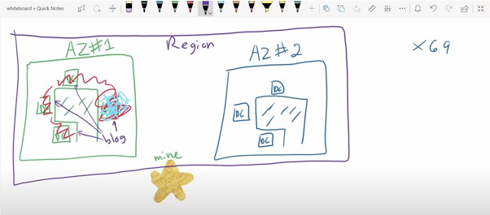

# [Region](https://aws.amazon.com/about-aws/global-infrastructure/regions_az/)
- A region is a `geographic location` where every data center inside the region is called an `availability zone`, AZ in short.
- There are `25 geographic regions` available in AWS, around the world.
- For example 
  - us-east-1 (US East (N. Virginia))
  - eu-west-1 (Europe (Ireland))
  - eu-north-1 (Europe (Stockholm))
  - ap-south-1 (Asia Pacific (Mumbai))

# [Availability Zone](https://aws.amazon.com/about-aws/global-infrastructure/regions_az/) 
- An Availability Zone (AZ) is `one or more discrete data centers` with redundant power, networking, and connectivity in an AWS Region. 
- AZs give customers the ability to operate production applications and databases that are more highly available, fault-tolerant, and scalable than would be possible from a single data center.
- There are `69 availability zones` available in AWS, around the world.
- Every AZ is labeled with a letter a, b, c etc.
- For example
  - AWS Region eu-central-1 has three availability zones eu-central-1a,1b,1c.

# [How to implement Fault-Tolerance in AWS?](https://www.linkedin.com/pulse/high-availability-vs-fault-tolerance-jon-bonso/) 
- An application requires 6 EC2 instances to handle the expected load. 
- A system can be considered highly available as long as it has several EC2 instances running in 2 different AZs. 
- On the other hand, a `fault-tolerant architecture is the one that still has 6 running instances, even if one AZ goes down`. 
- It could mean that the application has a total of 9 running instances on a regular basis, where there are 3 running instances on 3 different AZs. 
- So if one AZ experienced an outage, there are still 6 instances running that can handle the load.

# References
- [What are the differences AWS Regions and Availability Zones?](https://www.quora.com/What-are-the-differences-AWS-Regions-and-Availability-Zones)

