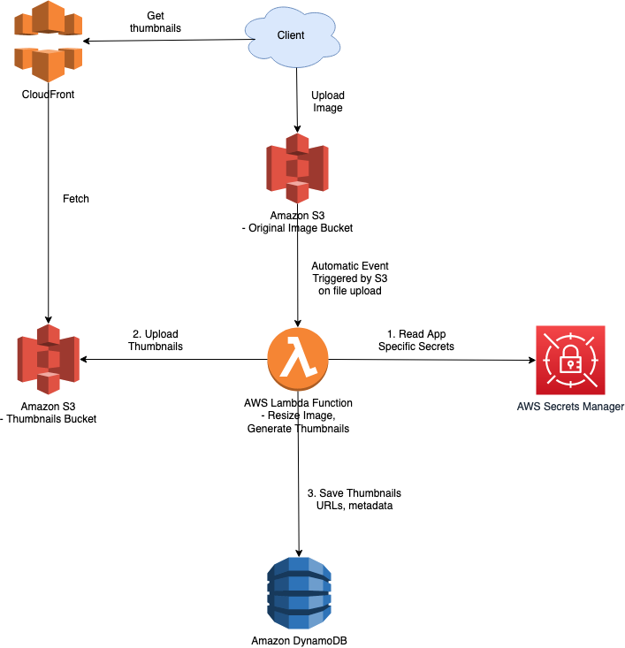

# Introduction
- AWS manages its [global architecture](AWS-Global-Architecture-Region-AZ.md) through region and availability zones.
- [Amazon Resouce Name (ARN)](https://docs.aws.amazon.com/general/latest/gr/aws-arns-and-namespaces.html) uniquely identify AWS resources.

<table>
  <tbody>
     <tr>
      <td>
        <a href="1_NetworkingAndContentDelivery">DNS Service</a>
      </td>
      <td>
        

            

                
            

        

      </td>
      <td rowspan=7 width="150px">
        
          
      </td>
    </tr>
    <tr>
      <td>
        <a href="1_NetworkingAndContentDelivery">Gateway & CDN</a>
      </td>
      <td>
        

            

                
                
            

        

      </td>
    </tr>
    <tr>
      <td>
        <a href="1_NetworkingAndContentDelivery">Load Balancer</a>
      </td>
      <td>
        

            

                
            

        

      </td>
    </tr>
    <tr>
        <td>
            <a href="1_NetworkingAndContentDelivery">Compute Services</a>
        </td>
    </tr>
  </tbody>
</table>

# Design Multi-Region Active-Active Architecture On AWS

# Design Scalable System on AWS

# Upload Image using Amazon S3 and Lambda

# Fanout Pattern with Amazon SNS & SQS

# AWS - System Designs
- :star: [Design Multi-Region Active-Active Architecture On AWS](0_AWSDesigns/DesignMultiRegionActiveActiveArchitectureOnAWS)
- :star: [Design Scalable System on AWS](0_AWSDesigns/DesignScalableSystemWithRDMS)
- [Upload Image using Amazon S3 and Lambda](0_AWSDesigns/DesignUploadImageAWSLambdaS3/README.md)
- [Send-SMS-API design - App Internal Clients, Multiple SMS-Providers, AutoScaling](../3_HLDDesignProblems/NotificationSystem/README.md)
- [Fanout Pattern with Amazon SNS & SQS](0_AWSDesigns/FanOutPatternSNSSQS/Readme.md)
- [WP Site with Amazon CloudFront & S3](0_AWSDesigns/WPSiteCloudFront&S3.md)
- [Microservices On AWS](0_AWSDesigns/MicroservicesOnAWS.md)
- [Dropbox Saves Millions by Building a Scalable Metadata Store on Amazon DynamoDB and Amazon S3](0_AWSDesigns/DropboxAmazonDynamoDB/Readme.md)

# AWS - Comparisons b/w Services
- [Amazon Aurora vs RDS](6_DatabaseServices/AWSAuroraVsRDS.md)
- [Amazon SQS vs SNS](../1_HLDDesignComponents/4_MessageBrokers/KafkaVsRabbitMQVsSQSVsSNS.md)
- [Amazon S3 vs EFS vs EBS](7_StorageServices/S3vsEFSvsEBS.md)
- [Amazon ECS vs EKS vs Fargate](3_InfraAutomation/EKSvsECSvsFargate.md)

# AWS - Various Services

 Service                                                                                      | Type                                                                    | Description                                                                                                                                                                       |
----------------------------------------------------------------------------------------------|-------------------------------------------------------------------------|-----------------------------------------------------------------------------------------------------------------------------------------------------------------------------------|
 :star: [Amazon Route 53](1_NetworkingAndContentDelivery/AmazonRoute53.md)                    | [Networking & Content Delivery Service](1_NetworkingAndContentDelivery) | `AWS DNS Service`                                                                                                                                                                 |
 :star: [AWS IAM](2_SecurityAndIdentityServices/AWSIAM.md)                                    | [Security Service](2_SecurityAndIdentityServices)                       | AWS User Management Service                                                                                                                                                       |
 :star: [Amazon VPC](2_SecurityAndIdentityServices/AmazonVPC.md)                              | [Security Service](2_SecurityAndIdentityServices)                       | Define and launch AWS resources in a logically isolated virtual network                                                                                                           |
 :star: [Amazon Elastic Load Balancer](1_NetworkingAndContentDelivery/ElasticLoadBalancer.md) | [Networking & Content Delivery Service](1_NetworkingAndContentDelivery) | `AWS Load Balancer Service`                                                                                                                                                       |
 :star: [Amazon CloudFront](1_NetworkingAndContentDelivery/AmazonCloudFront.md)               | [Networking & Content Delivery Service](1_NetworkingAndContentDelivery) | AWS Low-Latency [CDN Service](../1_HLDDesignComponents/0_SystemGlossaries/CDNs.md), which securely delivers content with `low latency and high transfer speeds`                   |
 :star: [Amazon S3](7_StorageServices/AmazonS3.md)                                            | [Storage Service](7_StorageServices)                                    | `Object storage` built to retrieve any amount of data from anywhere. `Cost effective & mostly used storage service in AWS`                                                        |
 :star: [AWS EC2 AutoScaling](4_ComputeServices/EC2/AWSEC2AutoScaling.md)                     | [Compute Service](4_ComputeServices)                                    | Auto-scaling of [EC2 instances](4_ComputeServices/EC2/ReadMe.md), based on demand & traffic ( CPU, Memory ).                                                                      |
 :star: [Amazon EC2](4_ComputeServices/EC2/ReadMe.md)                                         | [Compute Service](4_ComputeServices)                                    | `Self-Managed Virtual Machine` that run the application in the cloud.                                                                                                             |
 :star: [Amazon Aurora](6_DatabaseServices/AmazonAurora/Readme.md)                            | [Database Service](6_DatabaseServices)                                  | DB management service for Postgres and MySQL ( faster & more reliable than RDS )                                                                                                  |
 :star: [Amazon Elastic Cache](6_DatabaseServices/AmazonElasicCache.md)                       | [Database Service](6_DatabaseServices)                                  | Fully Managed [Redis & Memcache](../1_HLDDesignComponents/3_DatabaseComponents/In-Memory-Cache/Redis/README.md) service                                                           |
 :star: [Amazon SQS](5_MessageBrokerServices/AmazonSQS.md)                                    | [Message Broker Service](5_MessageBrokerServices)                       | Fully managed Message Queue Service                                                                                                                                               |
 :star: [Amazon Dynamo DB](6_DatabaseServices/AmazonDynamoDB.md)                              | [Database Service](6_DatabaseServices)                                  | Fully managed NoSQL service                                                                                                                                                       |
 :star: [Amazon CloudWatch](8_MonitoringServices/AmazonCloudWatch.md)                         | [Monitoring Service](8_MonitoringServices)                              | Monitor AWS Resources & set Alarms                                                                                                                                                |
 :star: [Amazon ECS](3_InfraAutomation/AmazonECS/Readme.md)                                          | [AWS Infrastructure Automation](3_InfraAutomation)                      | `Containers as a service`.                                                                                                                                                        |
 :star: [AWS Fargate ](4_ComputeServices/AWSFargate.md)                                       | [Compute Service](4_ComputeServices)                                    | Serverless compute for containers. Compatible with both [EKS](EKS.md) & [ECS](ECS.md) i.e. these services can run with Fargate as deployment option, instead of EC2.              |
 :star: [Amazon OpenSearch service](6_DatabaseServices/AmazonOpenSearch.md)                   | [Database Service](6_DatabaseServices)                                  | Successor to Amazon [ElasticSearch](../1_HLDDesignComponents/3_DatabaseComponents/Search-Engines/ElasticSearch) Service, includes built in OpenSearch Dashboard and Kibana.      |
 [Amazon EKS](3_InfraAutomation/AmazonEKS.md)                                                 | [AWS Infrastructure Automation](3_InfraAutomation)                      | Fully managed [Kubernetes](../1_HLDDesignComponents/6_DevOps/Kubernates.md) service                                                                                               |
:star: [AWS Cloud Formation](3_InfraAutomation/AWSCloudFormation/Readme.md)                         | [AWS Infrastructure Automation](3_InfraAutomation)                      | `Infrastructure as a CODE`. Configure & manage complete AWS infrastructure through cloudformation templates ( yaml or json ).                                                     |
 [Amazon API Gateway](1_NetworkingAndContentDelivery/AmazonAPIGateway.md)                     | [Networking & Content Delivery Service](1_NetworkingAndContentDelivery) | API Gateway for microservices implementation.                                                                                                                                     |
 [Amazon SNS](5_MessageBrokerServices/AmazonSNS.md)                                           | [Message Broker Service](5_MessageBrokerServices)                       | Fully managed pub/sub messaging, SMS, email, and mobile push notifications                                                                                                        |
 [Amazon RDS](6_DatabaseServices/AmazonRDS.md)                                                | [Database Service](6_DatabaseServices)                                  | Database management service for relational databases                                                                                                                              |
 :star: [AWS Lambda](4_ComputeServices/AWSLambda.md)                                          | [Compute Service](4_ComputeServices)                                    | Run code without thinking about servers or clusters.                                                                                                                              |
 [AWS WAF](2_SecurityAndIdentityServices/AWSWAF.md)                                           | [Security Service](2_SecurityAndIdentityServices)                       | Web Application Firewall Service                                                                                                                                                  |
 [AWS Secrets Manager](https://aws.amazon.com/secrets-manager/)                               | [Security Service](2_SecurityAndIdentityServices)                       | AWS Secrets Manager helps you manage, retrieve, and rotate database credentials, API keys, and other secrets throughout their lifecycles.                                         |
 [AWS VPN](https://aws.amazon.com/vpn/)                                                       | [Security Service](2_SecurityAndIdentityServices)                       | Extend your on-premises networks to the cloud and securely access them from anywhere.                                                                                             |
 [Amazon EFS](7_StorageServices/AmazonEFS.md)                                                 | [Storage Service](7_StorageServices)                                    | Shared File Storage between [EC2 instances](4_ComputeServices/EC2/ReadMe.md)                                                                                                      |
 [Amazon CloudTrail](8_MonitoringServices/AWSCloudTrail.md)                                   | [Monitoring Service](8_MonitoringServices)                              | Monitor [Amazon Route 53 API](1_NetworkingAndContentDelivery/AmazonRoute53.md) activities in AWS Account                                                                          |
 [Amazon Config](8_MonitoringServices/AWSConfig.md)                                           | [Monitoring Service](8_MonitoringServices)                              | Monitor Configration changes of AWS Resources                                                                                                                                     |
 [AWS Shield](2_SecurityAndIdentityServices/AWSShield.md)                                     | [Security Service](2_SecurityAndIdentityServices)                       | DDOS Prevention Service                                                                                                                                                           |
 [Amazon MQ](5_MessageBrokerServices/AmazonMQ.md)                                             | [Message Broker Service](5_MessageBrokerServices)                       | Open Source ([ActiveMQ](../1_HLDDesignComponents/4_MessageBrokers/ActiveMQ.md), [RabbitMQ](../1_HLDDesignComponents/4_MessageBrokers/RabbitMQ.md)) Queue Migration service        |
 [Amazon Redshift](6_DatabaseServices/AmazonRedshift.md)                                          | [Data Warehouse Service](6_DatabaseServices)                            | Redshift is a fully managed data warehouse service used in data analysis. (Postgres compatible querying layer)                                                                    |
 [AWS Elastic Beanstalk](https://aws.amazon.com/elasticbeanstalk/)                            | [AWS Infrastructure Automation](3_InfraAutomation)                      | Servers Management - Easy to begin, Impossible to outgrow                                                                                                                         |
 [Amazon EMR](4_ComputeServices/AmazonEMR.md)                                                 | Other Service                                                           | Fully Managed Service for [Apache Spark](../1_HLDDesignComponents/5_BigDataComponents/ApacheSpark.md)                                                                             |
 [Amazon Cognito](9_OtherServices/AmazonCognito.md)                                           | Other Service                                                           | Users login/signin service.                                                                                                                                                       |
 [AWS Private Link](https://aws.amazon.com/privatelink)                                       | [Networking & Content Delivery Service](1_NetworkingAndContentDelivery) | Establish private connectivity between [Amazon VPC](2_SecurityAndIdentityServices/AmazonVPC.md) and services hosted on AWS or on-premises, without exposing data to the internet. |
 [Amazon KeySpaces](6_DatabaseServices/AmazonKeySpaces.md)                                    | [Database Service](6_DatabaseServices)                                  | Fully managed service for [Apache Casandra](../1_HLDDesignComponents/3_DatabaseComponents/NoSQL-Databases/ApacheCasandra.md)                                                      |
 [Amazon WorkSpaces](https://aws.amazon.com/workspaces/)                                      | Other Service                                                           | Secure, reliable, and scalable access to persistent desktops from any location.                                                                                                   |

* [Utility services](https://stackoverflow.com/questions/33125790/why-some-services-are-called-aws-xxx-and-the-others-amazon-xxx) are prefixed with `AWS`, while standalone services are prefixed by `Amazon`.

# AWS - Cost Exploration Services
- [Cost Explorer](https://aws.amazon.com/aws-cost-management/aws-cost-explorer/)
- [AWS Budgets](https://aws.amazon.com/aws-cost-management/aws-budgets/)
- [Cost Allocation Tags](https://docs.aws.amazon.com/awsaccountbilling/latest/aboutv2/cost-alloc-tags.html)

# Source(s) and further reading
- [AWS Documentation Overview](https://aws.amazon.com/documentation-overview/)
- [AWS Interview Questions](https://www.simplilearn.com/tutorials/aws-tutorial/aws-interview-questions)
- [The Top 10 Most Used AWS Services](https://insider.ssi-net.com/insights/the-top-10-most-used-aws-services)
- [Is Amazon RDS for PostgreSQL or Amazon Aurora PostgreSQL a better choice for me?](https://aws.amazon.com/blogs/database/is-amazon-rds-for-postgresql-or-amazon-aurora-postgresql-a-better-choice-for-me/)