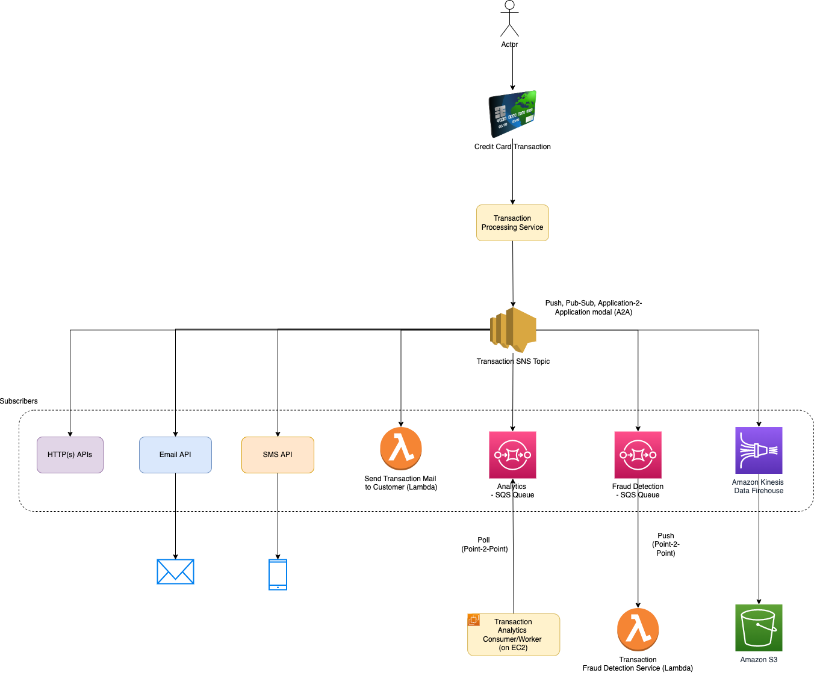
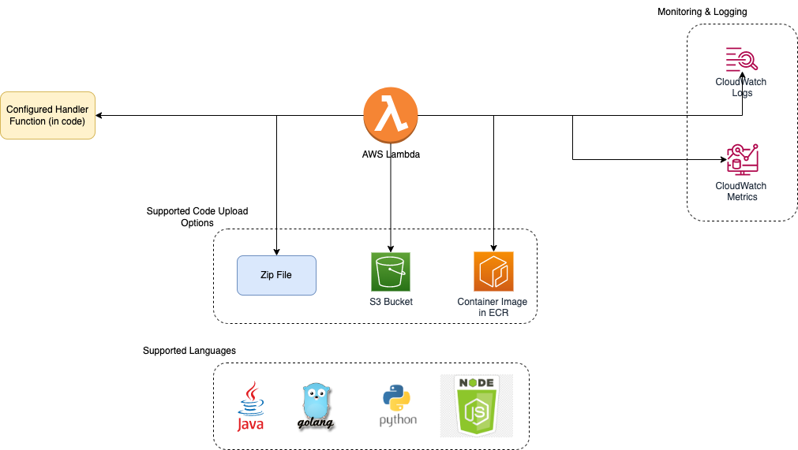

# Introduction
- AWS manages its [global architecture through region and availability zones](AWS-Global-Architecture-Region-AZ.md).
- [Amazon Resouce Name (ARN)](https://docs.aws.amazon.com/general/latest/gr/aws-arns-and-namespaces.html) uniquely identify AWS resources.

# System Designs

## Design Scalable System on AWS

[Read more](0_AWSDesigns/DesignScalableSystemWithRDMS/README.md)

## Design Multi-Region Active-Active Architecture On AWS

[Read more](0_AWSDesigns/DesignMultiRegionActiveActiveArchitectureOnAWS/README.md)

## Upload Image using Amazon S3 and Lambda

[Read more](0_AWSDesigns/DesignUploadImageAWSLambdaS3/README.md)

## Others
- [Send-SMS-API design - App Internal Clients, Multiple SMS-Providers, AutoScaling](../3_HLDDesignProblems/NotificationSystem/README.md)
- [WP Site with Amazon CloudFront & S3](0_AWSDesigns/WPSiteCloudFront&S3.md)
- [Microservices On AWS](0_AWSDesigns/MicroservicesOnAWS.md)
- [Dropbox Saves Millions by Building a Scalable Metadata Store on Amazon DynamoDB and Amazon S3](0_AWSDesigns/DropboxAmazonDynamoDB/Readme.md)

# AWS Services - Architecture, Features etc.

<table>
  <tbody>
     <tr>
      <td>
        <a href="1_NetworkingAndContentDelivery">DNS Service</a>
      </td>
      <td>
        

            

                
            

        

      </td>
       <td rowspan=14 width="150px">
            
              
        </td>
    </tr>
    <tr>
        <td>
            <a href="2_SecurityAndIdentityServices">Security Services</a>
        </td>
        <td>
            

                
                
                
                
                
            

        </td>
    </tr>
    <tr>
      <td>
        <a href="1_NetworkingAndContentDelivery">VPC - Public, Private Subnet</a>
      </td>
      <td>
        

            

                
            

        

      </td>
    </tr>
    <tr>
      <td>
        <a href="1_NetworkingAndContentDelivery">CDN - Static Content (Image, Video)</a>
      </td>
      <td>
        

            

                
                
            

        

      </td>
    </tr>
    <tr>
      <td>
        <a href="1_NetworkingAndContentDelivery">API Gateway, Load Balancer</a>
      </td>
      <td>
        

            

                
                
            

        

      </td>
    </tr>
    <tr>
        <td>
            <a href="4_ComputeServices">Compute Services</a>
        </td>
        <td>
            

                
                
                
                
            

        </td>
    </tr>
    <tr>
        <td>
            <a href="4_ComputeServices">Container Orchestration Services</a>
        </td>
        <td>
            

                
                
            

        </td>
    </tr>
    <tr>
        <td>
            <a href="6_DatabaseServices">In-Memory DB/Cache</a>
        </td>
        <td>
            

                
            

        </td>
    </tr>
    <tr>
        <td>
            <a href="5_MessageBrokerServices">Message Broker Services</a>
        </td>
        <td>
            

                
                
                
                
                
            

        </td>
    </tr>
    <tr>
        <td>
            <a href="6_DatabaseServices">Search Engine</a>
        </td>
        <td>
            

                
            

        </td>
    </tr>
    <tr>
        <td>
            <a href="6_DatabaseServices">Database Services</a>
        </td>
        <td>
            

                
                
                
                
            

        </td>
    </tr>
    <tr>
        <td>
            <a href="7_StorageServices">Storage Services</a>
        </td>
        <td>
            

                
                
            

        </td>
    </tr>
    <tr>
        <td>
            <a href="6_DatabaseServices">Data Warehousing</a>
        </td>
        <td>
            

                
            

        </td>
    </tr>
    <tr>
        <td>
            <a href="8_MonitoringServices">Monitoring Services</a>
        </td>
        <td>
            

                
                
            

        </td>
    </tr>
  </tbody>
</table>

## Amazon API Gateway - Features

[Read more](1_NetworkingAndContentDelivery/AmazonAPIGateway/Readme.md)

## Amazon Elastic Load Balancer

[Read more](1_NetworkingAndContentDelivery/ElasticLoadBalancer/Readme.md)

## Amazon ECS - Tasks, Fargate etc.

[Read more](4_ComputeServices/AmazonECS/README.md)

## Amazon SQS - Queue, Consumers etc.

[Read more](5_MessageBrokerServices/AmazonSQS.md)

## Amazon EventBridge - Targets, Rules etc.

[Read more](5_MessageBrokerServices/AmazonEventBridge.md)

## Amazon SNS - Pub/Sub, Push etc.

[Read more](5_MessageBrokerServices/AmazonSNS.md)

## AWS Lambda

[Read more](4_ComputeServices/AWSLambda/Readme.md)

## Auto-Scaling - How it works?

[Read more](4_ComputeServices/AmazonEC2/AutoScalingGroup/README.md)

## AWS Step Functions - Lambda

[Read more](4_ComputeServices/AWSStepFunctions.md)

## AWS - Comparisons b/w Services
- [Amazon RDS Aurora vs Other RDS DB engines](6_DatabaseServices/AmazonAuroraVsRDS.md)
- [Amazon SQS vs SNS](../1_HLDDesignComponents/4_MessageBrokers/KafkaVsRabbitMQVsSQSVsSNS.md)
- [Amazon S3 vs EFS vs EBS](7_StorageServices/S3vsEFSvsEBS.md)
- [Amazon ECS vs EKS vs Fargate](4_ComputeServices/EKSvsECSvsFargate.md)
- [Amazon API Gateway vs ELB](1_NetworkingAndContentDelivery/AmazonAPIGatewayVsELB.md)

## AWS - Services List, Table

Service                                                                                      | Type                                                                                | [Fully Managed?](FullyManagedVsSelfManaged.md) | [Location - Global vs Regional vs AZ](AWS-Global-Architecture-Region-AZ.md)        | Description                                                                                                                                                                                                                                                                 |
----------------------------------------------------------------------------------------------|-------------------------------------------------------------------------------------|------------------------------------------------|------------------------------------------------------------------------------------|-----------------------------------------------------------------------------------------------------------------------------------------------------------------------------------------------------------------------------------------------------------------------------|
:star: [Amazon Route 53](1_NetworkingAndContentDelivery/AmazonRoute53.md)                    | [Networking & Content Delivery Service](1_NetworkingAndContentDelivery)             | :white_check_mark:                             | :globe_with_meridians: Global                                                      | Fully Managed [AWS DNS Service](https://aws.amazon.com/route53/what-is-dns/)                                                                                                                                                                                                |
:star: [AWS IAM](2_SecurityAndIdentityServices/AWSUsers&AccessMgmt/AWSIAM.md)                | [Security Service](2_SecurityAndIdentityServices)                                   | :white_check_mark:                             | :globe_with_meridians: Global                                                      | AWS User & Access Management Service                                                                                                                                                                                                                                        |
:star: [Amazon VPC](1_NetworkingAndContentDelivery/AmazonVPC.md)                             | [Networking & Content Delivery Service](1_NetworkingAndContentDelivery)             | :x:                                            | :earth_americas: Regional                                                          | Define and launch AWS resources in a logically isolated virtual network                                                                                                                                                                                                     |
:star: [Amazon VPC Subnets](1_NetworkingAndContentDelivery/AmazonVPC.md)                             | [Networking & Content Delivery Service](1_NetworkingAndContentDelivery)             | :x:                                            | :classical_building: Availability Zone                                             | -                                                                                                                                                                                                                                                                           |
:star: [AWS Cloud Formation](3_InfraAutomation/AWSCloudFormation/Readme.md)                  | [AWS Infrastructure Automation](3_InfraAutomation)                                  | :white_check_mark:                             | :earth_americas: Regional                                                          | Infrastructure as a CODE  - Configure & manage complete AWS infrastructure through cloudformation templates (yaml or json).                                                                                                                                             |
:star: [Amazon CloudFront](1_NetworkingAndContentDelivery/AmazonCloudFront.md)               | [Networking & Content Delivery Service](1_NetworkingAndContentDelivery)             | :white_check_mark:                             | :globe_with_meridians: Global                                                      | AWS Low-Latency [CDN Service](../1_HLDDesignComponents/0_SystemGlossaries/CDNs.md), which securely delivers content with [low latency and high transfer speeds](../1_HLDDesignComponents/0_SystemGlossaries/LatencyThroughput.md)                                           |
:star: [Amazon API Gateway](1_NetworkingAndContentDelivery/AmazonAPIGateway/Readme.md)       | [Networking & Content Delivery Service](1_NetworkingAndContentDelivery)             | :white_check_mark:                             | :earth_americas: Regional                                                          | Serverless API service for API development.                                                                                                                                                                                                                                 |
:star: [Amazon Elastic Load Balancer](1_NetworkingAndContentDelivery/ElasticLoadBalancer/Readme.md) | [Networking & Content Delivery Service](1_NetworkingAndContentDelivery)             | :white_check_mark:                             | :earth_americas: Regional                                                          | Fully Managed AWS [Load Balancer Service](../1_HLDDesignComponents/0_SystemGlossaries/LoadBalancer.md)                                                                                                                                                                      |
:star: [Amazon EC2](4_ComputeServices/AmazonEC2/ReadMe.md)                                         | [Compute Service](4_ComputeServices)                                                | :x:                                            | :classical_building: Availability Zone                                             | [Self-Managed Virtual Machine](https://www.redhat.com/en/topics/virtualization/what-is-a-virtual-machine) that run the application in the cloud.                                                                                                                            |
:star: [AWS EC2 Auto Scaling Groups](4_ComputeServices/AmazonEC2/AutoScalingGroup/README.md)               | [Compute Service](4_ComputeServices)                                                | :white_check_mark:                             | :earth_americas: Regional                                              | Auto-scaling of [EC2 instances](4_ComputeServices/AutoScalingGroup/README.md), based on demand & traffic (CPU, Memory).                                                                                                                                                     |
[Amazon EBS](https://aws.amazon.com/ebs/)                                                     | [Storage Service](7_StorageServices)                                                | :x:                                            | :classical_building: Availability Zone                                             | -                                                                                                                                                                                                                                                                           |
[Amazon Elastic IP](https://docs.aws.amazon.com/AWSEC2/latest/UserGuide/elastic-ip-addresses-eip.html)  | [Networking & Content Delivery Service](1_NetworkingAndContentDelivery)             | :white_check_mark:                             | :earth_americas: Regional                                                          | An Elastic IP address is a static IPv4 address designed for dynamic cloud computing.                                                                                                                                                                                        |
:star: [AWS Fargate ](4_ComputeServices/AWSFargate.md)                                       | [Compute Service](4_ComputeServices)                                                | :white_check_mark:                             | :earth_americas: Regional                                                          | Serverless compute for containers.  - Compatible with both [EKS](4_ComputeServices/AmazonEKS.md) & [ECS](4_ComputeServices/AmazonECS/README.md) i.e. these services can run with Fargate as deployment option, instead of [EC2](4_ComputeServices/AmazonEC2/ReadMe.md). |
:star: [AWS Lambda](4_ComputeServices/AWSLambda/Readme.md)                                          | [Compute Service](4_ComputeServices)                                                | :white_check_mark:                             | :earth_americas: Regional                                                          | Run code without thinking about servers or clusters.                                                                                                                                                                                                                        |
:star: [Amazon ECS](4_ComputeServices/AmazonECS/README.md)                                   | [Container Orchestration Service](4_ComputeServices)                                | :white_check_mark:                             | :earth_americas: Regional                                                          | Full Managed [Container Orchestration Service](../1_HLDDesignComponents/0_SystemGlossaries/ContainerOrchestrationService.md) (Containers as a service).                                                                                                                     |
:star: [Amazon EKS](4_ComputeServices/AmazonEKS.md)                                          | [Container Orchestration Service](4_ComputeServices)                                | :white_check_mark:                             | :earth_americas: Regional                                                          | Fully managed [Kubernetes](../1_HLDDesignComponents/6_DevOps/Kubernates.md) service                                                                                                                                                                                         |
[Amazon RDS](6_DatabaseServices/AmazonRDS.md)                                                | [Database Service](6_DatabaseServices)                                              | :x:                                            | :classical_building: Availability Zone  (Highly Available if Multi-AZ enabled) | Database management service for relational databases                                                                                                                                                                                                                        |
:star: [Amazon RDS Aurora](6_DatabaseServices/AmazonRDSAurora/Readme.md)                            | [Database Service](6_DatabaseServices)                                              | :x:                                            | :classical_building: Availability Zone  (Highly Available if Multi-AZ enabled) | Database service for Postgres and MySQL ( faster & more reliable than RDS )                                                                                                                                                                                                 |
:star: [Amazon Elastic Cache](6_DatabaseServices/AmazonElasticCache.md)                      | [Database Service](6_DatabaseServices)                                              | :white_check_mark:                             | :earth_americas: Regional                                                          | Fully Managed [Redis & Memcache](../1_HLDDesignComponents/3_DatabaseComponents/In-Memory-Cache/Redis/README.md) service                                                                                                                                                     |
:star: [Amazon S3](7_StorageServices/AmazonS3.md)                                            | [Storage Service](7_StorageServices)                                                | :white_check_mark:                             | :globe_with_meridians: Global  (but Data/Bucket is :earth_americas: Regional)  | [Object storage](https://www.netapp.com/data-storage/storagegrid/what-is-object-storage/) built to retrieve any amount of data from anywhere.  - Cost effective & mostly used storage service in AWS.                                                                   |
:star: [Amazon Dynamo DB](6_DatabaseServices/AmazonDynamoDB/Readme.md)                       | [Database Service](6_DatabaseServices)                                              | :white_check_mark:                             | :earth_americas: Regional                                                          | Fully Managed NoSQL service                                                                                                                                                                                                                                                 |
:star: [Amazon SQS](5_MessageBrokerServices/AmazonSQS.md)                                    | [Message Broker Service](5_MessageBrokerServices)                                   | :white_check_mark:                             | :earth_americas: Regional                                                          | Fully Managed Message Queue Service                                                                                                                                                                                                                                         |
:star: [Amazon Event Bridge](5_MessageBrokerServices/AmazonEventBridge.md)                   | [Message Broker Service](5_MessageBrokerServices)                                   | :white_check_mark:                             | :earth_americas: Regional                                                          | Fully Managed Event Bus Service                                                                                                                                                                                                                                             |
:star: [Amazon CloudWatch](8_MonitoringServices/AmazonCloudWatch.md)                         | [Monitoring Service](8_MonitoringServices)                                          | :white_check_mark:                             | :earth_americas: Regional                                                          | To monitor AWS Resources & set Alarms                                                                                                                                                                                                                                       |
:star: [Amazon OpenSearch service](6_DatabaseServices/AmazonOpenSearch.md)                   | [Database Service](6_DatabaseServices)                                              | :white_check_mark:                             | :earth_americas: Regional                                                          | Successor to [Amazon ElasticSearch](../1_HLDDesignComponents/3_DatabaseComponents/Search-Engines/ElasticSearch) Service, includes built in OpenSearch Dashboard and Kibana.                                                                                                 |
[Amazon SNS](5_MessageBrokerServices/AmazonSNS.md)                                           | [Message Broker Service](5_MessageBrokerServices)                                   | :white_check_mark:                             | :earth_americas: Regional                                                          | Fully Managed Pub/Sub messaging, SMS, email, and mobile push notifications                                                                                                                                                                                                  |
[Amazon MQ](5_MessageBrokerServices/AmazonMQ.md)                                             | [Message Broker Service](5_MessageBrokerServices)                                   | :white_check_mark:                             | :earth_americas: Regional                                                          | Open Source ([ActiveMQ](../1_HLDDesignComponents/4_MessageBrokers/ActiveMQ.md), [RabbitMQ](../1_HLDDesignComponents/4_MessageBrokers/RabbitMQ.md)) Queue Migration service                                                                                                  |
[Amazon Kinesis](5_MessageBrokerServices/AmazonKinesis.md)                                   | [Message Broker Service](5_MessageBrokerServices)                                   | :white_check_mark:                             | :earth_americas: Regional                                                          | Easily collect, process, and analyze video and data streams in real time.                                                                                                                                                                                                   |
[Amazon Redshift](6_DatabaseServices/AmazonRedshift.md)                                      | [Data Warehouse Service](6_DatabaseServices)                                        | :white_check_mark:                             | :earth_americas: Regional                                                          | Fully Managed data warehouse service used in data analysis. (Postgres compatible querying layer)                                                                                                                                                                            |
[Amazon KeySpaces](6_DatabaseServices/AmazonKeySpaces.md)                                    | [Database Service](6_DatabaseServices)                                              | :white_check_mark:                             | :earth_americas: Regional                                                          | Fully Managed Service for [Apache Casandra](../1_HLDDesignComponents/3_DatabaseComponents/NoSQL-Databases/ApacheCasandra.md)                                                                                                                                                |
[AWS WAF](2_SecurityAndIdentityServices/AWSWAF.md)                                           | [Security Service](2_SecurityAndIdentityServices)                                   | :white_check_mark:                             | :globe_with_meridians: Global                                                      | Web Application Firewall Service                                                                                                                                                                                                                                            |
[AWS Shield](2_SecurityAndIdentityServices/AWSShield.md)                                     | [Security Service](2_SecurityAndIdentityServices)                                   | :white_check_mark:                             | :earth_americas: Regional                                                          | DDOS Prevention Service                                                                                                                                                                                                                                                     |
[AWS Secrets Manager](2_SecurityAndIdentityServices/AWSSecretsManager.md)                    | [Security Service](2_SecurityAndIdentityServices)                                   | :white_check_mark:                             | :earth_americas: Regional                                                          | Easily rotate, manage and retrieve secrets throughout their lifecycle.                                                                                                                                                                                                      |
[AWS VPN](2_SecurityAndIdentityServices/AWSUsers&AccessMgmt/AWSVPN.md)                       | [Security Service](2_SecurityAndIdentityServices)                                   | :white_check_mark:                             | :earth_americas: Regional                                                          | Extend your on-premises networks to the cloud and securely access them from anywhere.                                                                                                                                                                                       |
[Amazon Cognito](2_SecurityAndIdentityServices/AmazonCognito.md)                             | [Security Service](2_SecurityAndIdentityServices)                                   | :white_check_mark:                             | :earth_americas: Regional                                                          | Users login/signin service.                                                                                                                                                                                                                                                 |
[Amazon EFS](7_StorageServices/AmazonEFS.md)                                                 | [Storage Service](7_StorageServices)                                                | :white_check_mark:                             | :earth_americas: Regional                                                          | Shared File Storage between [EC2 instances](4_ComputeServices/AmazonEC2/ReadMe.md)                                                                                                                                                                                          |
[Amazon CloudTrail](8_MonitoringServices/AWSCloudTrail.md)                                   | [Monitoring Service](8_MonitoringServices)                                          | :white_check_mark:                             | :earth_americas: Regional                                                          | To monitor [Amazon Route 53 API](1_NetworkingAndContentDelivery/AmazonRoute53.md) activities in AWS Account                                                                                                                                                                 |
[Amazon Config](8_MonitoringServices/AWSConfig.md)                                           | [Monitoring Service](8_MonitoringServices)                                          | :white_check_mark:                             | :earth_americas: Regional                                                          | To monitor Configration changes of AWS Resources                                                                                                                                                                                                                            |
[Amazon EMR](4_ComputeServices/AmazonEMR.md)                                                 | [Compute Service](4_ComputeServices)                                                | :white_check_mark:                             | :earth_americas: Regional                                                          | Fully Managed Service for [Apache Spark](../1_HLDDesignComponents/5_BigDataComponents/ApacheSpark.md)                                                                                                                                                                       |
[AWS Step Functions](4_ComputeServices/AWSStepFunctions.md)                                  | [Compute Service](4_ComputeServices)                                                | :white_check_mark:                             | :earth_americas: Regional                                                          | Low-code, visual workflow service.                                                                                                                                                                                                                                          |
[AWS Private Link](1_NetworkingAndContentDelivery/AWSPrivateLink.md)                         | [Networking & Content Delivery Service](1_NetworkingAndContentDelivery)             | :white_check_mark:                             | :earth_americas: Regional                                                          | Establish private connectivity between [Amazon VPC](1_NetworkingAndContentDelivery/AmazonVPC.md) and services hosted on AWS or on-premises, without exposing data to the internet.                                                                                          |
[AWS Elastic Beanstalk](https://aws.amazon.com/elasticbeanstalk/)                            | [AWS Infrastructure Automation](3_InfraAutomation)                                  | :white_check_mark:                             | :earth_americas: Regional                                                          | Servers Management - Easy to begin, Impossible to outgrow                                                                                                                                                                                                                   |
[Amazon WorkSpaces](https://aws.amazon.com/workspaces/)                                      | [End User Computing](https://aws.amazon.com/products/end-user-computing/)           | :white_check_mark:                             | :classical_building: Availability Zone                                             | Secure, reliable, and scalable access to persistent desktops from any location.                                                                                                                                                                                             |
[AWS Identity Center (successor to AWS SSO)](2_SecurityAndIdentityServices/AWSUsers&AccessMgmt/AWSIAMIdentityCenter.md) | [Security Service](2_SecurityAndIdentityServices)                                   | :white_check_mark:                             | :globe_with_meridians: Global                                                      | Centrally manage workforce access to multiple AWS accounts and applications.                                                                                                                                                                                                |
[AWS Organization](2_SecurityAndIdentityServices/AWSUsers&AccessMgmt/AWSOrganization.md)      | [Security Service](2_SecurityAndIdentityServices)                                   | :white_check_mark:                             | :globe_with_meridians: Global                                                      | Centrally manage your environment as you scale your AWS resources.                                                                                                                                                                                                          |

* [Utility services](https://stackoverflow.com/questions/33125790/why-some-services-are-called-aws-xxx-and-the-others-amazon-xxx) are prefixed with `AWS`, while standalone services are prefixed by `Amazon`.

# Source(s) and further reading
- [AWS Documentation Overview](https://aws.amazon.com/documentation-overview/)
- [AWS Interview Questions](https://www.simplilearn.com/tutorials/aws-tutorial/aws-interview-questions)
- [The Top 10 Most Used AWS Services](https://insider.ssi-net.com/insights/the-top-10-most-used-aws-services)
- [Is Amazon RDS for PostgreSQL or Amazon Aurora PostgreSQL a better choice for me?](https://aws.amazon.com/blogs/database/is-amazon-rds-for-postgresql-or-amazon-aurora-postgresql-a-better-choice-for-me/)