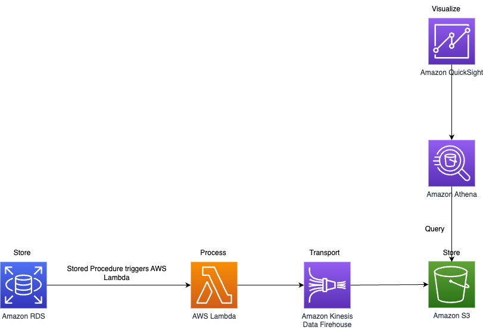
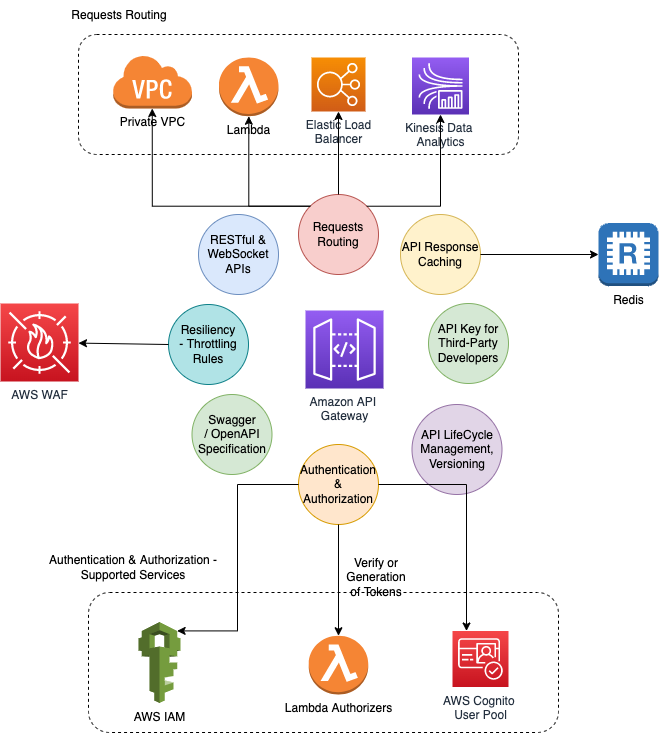
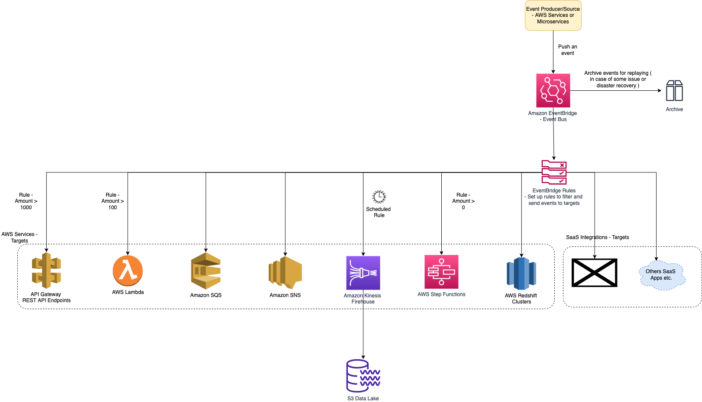

# Amazon Web Services

# Best Practices

| Practice                                                            | Description                                                                                                                                                                                                                                                                                                                             |
|---------------------------------------------------------------------|-----------------------------------------------------------------------------------------------------------------------------------------------------------------------------------------------------------------------------------------------------------------------------------------------------------------------------------------|
| [AWS Services List](AWS-Services-List.md)                           | List of all services in AWS.                                                                                                                                                                                                                                                                                                            |
| Maintain resiliency                                                 | A well-known best practice for cloud architecture is to use [Region-scoped, managed services](AWS-Global-Architecture-Region-AZ.md) - At a minimum, you should use two AZs. - [AWS](https://docs.aws.amazon.com) manages its [global architecture through region and availability zones](AWS-Global-Architecture-Region-AZ.md). |
| [Go serverless/Cloud Native](AWS-Serverless-Architecture.md)        | AWS provides easily managed [serverless architecture](AWS-Serverless-Architecture.md).                                                                                                                                                                                                                                                  |
| [AWS Well-Architected Framework](AWS-Well-Architected-Framework.md) | [AWS Well-Architected](https://aws.amazon.com/architecture/well-architected) helps cloud architects build secure, high-performing, resilient, and efficient infrastructure for a variety of applications and workloads.                                                                                                                 |

# System Designs

## Design Scalable System on AWS

[Read more](0_AWSDesigns/DesignScalableSystemWithRDMS/README.md)

## Design Multi-Region Active-Active Architecture On AWS

[Read more](0_AWSDesigns/DesignMultiRegionActiveActiveArchitectureOnAWS/README.md)

## Upload Image using Amazon S3 and Lambda

[Read more](0_AWSDesigns/DesignUploadImageAWSLambdaS3/README.md)

## IoT sensor data capture architecture

## Real-time data analytics architecture

## Others
- [Send-SMS-API design - App Internal Clients, Multiple SMS-Providers, AutoScaling](../3_HLDDesignProblems/NotificationSystem/README.md)
- [WP Site with Amazon CloudFront & S3](0_AWSDesigns/WPSiteCloudFront&S3.md)
- [Dropbox Saves Millions by Building a Scalable Metadata Store on Amazon DynamoDB and Amazon S3](0_AWSDesigns/DropboxAmazonDynamoDB/Readme.md)

# AWS Services - Architecture, Features etc.

<table>
  <tbody>
     <tr>
      <td>
        <a href="1_NetworkingAndContentDelivery">DNS Service, Service Discovery</a>
      </td>
      <td>
        

            

                
                
            

        

      </td>
       <td rowspan=16 width="150px">
            
        </td>
    </tr>
    <tr>
        <td>
            <a href="2_SecurityAndIdentityServices">User Management & Security Services</a>
        </td>
        <td>
            

                
                
                
                
                
                
            

        </td>
    </tr>
    <tr>
      <td>
        <a href="1_NetworkingAndContentDelivery">VPC - Public, Private Subnet</a>
      </td>
      <td>
        

            

                
            

        

      </td>
    </tr>
    <tr>
      <td>
        <a href="1_NetworkingAndContentDelivery">CDN - Static Content (Image, Videos etc.)</a>
      </td>
      <td>
        

            

                
                
            

        

      </td>
    </tr>
    <tr>
      <td>
        <a href="1_NetworkingAndContentDelivery">API Gateway, Load Balancer</a>
      </td>
      <td>
        

            

                
                
            

        

      </td>
    </tr>
    <tr>
        <td>
            <a href="3_ComputeServices">Compute Services</a>
        </td>
        <td>
            

                
                
                
                
            

        </td>
    </tr>
    <tr>
        <td>
            <a href="4_ContainerOrchestrationServices">Container Orchestration Services</a>
        </td>
        <td>
            

                
                
                
            

        </td>
    </tr>
    <tr>
        <td>
            <a href="6_DatabaseServices">In-Memory DB/Cache</a>
        </td>
        <td>
            

                
            

        </td>
    </tr>
    <tr>
        <td>
            <a href="5_MessageBrokerServices/Readme.md">Message Broker Services</a>
        </td>
        <td>
            

                
                
                
                
                
                
            

        </td>
    </tr>
    <tr>
        <td>
            <a href="6_DatabaseServices">Search Engine</a>
        </td>
        <td>
            

                
            

        </td>
    </tr>
    <tr>
        <td>
            <a href="6_DatabaseServices">Database Services</a>
        </td>
        <td>
            

                
                
                
                
            

        </td>
    </tr>
    <tr>
        <td>
            <a href="7_StorageServices">Storage Services</a>
        </td>
        <td>
            

                
                
                
            

        </td>
    </tr>
    <tr>
        <td>
            <a href="6_DatabaseServices">Data Warehousing</a>
        </td>
        <td>
            

                
            

        </td>
    </tr>
    <tr>
        <td>
            <a href="10_BigDataComponents/BatchProcessing">Batch Processing</a>
        </td>
        <td>
            

                
            

        </td>
    </tr>
    <tr>
        <td>
            <a href="10_BigDataComponents/StreamProcessing">Stream Processing</a>
        </td>
        <td>
            

                
            

        </td>
    </tr>
    <tr>
        <td>
            <a href="8_MonitoringServices">Monitoring Services</a>
        </td>
        <td>
            

                
                
                
            

        </td>
    </tr>
  </tbody>
</table>

## Amazon API Gateway - Features

[Read more](1_NetworkingAndContentDelivery/2_ApplicationNetworking/AmazonAPIGateway/Readme.md)

## Amazon Elastic Load Balancer

[Read more](1_NetworkingAndContentDelivery/2_ApplicationNetworking/ElasticLoadBalancer/Readme.md)

## Amazon Global Accelerator

[Read more](1_NetworkingAndContentDelivery/1_EdgeNetworking/AWSGlobalAccelerator.md)

## Amazon ECS - Tasks, Fargate etc.

[Read more](4_ContainerOrchestrationServices/AmazonECS/Readme.md)

## Amazon EC2, AMI, EBS, Instance Store

[Read more](3_ComputeServices/AmazonEC2/Readme.md)

## Amazon SQS - Queue, Consumers etc.

[Read more](5_MessageBrokerServices/AmazonSQS.md)

## Amazon EventBridge - Targets, Rules etc.

[Read more](5_MessageBrokerServices/AmazonEventBridge.md)

## Amazon SNS - Pub/Sub, Push etc.

[Read more](5_MessageBrokerServices/AmazonSNS.md)

## AWS Lambda

[Read more](3_ComputeServices/AWSLambda/Readme.md)

## Auto-Scaling - How it works?

[Read more](3_ComputeServices/AmazonEC2/AutoScalingGroup/Readme.md)

## AWS Step Functions - Lambda

[Read more](3_ComputeServices/AWSStepFunctions.md)

## Amazon VPC, Subnet etc.

[Read more](1_NetworkingAndContentDelivery/3_NetworkFoundations/AmazonVPC/Readme.md)

## Amazon Storage Services

[Read more](7_StorageServices/Readme.md)

## Amazon Organization, Identity Center

[Read more](2_SecurityAndIdentityServices/4_MultipleAccounts/AWSOrganization.md)

# Terminologies
- [Utility services](https://stackoverflow.com/questions/33125790/why-some-services-are-called-aws-xxx-and-the-others-amazon-xxx) are prefixed with `AWS`, while standalone services are prefixed by `Amazon`.
- [Amazon Resouce Name (ARN)](https://docs.aws.amazon.com/general/latest/gr/aws-arns-and-namespaces.html) uniquely identify AWS resources.

# Source(s) and further reading
- [AWS Documentation Overview](https://aws.amazon.com/documentation-overview/)
- [AWS Interview Questions](https://www.simplilearn.com/tutorials/aws-tutorial/aws-interview-questions)
- [The Top 10 Most Used AWS Services](https://insider.ssi-net.com/insights/the-top-10-most-used-aws-services)
- [Various AWS Instances Comparisons](https://instances.vantage.sh/)
- [Introduction to AWS Services](https://www.youtube.com/watch?v=Z3SYDTMP3ME)
- [Microservices On AWS](https://docs.aws.amazon.com/whitepapers/latest/microservices-on-aws/microservices-on-aws.html)