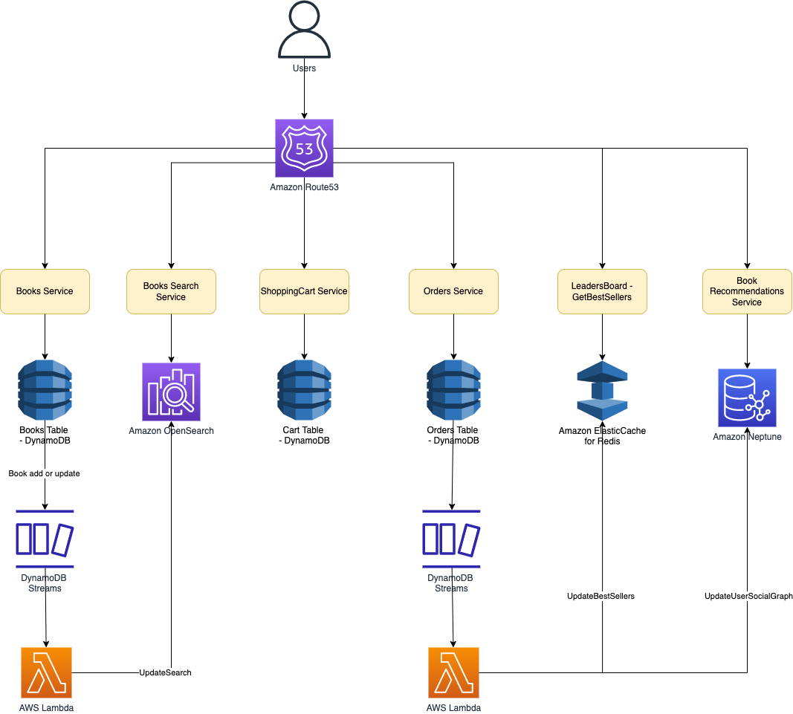

# AWS BookStore Sample App

# Tech Stack

| Service                       | Remarks                                                                                      |
|-------------------------------|----------------------------------------------------------------------------------------------|
| Amazon DynamoDB               | It stores all of the data for books, orders, and the checkout cart.                          |
| Amazon Elasticsearch          | It powers search functionality for books.                                                    |
| Amazon Neptune                | It stores information on a user's social graph and book purchases to power recommendations.  |
| Amazon ElasticCache for Redis | It powers the books leaderboard.                                                             |
| AWS Lambda                    | It updates derived data in different services like Amazon Elasticsearch, Amazon Neptune etc. |

# Read more
- [AWS bookstore sample app](https://github.com/aws-samples/aws-bookstore-demo-app)