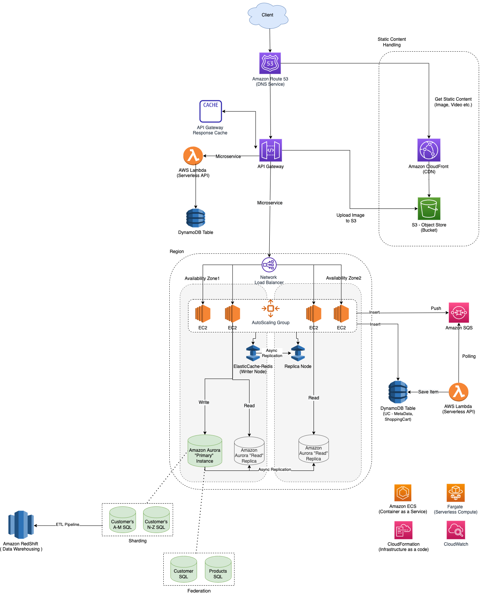

# Design a system that scales to a million of users on AWS

# Source(s) and further reading 
- [Video - Scaling up to your first 10 million users](https://www.youtube.com/watch?v=kKjm4ehYiMs)
- [Slide - Scaling Up to Your First 10 Million Users (ARC205-R1) - AWS re:Invent 2018](https://www.slideshare.net/AmazonWebServices/scaling-up-to-your-first-10-million-users-arc205r1-aws-reinvent-2018)
- [Design a system that scales to millions of users on AWS](https://github.com/donnemartin/system-design-primer/blob/master/solutions/system_design/scaling_aws/README.md)
