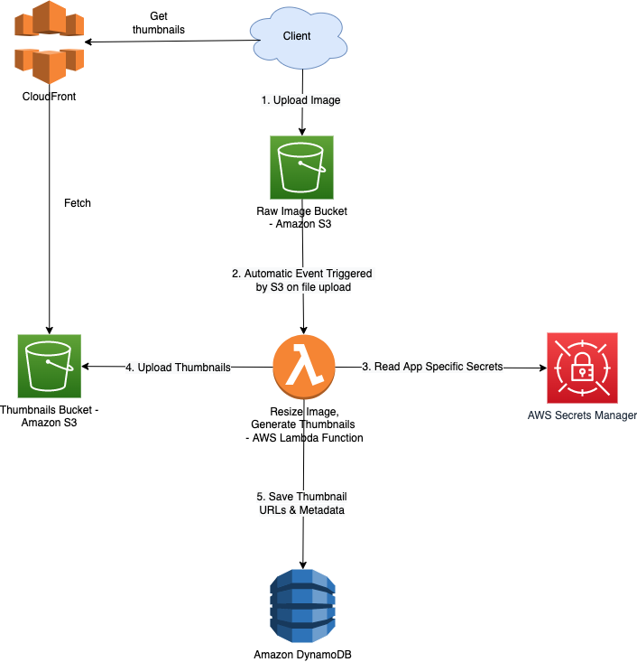

# Upload Image using Amazon S3 and Lambda

## References
- [AWS - Serverless Image Handler](https://aws.amazon.com/solutions/implementations/serverless-image-handler/)
- [Amazon S3 Event Notifications](https://docs.aws.amazon.com/AmazonS3/latest/userguide/EventNotifications.html)