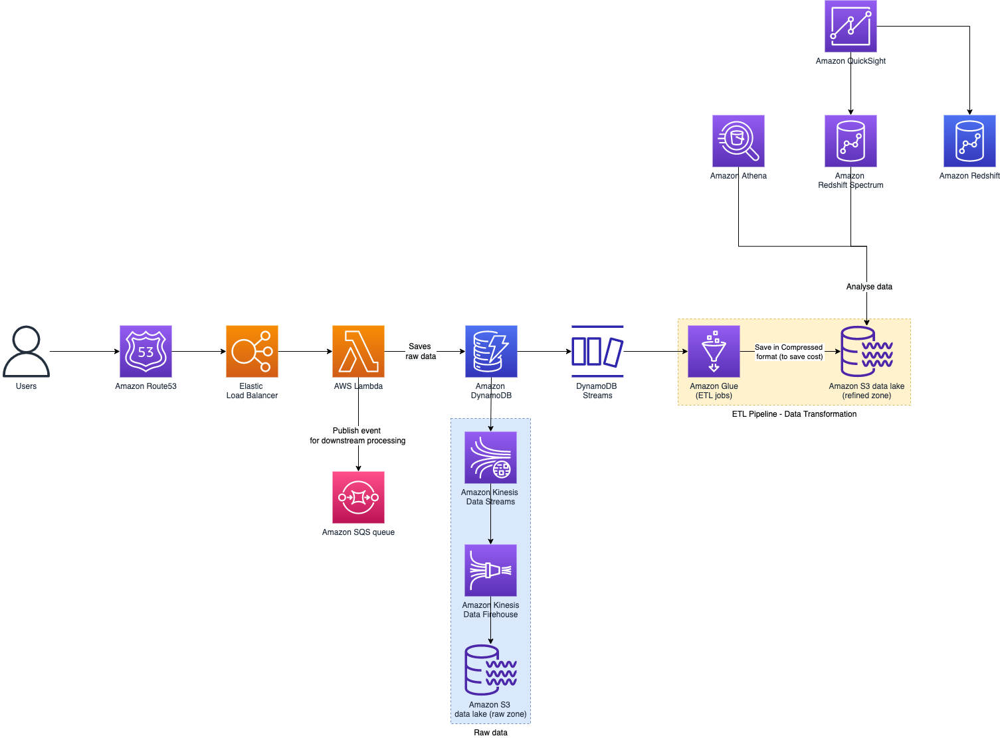

# AWS Stream Processing using Glue & S3

   

# Read more
- [AWS serverless etl and streaming demo](https://github.com/liangruibupt/glue-streaming-etl-demo)
- [7 patterns for IoT data ingestion and visualization- How to decide what works best for your use case](https://aws.amazon.com/blogs/iot/7-patterns-for-iot-data-ingestion-and-visualization-how-to-decide-what-works-best-for-your-use-case/)