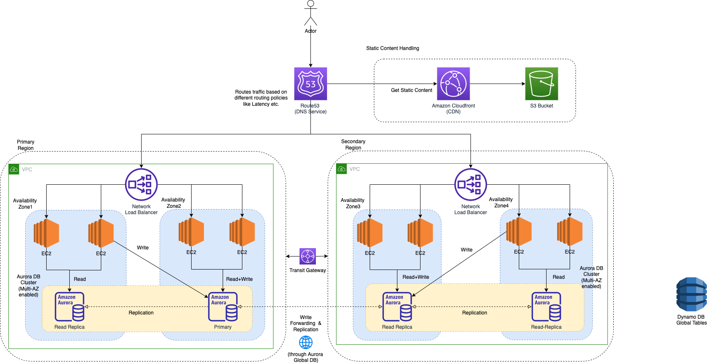

# Design Multi-Region Active-Active Architecture On AWS

# Why bother with multi-region architectures?

## Improve latency for end-users
- [Amazon CloudFront](../../1_NetworkingAndContentDelivery/AmazonCloudFront.md) can be used to speed up delivery static content (static files such as site code, HTML/CSS/JS, photos, and videos etc.) to end-users across the globe.
- Using a globally-distributed network of caching servers, static content is served as if it was local to consumers, thus improving the delivery of that static content.

However the [multi-region](../../2_AWSComponents/AWS-Global-Architecture-Region-AZ.md) backend setup might be needed for dynamic API calls.
- For example, if you have users in Europe but your backend is in US or Australia, the added latency is respectively approximately 140ms and 300ms. 
- Those delays would be unacceptable to start with for many popular games, banking requirements, or interactive applications.
  

## Disaster Recovery
- [Multi-region](../../2_AWSComponents/AWS-Global-Architecture-Region-AZ.md) setup helps in the [disaster recovery](../../1_HLDDesignComponents/0_SystemGlossaries/Reliability/FaultTolerance.md#disaster-recoveryhttpsenwikipediaorgwikidisaster_recovery).

## :star: Use local resources and avoid cross-regional calls

[Amazon Services with Cross-Region support](../../2_AWSComponents/AWS-Global-Architecture-Region-AZ.md), should be used like,
- [Amazon S3](../../2_AWSComponents/7_StorageServices/3_ObjectStorageS3/Readme.md#cross-region-supported)
- [Amazon Aurora Global Database](../../2_AWSComponents/6_DatabaseServices/AmazonRDS/AmazonAurora/AuroraGlobalDatabase.md)
- [Amazon Dynamo DB Global Tables](../../2_AWSComponents/6_DatabaseServices/AmazonDynamoDB/Readme.md)

## Business Requirements like GDPR, Localization etc.

# How to build multi-region active-active architecture in AWS?

## Reliable data replication
- Since we need to maintain [high availability and partition tolerance in CAP theorem](../../1_HLDDesignComponents/3_DatabaseComponents/1_Glossaries/CAPTheorem.md), we have to compromise consistency.
- [Eventual consistency](../../1_HLDDesignComponents/3_DatabaseComponents/1_Glossaries/Replication&Consistency/Consistency.md) would have to be done, as databases are spread across multi-regions.

## Global network infrastructure
- [AWS Regions](../../2_AWSComponents/AWS-Global-Architecture-Region-AZ.md) are connected to a private global network backbone, which provides lower cost and more consistent cross-region network latency when compared with the public internet.

## Build Stateless applications
- [Read more](../../1_HLDDesignComponents/0_SystemGlossaries/Readme.md)

## DNS routing using Amazon Route53
- [Read more](../../2_AWSComponents/1_NetworkingAndContentDelivery/1_EdgeNetworking/AmazonRoute53/Readme.md)

# Source(s) and further reading
- [How to build a multi-region active-active architecture on AWS?](https://acloudguru.com/blog/engineering/why-and-how-do-we-build-a-multi-region-active-active-architecture)
