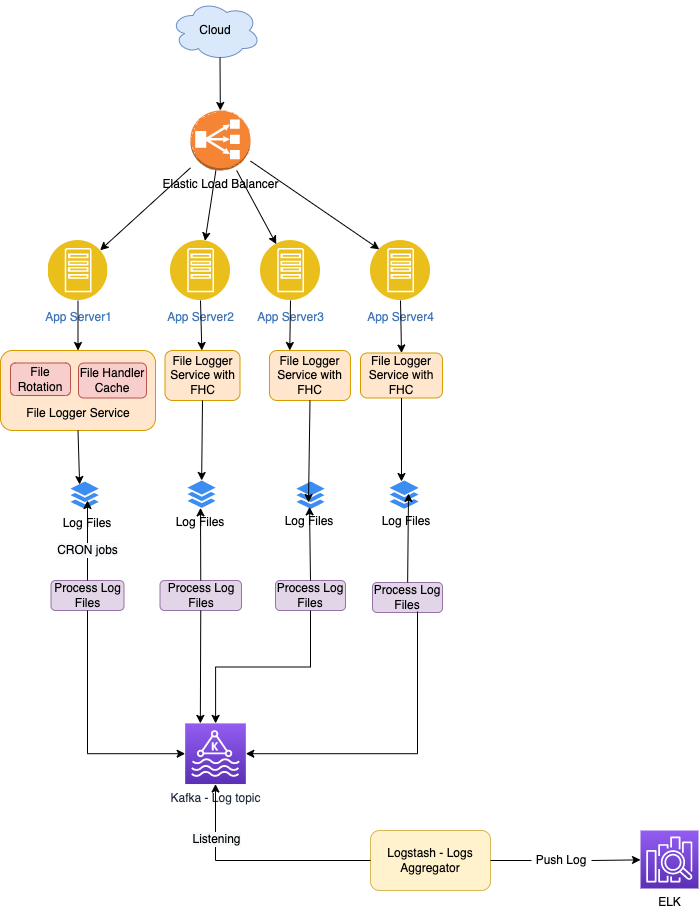

# Requirements
- Lets consider an API - http://some/api/$filename/$multibytedata
  - API Inputs - $filename, $multibytedata.
  - Check if a file is present
  - If not create a file
  - Append data to file
- Users can call this api concurrently
- Ensure consistency ( file must be saved, before return true to the API )

# Possible Options
- Live Aggregation
- Delayed Aggregation
- [FileBeat & ELK Stack](https://www.elastic.co/guide/en/beats/filebeat/current/how-filebeat-works.html)

# Important Points
- Recently opened file handles should be stored in the local app server cache

# What is the purpose of [log rotation](https://www.mezmo.com/learn-log-management/what-is-log-rotation-how-does-it-work)?
- Large file issues ( If a log file is already a terabyte at the end of the day, allowing it to grow another terabyte can create several issues. )
  - It would take a lot of disk space ( terabytes of data ) in few days itself.
  - Opening the big file would be impossible if the local device doesn't have enough memory resources.
- We would keep rotating the log files at 10KB file size. ( for best memory optimization )
- Kafka topics can be log file name.
- [Kafka Estimation](../../1_HLDDesignComponents/MessageBrokers)   
 
# Other Points
- Interview Question@FluxOn, 6thJune2022
