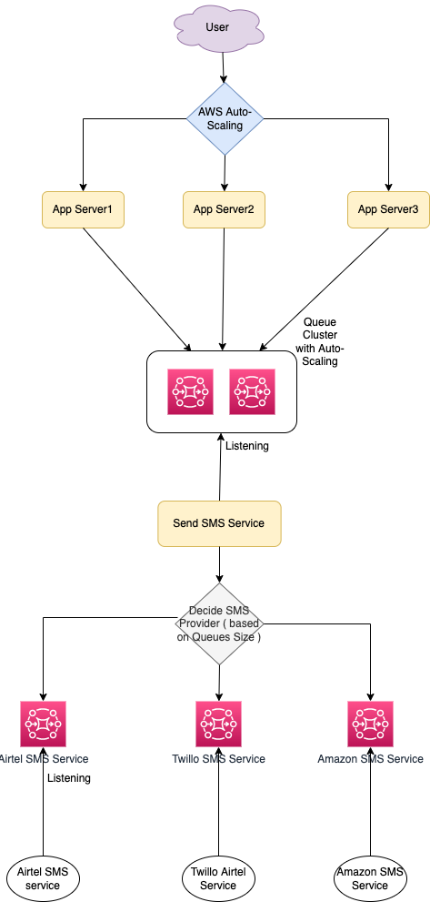

# Requirements - Notification System
- SendSMSAPI ( like OTP ) - Consider generate OTP service `A`, which client calls to get the OTP on the different mediums ( like SMS, WhatsApp etc. ).
- `A` service calls `B` service to send the notification to the user using multiple SMS providers like Twillo, Airtel etc.

# AutoScaling of App Servers
- Use `Elastic Load Balancing` ( with `AWS AutoScaling` configured )
- Or implement our own auto-scaling - Based on app server's memory usage/CPU usage, heart beat etc., we can add/delete another app server.

# Autoscaling of Message Queues
Based on Throttling, autoscaling of the queue system ( [Amazon SQS](https://aws.amazon.com/sqs/) ) can be done
- Based on number of messages in the queue, the workers can keep adding up ( with min, max configuration )
- If max configuration of workers is reached, another queue would be added in the cluster.

# How would we implement rate limiting of the SMS providers? ( follow their SLA )
- Let's assume `Twillo API` has a limit of 5000 SMS per second.
- We can achieve this either by using `Redis` ( for distributed system ) or we check the current processing queue size to handle this.

# References 
- https://docs.aws.amazon.com/autoscaling/ec2/userguide/as-using-sqs-queue.html
- https://developer.ibm.com/tutorials/auto-scale-rabbitmq-consumers-by-queue-size-on-openshift/
- Asked in GoGroup interview, 22-June-2022