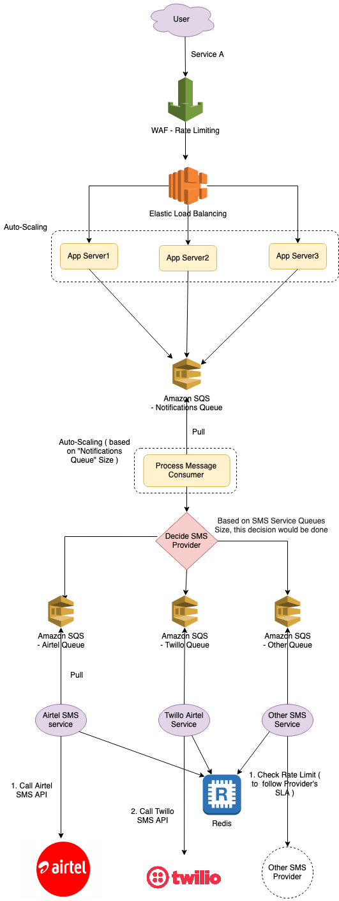

# Send-SMS-API design (App Internal Clients, Multiple SMS-Providers, AutoScaling)
- Consider there is a `Send-SMS-API` which sends SMS to the client (like OTP) 
- In Send-SMS-API, there is a `OTP service A`, which client calls to get the OTP on SMS.
- `Service A` calls `Service B`, to send the notification to the user using multiple SMS providers like Airtel, Twillo etc.

# AutoScaling

## AutoScaling of "Service A" App Servers
- Use [Elastic Load Balancing](../../2_AWSComponents/1_NetworkingAndContentDelivery/ElasticLoadBalancer.md) ( with [AWS AutoScaling](../../2_AWSComponents/4_ComputeServices/EC2/AWSEC2AutoScaling.md) configured )
- Or we can implement our own auto-scaling (i.e. delete/add another app server), based on app server's memory usage/CPU usage, heart beat etc.

## AutoScaling of "Notification queue" workers
- [Based on number of messages in the "Notifications" queue](https://docs.aws.amazon.com/autoscaling/ec2/userguide/as-using-sqs-queue.html) (like [Amazon SQS](../../2_AWSComponents/5_MessageBrokerServices/AmazonSQS.md)), the workers can keep on scaling up & scaling down ( with min, max configuration ).

# How would we implement rate limiting of the 3rd party SMS providers? ( & follow their SLA )
- Let's assume `Twillo API` has a limit of 5000 SMS per second.
- We can achieve this either by using `Redis` ( for distributed system ) or we check the current processing queue size to handle this.
- [To understand more about Rate Limiting, check here](../RateLimiterAPI)

# References
- [Scaling based on Amazon SQS](https://docs.aws.amazon.com/autoscaling/ec2/userguide/as-using-sqs-queue.html)
- [Auto-scale message consumers by RabbitMQ queue size](https://developer.ibm.com/tutorials/auto-scale-rabbitmq-consumers-by-queue-size-on-openshift/)
- [API Throttling and Rate Limiting](https://mytechblogs.medium.com/api-throttling-and-rate-limiting-4835ce901857)
- Asked in GoGroup interview, 22-June-2022