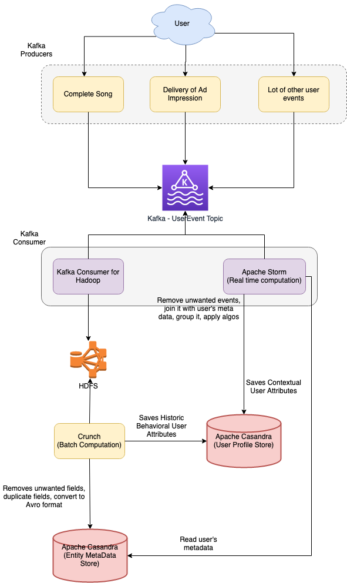

# Why Casandra?

## Scale Horizontally
- [Casandra scales horizontally](../../1_HLDDesignComponents/3_DatabaseComponents/ApacheCasandra.md#scale-horizontally)

## Low Latency, Fast Writes
- [Casandra offers low-latency with fast writes](../../1_HLDDesignComponents/3_DatabaseComponents/ApacheCasandra.md#low-latency-fast-writes)
- In fact in our usage of Cassandra for personalization, writes are typically an order of magnitude faster than reads.

## Support replication – preferably cross-site ( EU data center and NA data center)
- [Casandra supports cross-site replication](../../1_HLDDesignComponents/3_DatabaseComponents/ApacheCasandra.md#support-replication---cross-site-data-centers)
   
## Others  
- Have the ability to load bulk and streaming data from Crunch and Storm respectively
- Have a decent ability to model different data schemas for different use-cases of entity metadata since we didn’t want to invest in yet another solution for EMS as that would have increased our operational cost.
- [Casandra supports bulk-support replication](../../1_HLDDesignComponents/3_DatabaseComponents/ApacheCasandra.md#good-integration-with-open-source-softwares-like-hadoop-spark-hive-hdfs-etc)

# Casandra Column Families

```sql
CREATE TABLE entitymetadata (
entityid text,
featurename text,
featurevalue text,
PRIMARY KEY (entityid, featurekey)
)

CREATE TABLE userprofilelatest (
userid text,
featurename text,
featurevalue text,
PRIMARY KEY (userid, featurename)
)
```

# Reference
- [Personalization at Spotify using Cassandra](https://engineering.atspotify.com/2015/01/personalization-at-spotify-using-cassandra/)