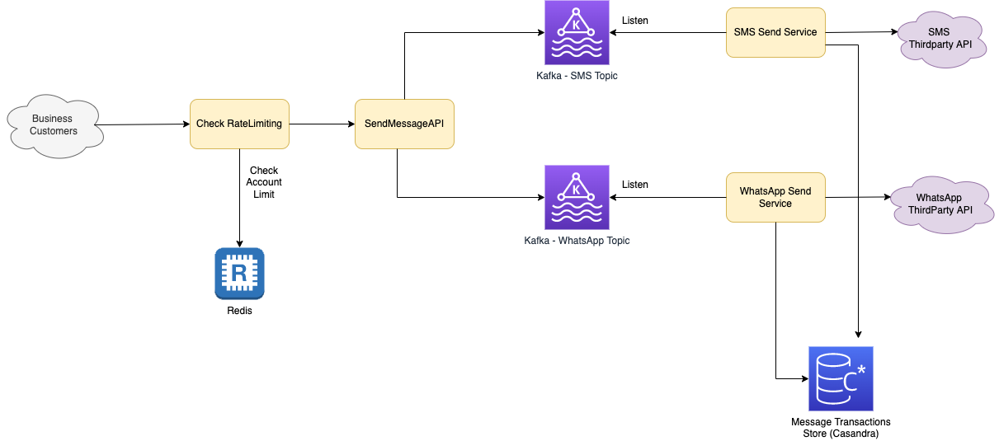

# Introduction
- Design Twillo API - Message platform for business.
- Different plans - Basic, Paid etc.

# Requirements - Basic Plan
- 1000 free messages
- X amount per whatsapp
- Y amount per sms
- 1000 transactions limit per second per team

# Tech Stack

| Service                       | Remarks                                                                                                                                                            |
|-------------------------------|--------------------------------------------------------------------------------------------------------------------------------------------------------------------|
| Kafka - Data Streaming        | [Kafka](../../1_HLDDesignComponents/4_MessageBrokers/Kafka/Readme.md) can be used for the data streaming, to store & process the messages.                         |
| Kafka - Topics                | There would be 2 different topics (in [Kafka](../../1_HLDDesignComponents/4_MessageBrokers/Kafka/Readme.md)) for SMS, WhatsApp message types etc.                  |
| Kafka - Estimation            | [How to decide number of partitions in Kafka?](../../1_HLDDesignComponents/4_MessageBrokers/Kafka/KafkaEstimations.md)                                             |
| Redis - Rate Limiting         | [To understand more about Rate Limiting, check here](../RateLimiterAPI)                                                                                            |
| Casandra - Messages Datastore | [Casandra](../../1_HLDDesignComponents/3_DatabaseComponents/NoSQL-Databases/ApacheCasandra.md) can be used to store messages (from logging, auditing perspective). |

# DB Design

## Plan
- Label - Basic, Pro, Business
- FreeMessages limit
- SMS
- WhatsApp

## Teams
- id_team
- name

## Teams_Active_Plan
- id_team
- current_plan
- start_date
- end_date
- updated_at
- created_at
- current_free_count => 0

## Teams_Historical_Data
- History

## Transactions
- id_team
- Timestamp
- Message Type
- Billing Amount
    
# References
- [Messaging Architecture for Independent Software Vendors (ISVs)](https://www.twilio.com/blog/messaging-architecture-independent-software-vendors)
- [Stripe - Scaling your API with rate limiters](https://stripe.com/blog/rate-limiters)
