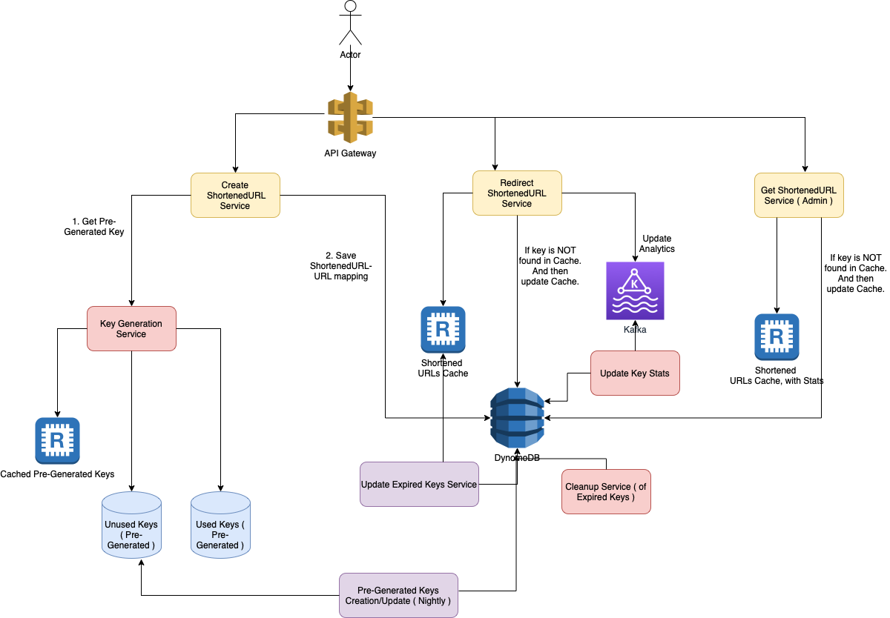

# Functional Requirements
- Shortening: Take a url and return a much shorter url. Ex: http://www.interviewbit.com/courses/programming/topics/time-complexity/ => http://goo.gl/GUKA8w/
- Redirection: Take a short url and redirect to the original url.
Ex: http://goo.gl/GUKA8w => http://www.interviewbit.com/courses/programming/topics/time-complexity/"
- Custom url: Allow the users to pick custom shortened url.
Ex: http://www.interviewbit.com/courses/programming/topics/time-complexity/ => http://goo.gl/ib-time"
- Analytics: Usage statistics for site owner.
Ex: How many people clicked the shortened url in the last day?
Gotcha: What if two people try to shorten the same URL?

# Non-Functional Requirements
- The system should be highly available. This is required because, if our service is down, all the URL redirections will start failing.
- URL redirection should happen in real-time with minimal latency.
- Shortened links should not be guessable (not predictable).

# Estimation
- [Tiny URL Estimation](https://docs.google.com/spreadsheets/d/15vApko2QrmZmv5qTEIyU_IAWvgY3MD23TR3TuLUiPc8/edit#gid=1712068460)

# Read vs Writes - URL Shortening is a read-heavy
- [URL Shortening Service]() is a read-heavy system - `100:1` ratio between read and write.
- There will be lots of redirection requests compared to new URL shortenings.
- Let’s assume a 100:1 ratio between read and write.

# High Level Design

# REST APIs
- `createURL(api_dev_key, original_url, custom_alias=None, user_name=None, expire_date=None)`
- `deleteURL(api_dev_key, url_key)`
- `RedirectionAPI(hash) {redirect_to url_mapping[hash]}

# How do we detect and prevent abuse? 
- To prevent abuse, we can limit users via their `api_dev_key`.
- Each `api_dev_key` can be limited to a certain number of URL creations and redirections per some time period (which may be set to a different duration per developer key).

# Database Schema

## URL table
- Hash (PK)
- Original URL
- Creation Date
- Expiration Date
- User ID

# Users-Table
- Name
- Email
- DateOfBirth
- CreationDate
- LastLogin

# Which database to use? - SQL vs NoSQL
- [NoSQL](../../1_HLDDesignComponents/3_DatabaseComponents/ReadMe.md) can be used here since we are anticipating a billion of rows & no relationship is needed between rows.
- Read more about [NoSQL vs SQL](../../1_HLDDesignComponents/3_DatabaseComponents/ReadMe.md).

# Cache frequently accessed URLs
- We can cache URLs that are frequently accessed. (with `LRU - Least Recently Used` policy)
- We can use any off-the-shelf solution like [Redis](../../1_HLDDesignComponents/3_DatabaseComponents/In-Memory-Cache/Redis/Readme.md), which can store full URLs with their respective hashes.
- Thus, the application servers, before hitting the backend storage, can quickly check if the cache has the desired URL.

# Key Generation Service
- Whenever we want to shorten a URL, we will take one of the already-generated keys `UnusedKeys` and use it ( & move it to `UsedKeys` table )
- Not only are we not encoding the URL, but we won’t have to worry about `duplications or collisions`.

## Database Tables
KGS can use two tables to store keys:
- `Unused keys` - One for keys that are not used yet
- `Used keys` - One for all the used keys

## Cache Memory - Redis
- `KGS` can always keep some keys in memory ([Redis](../../1_HLDDesignComponents/3_DatabaseComponents/In-Memory-Cache/Redis/Readme.md)) to quickly provide them whenever a server needs them.
- As soon as `KGS` loads some keys in memory, those would be marked it can move them to the `used keys` table.

## Concurrency Issues
- `KGS` also has to make sure NOT to give the same key to multiple servers.
- Hence, it must `synchronize (or get a transaction lock on)` the Redis data structure, holding the keys before removing keys from it and giving them to a server.

## How can each cache replica be updated?
- Whenever there is a cache miss, our servers would be hitting a backend database.
- Whenever this happens, we can update the cache and pass the new entry to all the cache replicas.
- Each replica can update its cache by adding the new entry. If a replica already has that entry, it can simply ignore it.

# Hash-Based Partitioning
In this scheme, we take a hash of the object we are storing.
- We then calculate which partition to use based upon the hash.
- In our case, we can take the hash of the ‘key’ or the short link to determine the partition in which we store the data object.

This approach can still lead to overloaded partitions, which can be solved using [Consistent Hashing](../../1_HLDDesignComponents/0_SystemGlossaries/Database/ConsistentHashing.md).

# Open Question
- How to improve latency of write operation? 
  - Instead of 2, we should have 1 database call? 
  - What if Redis goes down?

# Cleanup Service
- If we chose to continuously search for expired links to remove them, it would put a lot of pressure on our database. 
- Instead, we can slowly remove expired links and do a lazy cleanup. 
- Our service will ensure that only expired links will be deleted, although some expired links can live longer but will never be returned to users.

# Telemetry/Analytics
Some statistics worth tracking:
- country of the visitor,
- date and time of access,
- web page that referred the click,
- browser, or platform from where the page was accessed.

# Load Balancer
- We can add a Load balancing layer at three places in our system:
- Between Clients and Application servers
- Between Application Servers and database servers
- Between Application Servers and Cache servers

# Security and Permissions
- We can store the permission level (public/private) with each URL in the database.
- We can also create a separate table to store UserIDs that have permission to see a specific URL.

# Should we choose Consistency or Availability for our service?
- This is a tricky one. Both are extremely important. However, CAP theorem dictates that we choose one. Do we want a system that always answers correctly but is not available sometimes? Or else, do we want a system which is always available but can sometime say that a URL does not exists even if it does?
- This tradeoff is a product decision around what we are trying to optimize. Let's say, we go with consistency here.

# How should we compute the hash of a URL?
- We can use a list of salts in case of collision.
- For each read request, we can compute all possible shortened URLs using our list of salts and query for them in parallel to save time.

# How would you shard the data if you were working with SQL DB?
- We can use integer encoding of the shortened URL to distribute data among our DB shards.
- Assuming we assign values from 0 to 61 to characters a to z, A to Z, and 0 to 9, we can compute the integer encoding of the shortened URL.
- We can see that the maximum value of integer encoding will be less than 10^13, which we can divide among our DB shards.
- We will use consistent hashing to ensure we don't have to rehash all the data again if we add new DB shards later.

## References
- [Groking the System Design](https://www.educative.io/courses/grokking-modern-system-design-interview-for-engineers-managers/m753voqPO4O)
- [System Design : Scalable URL shortener service like TinyURL](https://medium.com/@sandeep4.verma/system-design-scalable-url-shortener-service-like-tinyurl-106f30f23a82)