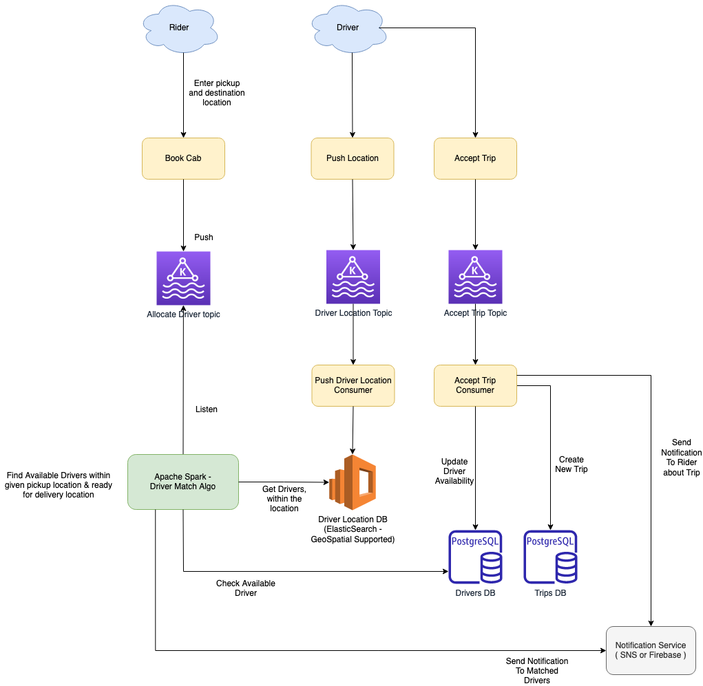

# Uber Driver Allocation - Design Problem
Design driver allocation to riders in an Uber-like system
- Assume many riders and drivers are using the system in parallel
- Various solutions and their trade-offs
- What happens when traffic increases?
- Components/ services required

# Stats
- The goal for Uber’s geospatial index is a million write per second.
- Many multiples of that for reading.
- The dispatch system has thousands of nodes.

# User Actors
There are two types of users in our system
- Driver 
- Rider

# Requirements and Goals of the System
- Drivers need to regularly notify the service about their current location and their availability to pick passengers.
- Passengers get to see all the nearby available drivers.
- Customer can request a ride; nearby drivers are notified that a customer is ready to be picked up.
- Once a driver and a customer accept a ride, they can constantly see each other’s current location until the trip finishes.
- Upon reaching the destination, the driver marks the journey complete to become available for the next ride.

# Use Cases

## Rider - Book Cab
- Enter Pick the location, destination location & click `Continue`
- Search Cab service would publish message to [Search Driver Kafka topic](../../1_HLDDesignComponents/4_MessageBrokers/Kafka.md).
- Consumer would consume from [Allocation Driver Kafka topic](../../1_HLDDesignComponents/4_MessageBrokers/Kafka.md).
- [Driver Match Algo](#star-driver-match-algo) to find riders for the given `{rider, pickup, drop}` location msg.
- Match the rider pick location with the corresponding location in `DriverLocationDB`.
- Push the notification to the matched drivers.
- If one of them accepts the trip, then we will create `TripsDB` record. 
- And notify the rider through push notification.

## Driver - Push Location
- Push the current location via [Driver Location Kafka topic](../../1_HLDDesignComponents/4_MessageBrokers/Kafka.md) ([high throughput](../../1_HLDDesignComponents/0_SystemGlossaries/LatencyThroughput.md)).
- Consumer would consume from [Kafka](../../1_HLDDesignComponents/4_MessageBrokers/Kafka.md) & then push to [ElasticSearch (Geospatial supported)](../../1_HLDDesignComponents/3_DatabaseComponents/Search-Engines/ElasticSearch#geospatial-support).

## :star: Driver Match algo
- Area filter
- Availability of driver (not available, busy, schedule)
- [Dispatch System - Location estimate?](#dispatch-system---using-google-s2-library)
  - Distance - High performance intensive (between pickup)
- Special - Give preference ( top-rated drivers ) to the premium riders
- filtered drivers, can be done on the end.

### Dispatch System - Using Google S2 Library

The dispatch system completely works on maps and location data/GPS, so the first thing which is important is to model our maps and location data.
- Earth has a spherical shape, so it’s difficult to do summarization and approximation by using latitude and longitude. 
- To solve this problem Uber uses the [Google S2 library](https://s2geometry.io/). 
- This library divides the map data into tiny cells (for example 3km) and gives the unique ID to each cell. 
- This is an easy way to spread data in the distributed system and store it easily.
- S2 library gives coverage for any given shape easily. 

Suppose you want to figure out all the supplies available within a 3km radius of a city. 
- `Using the S2 libraries you can draw a circle of 3km radius, and it will filter out all the cells with IDs that lie in that particular circle`. 
- This way you can easily match the rider to the driver, and you can easily find out the number of cars(supply) available in a particular region.

## Multiple driver accepting trip
- Lets say `L Location is requested & 10 drivers are present`.
- Lock `TripsDB` record so only one driver accepts the trip.
- If locked/ trip accepted, notify other 9 drivers something.

# DB Schemas

## TripsDB - RDBMS
- id_rider
- id_driver
- pick_location
- destination_location
- estimated time
- estimated fare
- current_status
- payment_mode
- id_payment

## DriverLocationDB - ElasticSearch GeoSpatial DB
- location : [{driver, timestamp}]
- Retaining last x mins of info ( i.e. `TTL` config)

## GeoDB cache Redis (less accurate but fast)
- location to driver

# How to scale the system?
- AutoScale the instances using AWS AutoScaling group.

# References
- [System Design of Uber App – Uber System Architecture](https://www.geeksforgeeks.org/system-design-of-uber-app-uber-system-architecture/)
- [Scaling Uber’s Elasticsearch as an Geo-Temporal Database](https://qconlondon.com/ln2018/system/files/presentation-slides/qcon-london-2018-pdf.pdf)
- [codeKarle - Uber System Design | Ola System Design | System Design Interview Question - Grab, Lyft](https://www.youtube.com/watch?v=Tp8kpMe-ZKw)
- [How Uber Scales Their Real-Time Market Platform](http://highscalability.com/blog/2015/9/14/how-uber-scales-their-real-time-market-platform.html)
- [Uber Backend Design - Educative.io](https://www.educative.io/blog/uber-backend-system-design)
