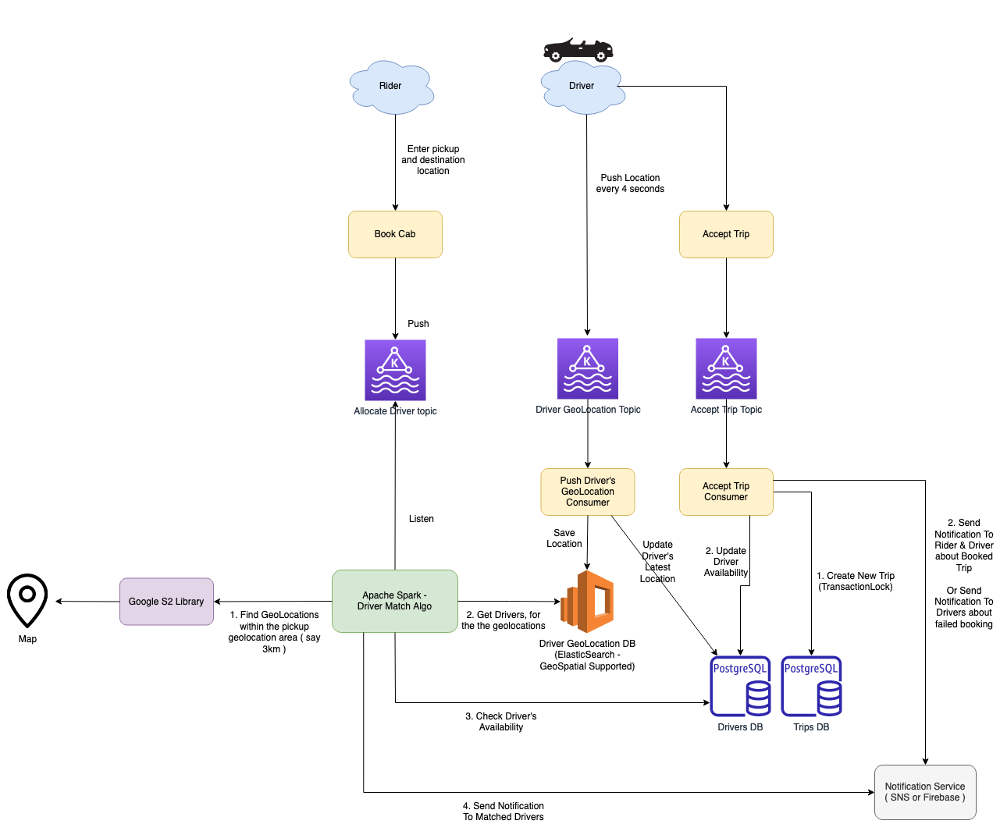

# Uber Driver Allocation - Design Problem

Design driver allocation to riders in an Uber-like system
- Assume many riders and drivers are using the system in parellel
- Various solutions and their trade-offs
- What happens when traffic increases?
- Components/ services required

# User Actors
- Rider
- Driver

# Use Cases

## Rider - Book Cab
- Enter Pick the location, destination location & click `Continue`
- `Search Cab` service would publish message to [Search Driver Kafka topic](../../1_HLDDesignComponents/4_MessageBrokers/Kafka.md).
- Consumer would consume from [Allocation Driver Kafka topic](../../1_HLDDesignComponents/4_MessageBrokers/Kafka.md).
- [Driver Match Algo](#star-driver-match-algo) to find riders for the given `{rider, pickup, drop}` location msg.
- Match the rider pick location with the corresponding location in `DriverLocationDB`.
- Push the notification to the matched drivers.
- If one of them accepts the trip, then we will create `TripsDB` record. 
- And notify the rider through push notification.

## Driver - Push Location
- Push the current location via [Driver Location Kafka topic](../../1_HLDDesignComponents/4_MessageBrokers/Kafka.md) ([high throughput](../../1_HLDDesignComponents/0_SystemGlossaries/LatencyThroughput.md)).
- Consumer would consume from [Kafka](../../1_HLDDesignComponents/4_MessageBrokers/Kafka.md) & then push to [ElasticSearch (Geospatial supported)](../../1_HLDDesignComponents/3_DatabaseComponents/NoSQL-Databases/ElasticSearch#geospatial-support).

## :star: Driver Match algo
- Area filter
- Availability of driver (not available, busy, schedule)
- Location estimate?
  - Distance - High performance intensive (between pickup)
- Special - Give preference ( top-rated drivers ) to the premium riders
- filtered drivers, can be done on the end

## Multiple driver accepting trip
- location L requested - 10 drivers are present
- Lock `TripsDB` record so only one driver accepts the trip.
- If locked/ trip accepted, notify other 9 drivers something.

# DB Schemas

## TripsDB - RDBMS
- id_rider
- id_driver
- pick_location
- destination_location
- estimated time
- estimated fare
- current_status
- payment_mode
- id_payment

## DriverLocationDB - ElasticSearch GeoSpatial DB
- location : [{driver, timestamp}]
- Retaining last x mins of info ( i.e. `TTL` config)

## GeoDB cache Redis (less accurate but fast)
- location to driver

# How to scale the system?
- AutoScale the instances using AWS AutoScaling group.

# References
- [Uber Backend Design - Educative.io](https://www.educative.io/blog/uber-backend-system-design)
- [System Design of Uber App – Uber System Architecture](https://www.geeksforgeeks.org/system-design-of-uber-app-uber-system-architecture/)
- [How Uber Scales Their Real-Time Market Platform](http://highscalability.com/blog/2015/9/14/how-uber-scales-their-real-time-market-platform.html)