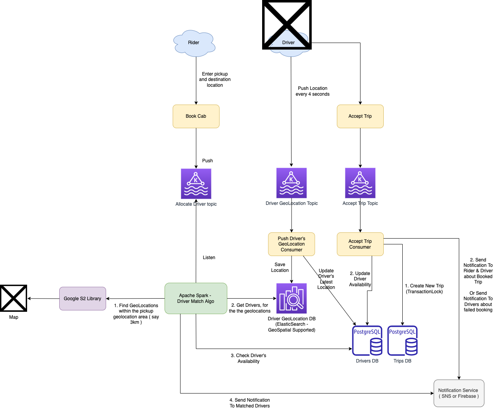

# Driver Allocation System Design - Uber, Ola, Lyft, Grab etc.

[Read more](DriverAllocationDesignProblem.md)

# Real-world Systems

|       | Remarks                                                          |
|-------|------------------------------------------------------------------|
| Uber  | [Uber](../../4_TechStacksRealWorld/Uber)                         |
| GoJek | [GoJek TechStack](../../4_TechStacksRealWorld/GoJekTechStack.md) |

# Read more
- [Service-Oriented Architecture: Scaling the Uber Engineering Codebase As We Grow](https://www.uber.com/en-IN/blog/service-oriented-architecture/)
- [Uber System Design | Ola System Design | System Design Interview Question - Grab, Lyft](https://www.youtube.com/watch?v=Tp8kpMe-ZKw)

