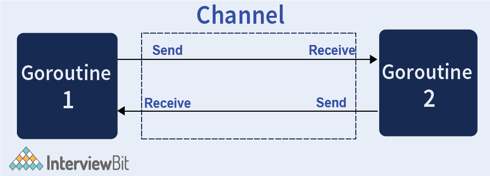

# Concurrency
- Go provides very good support for concurrency using `Go Routines or channels`.
- They take advantage of efficient memory management strategies and multicore processor architecture for implementing concurrency.

# Difference between concurrent and parallelism in Golang
- Concurrency is when your program can handle multiple tasks at once while parallelism is when your program can execute multiple tasks at once using multiple processors.
- In other words, concurrency is a property of a program that allows you to have multiple tasks in progress at the same time, but not necessarily executing at the same time. Parallelism is a runtime property where two or more tasks are executed at the same time.

# What are Go channels and how are channels used in Golang?



[Read more](https://www.geeksforgeeks.org/channel-in-golang/)

## Create Channel

```go
var channel_name chan Type

OR 

channel_name:= make(chan Type)
```

## Send data to Channel

```go
channel_name <- element // Send data

element := <-Mychannel // Receive data
```

# References
- [Crack the top 50 Golang interview questions](https://www.educative.io/blog/50-golang-interview-questions)