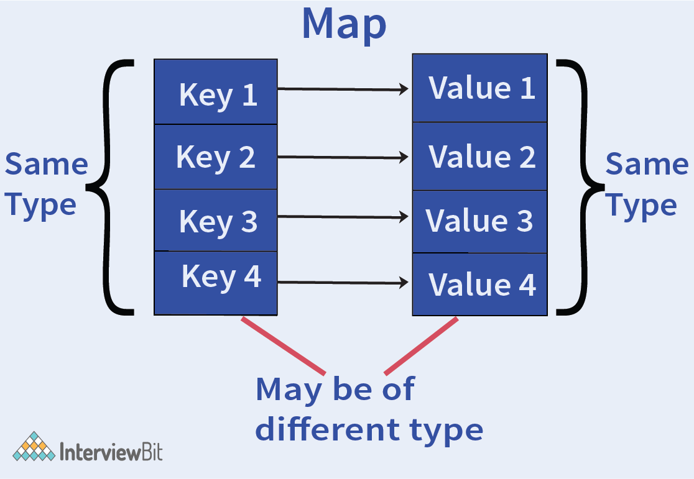

# What is Golang?
- Go is a high level, general-purpose programming language that is `very strongly and statically typed` by providing support for garbage collection and [concurrent programming](ConcurrencyGo.md). 
- :star: [Go Coding Helpers & Guidelines](CodingHelpers&GuidelinesGo.md)
- In Go, the programs are built by using `packages that help in managing the dependencies efficiently`. 
- It also uses a compile-link model for generating executable binaries from the source code.
- Go technically is [pass by value](https://stackoverflow.com/questions/47296325/passing-by-reference-and-value-in-go-to-functions)
- Go is a [case-sensitive language](https://en.wikipedia.org/wiki/Case_sensitivity).

# :star: Why is Golang fast compared to other languages?
- Golang is faster than other programming languages because of its simple and efficient memory management and [concurrency model](ConcurrencyGo.md).
- The compilation process to machine code is very fast and efficient.
- Additionally, the dependencies are linked to a `single binary file thereby putting off dependencies on servers`.

# Important Features

| Title                                                                                          | Remarks |
|------------------------------------------------------------------------------------------------|---------|
| [Slices in GoLang](SlicesGo.md)                                                                | -       |
| [Pointers in GoLang](PointersGo.md)                                                            | -       |
| [OOPs in GoLang](OOPsGo.md)                                                                    | -       |
| [Concurrency in GoLang](ConcurrencyGo.md)                                                      | -       |
| [Coding Helpers & Guidelines in GoLang](CodingHelpers&GuidelinesGo.md)                         | -       |
| [DB Transaction in GoLang](DBTransactionGo.md)                                                 | -       |

# Why does Go have type parameters?
- Type parameters permit what is known as [generic programming]((https://go.dev/doc/faq#overloading)), in which functions and data structures are defined in terms of types that are specified later, when those functions and data structures are used.
- For example, they make it possible to write a function that returns the minimum of two values of any ordered type, without having to write a separate version for each possible type.

# What are the advantages of Golang over other languages?

## Simple and Understandable
- Go was developed by keeping simplicity, maintainability and readability in mind.

## Standard Powerful Library
- Go supports all standard libraries and packages that help in writing code easily and efficiently.

## Support for concurrency
- Go provides very good support for [concurrency using  Go Routines or channels](ConcurrencyGo.md).
- They take advantage of efficient memory management strategies and multi-core processor architecture for implementing concurrency.
- Go has first-class supports for Concurrency having the ability to use [multi-core processor architectures](ConcurrencyGo.md) to the advantage of the developer and utilize memory efficiently.

## Static Type Checking
- Go is a very strong and statically typed programming language.
- This ensures that the `code is type-safe and all type conversions are handled efficiently`. 
- This is done for reducing the chances of errors at runtime.

## Easy to install binaries
- Go provides support for generating binaries for the applications with all required dependencies.

## Good Testing Support
- Go has good support for `writing unit test cases` along with our code. 
- There are libraries that support checking code coverage and generating code documentation.

# What are Golang packages?
- The package is declared at the top of the Go source file as `package <package_name>`.
- The packages can be imported to our source file by writing: `import <package_name>`.


# How to build and install Go Programs?

| Title                                   | Command                                                                                                                                         | Remarks |
|-----------------------------------------|-------------------------------------------------------------------------------------------------------------------------------------------------|---------|
| Test Go Program                         | go run <goFileName.go>                                                                                                                          | -       |
| Test a folder with go programs          | go run .                                                                                                                                        |
| Create a Go Module to build a Go Binary | go mod init <moduleName>                                                                                                                        | -       |
| Creating Go Binaries                    | go build // Build with the same name as moduleName in pwd directory<br/><br/>go build -o bin/hello // Build with "hello" name in bin/ directory | -       |
| Run Go Binaries                         | ./moduleName                                                                                                                                    | -       |
| Installing Go Programs                  | go install // This will build the binary and place it in $GOPATH/bin.                                                                           | -       |

[Read more](https://www.digitalocean.com/community/tutorials/how-to-build-and-install-go-programs)

# What do you understand by Golang string literals?
- String literals are those variables storing string constants that can be a single character or that can be obtained as a result of the concatenation of a sequence of characters. 
- Go provides two types of string literals - Raw & Interpreted string literals.

## Raw string literals

```go
`interviewbit`
```

## Interpreted string literals

```go
"Interviewbit
Website"
```

# What is the syntax used for the for loop in Golang?

```go
for [condition |  ( init; condition; increment ) | Range]  
{  
statement(s);  
//more statements
}  
```

# What do you understand by the scope of variables in Go?

## Local variables
- These are declared inside a function or a block and is accessible only within these entities.

## Global variables
- These are declared outside function or block and is accessible by the whole source file.

#  Is it possible to return multiple values from a function in Go?

```go

package main
import (
	"fmt"
)

func reverseValues(a,b string)(string, string){
    return b,a    //notice how multiple values are returned
}

func main(){
    val1,val2:= reverseValues("interview","bit")    // notice how multiple values are assigned
    fmt.Println(val1, val2)
}
```

# Is it possible to declare variables of different types in a single line of code in Golang?

```go
var a,b,c= 9, 7.1, "interviewbit"
```

# How can we check if the Go map contains a key?



```go
if val, isExists := map_obj["foo"]; isExists {
    //do steps needed here
}
```

# Can you format a string without printing?

```go
return fmt.Sprintf ("Size: %d MB.", 50)
```

# What do you understand by Type Assertion in Go?
- Type casting of the generic interface to the specific type, is done like `.(SpecificTypeObj)`.

```go
t := i.(T)
```

# Others
- [Panic](https://golangbot.com/panic-and-recover/) is like exception in GoLang.
- [How to write unit tests in GoLang?](https://blog.alexellis.io/golang-writing-unit-tests/)
- [Labels in Go](https://medium.com/golangspec/labels-in-go-4ffd81932339)
- [Custom Errors](https://golangbot.com/custom-errors/)

# References
- [Golang Interview Questions](https://www.interviewbit.com/golang-interview-questions/)