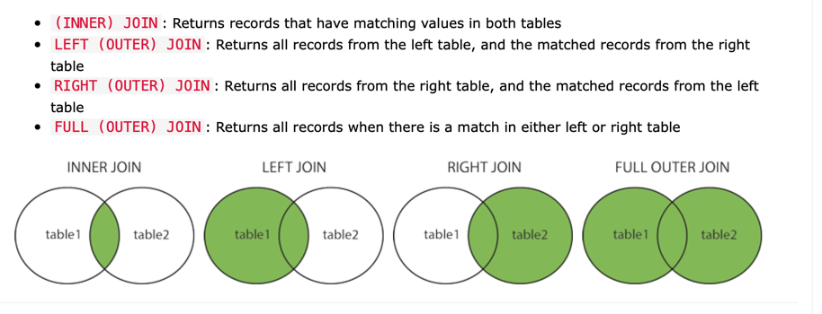

# Different Types of joins



[Read more](https://www.w3schools.com/sql/sql_join.asp)

# Having Clause

```sql
SELECT COUNT(CustomerID), Country
FROM Customers
GROUP BY Country
HAVING COUNT(CustomerID) > 5;
```
[Read more](https://www.w3schools.com/sql/sql_having.asp)

# Postgres Aggregate
- The [PostgreSQL ARRAY_AGG()](https://www.postgresqltutorial.com/postgresql-aggregate-functions/postgresql-array_agg/) function is an aggregate function that accepts a set of values and returns an array in which each value in the set is assigned to an element of the array.
- `@>` is the [contains operator](https://stackoverflow.com/questions/36985926/what-does-the-operator-in-postgres-do) in the SQL query in postgres.

# Postgres function
- A [PostgreSQL function or a stored procedure](https://www.javatpoint.com/postgresql-functions) is a set of SQL and procedural commands such as declarations, assignments, loops, flow-of-control etc. stored on the database server and can be involved using the SQL interface. 
- And it is also known as PostgreSQL stored procedures.

````sql
CREATE FUNCTION insertListOrdered1(sampleiUUDs1 UUID[], sampleID int, startOrder int)
	RETURNS void AS $$
  DECLARE
  	counter INTEGER := startOrder;
  	arow record;
 		foo varchar(50);
  BEGIN
  	for arow in select sample_id FROM sampleiID JOIN unnest(sampleiUUDs1) WITH ORDINALITY t(uuid, ord) USING (uuid) ORDER BY t.ord
		 loop
				INSERT INTO tags_illustration_links (sampleID, priority, sampleiID) VALUES (sampleID, counter, arow.sampleiID);
    	counter:=counter+1;
		 end loop;
   END;
$$ LANGUAGE plpgsql;

select insertListOrdered1(‘{123-123}’, 51, 0);
````
