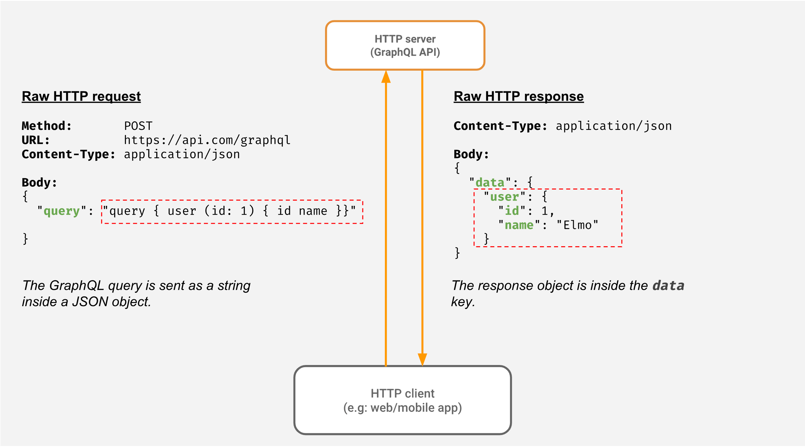

# [GraphQL](https://graphql.org)
- Dynamically get the data columns as needed.
  - Client has control of what data it needs from server?
- GraphQL is schema less
- `GraphQL is faster than REST` because as you can pick the fields you want to query, so the request will always be the smallest possible. 
- Additionally, with GraphQL, you can enquire multiple entities in one request, and because less bits will be transferred over the wire so your projects will perform faster than while using REST.

# [GraphQL with ElasticSearch](https://blog.smartive.ch/graphql-and-elasticsearch-a-love-letter-9ed64d5c094)
- There are several libraries which expose the full Elasticsearch API as a GraphQL API. 
- But like traditional REST APIs with Elasticsearch Backends, we mostly don’t want to expose all the possibilities which the `Elasticsearch Query Language` offers to the end users.
- At the end we have a GraphQL API running on two NodeJS nodes and two Elasticsearch nodes, serving up to `5000rpm in a 50ms`.

## Denormalize Datasource in ElasticSearch for Improved Performance

# References
- [GraphQL vs REST APIs | What's the Best Kind of API?](https://www.youtube.com/watch?v=F0_pkxQMZnc)