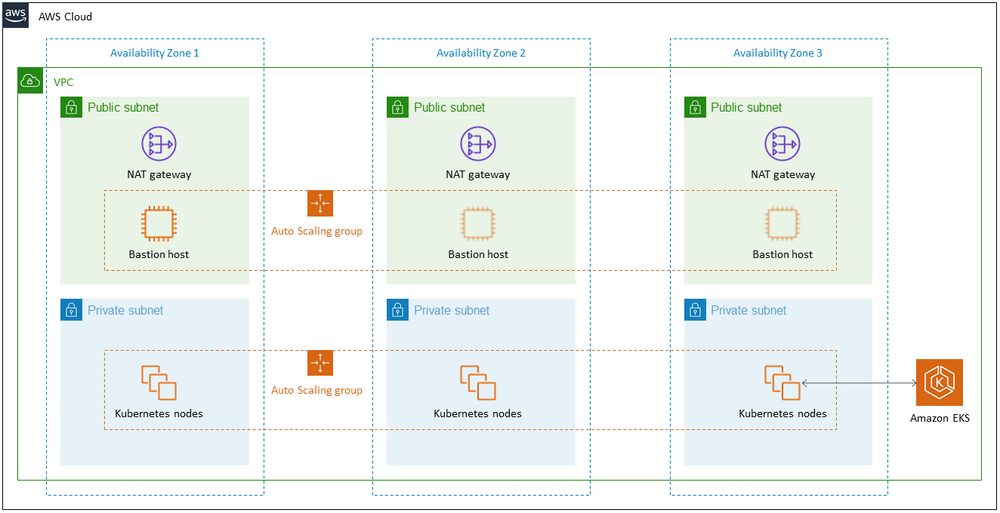

# [Amazon EKS - Amazon Elastic Kubernetes Service](https://aws.amazon.com/eks/)
- Amazon Elastic Kubernetes Service (Amazon EKS) is a `managed container service` to run and scale [Kubernetes](../../DevOps/Kubernates.md) applications in the cloud or on-premises.
- [EKS cluster for EC2 instances - Cloudformation template](/CloudFormation/templates/EKS_ECS.yml)

# [Modular and Scalable Amazon EKS Architecture on AWS](https://aws.amazon.com/quickstart/architecture/amazon-eks/)

