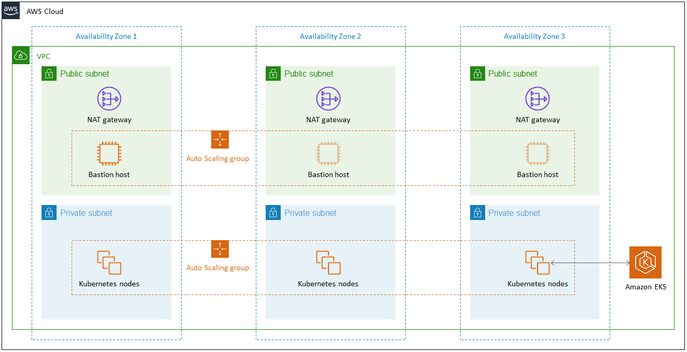

# [AWS EKS - Amazon Elastic Kubernetes Service](https://aws.amazon.com/eks/)
- Amazon Elastic Kubernetes Service (Amazon EKS) is a `managed container service to run and scale Kubernetes applications in the cloud or on-premises`.
- [EKS cluster for EC2 instances - Cloudformation template](../AWSResourceMgmtServices/CloudFormation/templates/EKS_ECS.yml)

# [Modular and Scalable Amazon EKS Architecture on AWS](https://aws.amazon.com/quickstart/architecture/amazon-eks/)

# References
- [AWS — Amazon EKS vs ECS — Comparison](https://medium.com/awesome-cloud/aws-amazon-eks-vs-amazon-ecs-comparison-difference-between-eks-and-ecs-7451abd23859)
- [https://aws.amazon.com/kubernetes/](https://aws.amazon.com/kubernetes/)