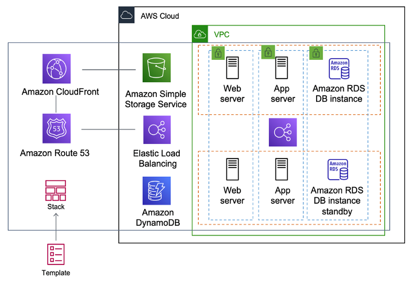

# [AWS CloudFormation - Infrastructure as a CODE](https://aws.amazon.com/cloudformation/)
- AWS CloudFormation is a service that helps you model and set up your AWS resources so that you can spend less time managing those resources and more time focusing on your applications that run in AWS.
- `You create a template that describes all the AWS resources that you want (like Amazon EC2 instances or Amazon RDS DB instances), and CloudFormation takes care of provisioning and configuring those resources for you.`
- You don't need to individually create and configure AWS resources and figure out what's dependent on what - CloudFormation handles that.
- [AWS CloudFormation creating an entire environment (stack) from one template workflow](https://docs.aws.amazon.com/whitepapers/latest/introduction-devops-aws/aws-cloudformation.html)

# What are the steps involved in a CloudFormation Solution?
- Create or use an existing CloudFormation template using `JSON or YAML format`.
- Save the code in an S3 bucket, which serves as a repository for the code.
- Use AWS CloudFormation to call the bucket and create a stack on your template.
- CloudFormation reads the file and understands the services that are called, their order, the relationship between the services, and provisions the services one after the other.