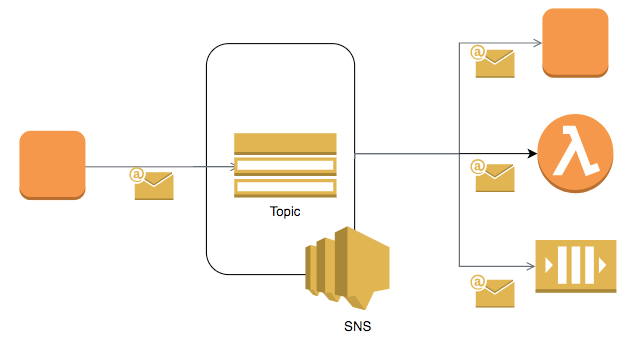

# Amazon SNS (Simple Notification Service)

- Amazon Simple Notification Service (Amazon SNS) is a fully managed messaging service for both application-to-application (A2A) and application-to-person (A2P) communication.
- Using Amazon SNS topics, your publisher systems can fanout messages to a large number of subscriber systems, including Amazon SQS queues, AWS Lambda functions, HTTPS endpoints, and Amazon Kinesis Data Firehose, for parallel processing.
- The A2P functionality enables you to send messages to users at scale via SMS, mobile push, and email.
- The A2A pub/sub functionality provides topics for high-throughput, push-based, many-to-many messaging between distributed systems, microservices, and event-driven serverless applications.

## Amazon SQS vs Amazon SNS

Basis | Amazon SQS                                                                                             | Amazon SNS                                                                                                                                                   |
------------------------------------|--------------------------------------------------------------------------------------------------------|--------------------------------------------------------------------------------------------------------------------------------------------------------------|
Paradigm | `Pull Model`                                                                                           | `Push Model`                                                                                                                                                 |
Process | Message would be pushed to the `Queue`. Consumers would consume it and it would be removed from Queue. | When an SNS Topic receives an event notification (from publisher), it is broadcasted to all Subscribers.                                                     |
Use Cases | -                                                                                                      | Monitoring Apps, workflow systems, mobile apps                                                                                                               |
Web Services | -                                                                                                      | Provides mobile and enterprise messaging web services - Push notifications to Apple, Android, FireOS, Windows devices, Send SMS to mobile users, Send Emails |

# References
- [SQS vs SNS vs Amazon MQ - Comparison - AWS Certification Cheat Sheet](https://cloud.in28minutes.com/aws-certification-sqs-vs-sns-vs-amazon-mq)