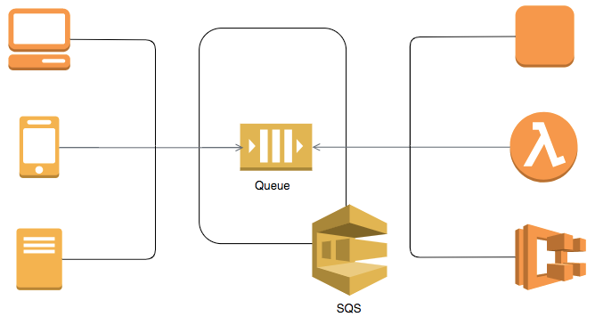
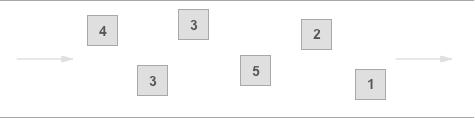
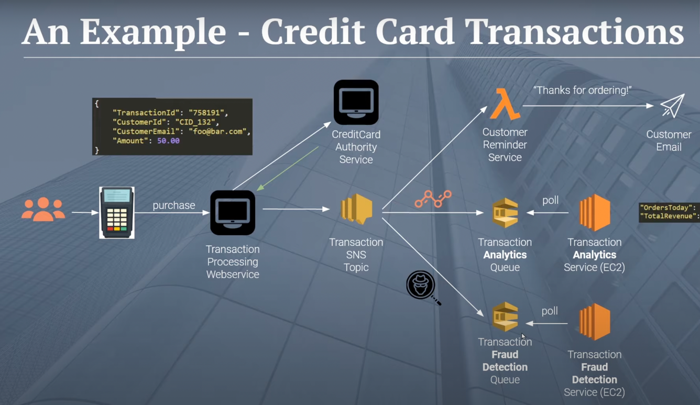

# [Amazon SQS (Simple Queue Service)](https://aws.amazon.com/sqs/)

- Amazon Simple Queue Service (SQS) is a fully managed message queuing service that enables you to decouple and scale microservices, distributed systems, and serverless applications.
- SQS offers two types of message queues.
    - `Standard queues` offer maximum throughput, best-effort ordering, and at-least-once delivery.
    - `SQS FIFO queues` are designed to guarantee that messages are processed exactly once, in the exact order that they are sent.

# Queue types

## Standard Queues (Out-Of-Order)

### Unlimited Throughput
- Standard queues support a nearly `unlimited number of transactions per second (TPS)` per API action.

### At-Least-Once Delivery
- A message is delivered at least once, but occasionally more than one copy of a message is delivered.

### Best-Effort Ordering
- Occasionally, `messages might be delivered in an order different from which they were sent`.

### Use Cases

You can use standard message queues in many scenarios, as long as `your application can process messages that arrive more than once and out of order`.

For example:
- Decouple live user requests from intensive background work: `Let users upload media while resizing or encoding it`.
- Allocate tasks to multiple worker nodes: Process a high number of credit card validation requests. 
- Batch messages for future processing: Schedule multiple entries to be added to a database.

## FIFO Queues (FIFO-Order)

### High Throughput
- By default, FIFO queues support up to `300 messages per second` (300 send, receive, or delete operations per second). 
- When you batch 10 messages per operation (maximum), FIFO queues can support up to 3,000 messages per second. 
- If you require higher throughput, you can enable high throughput mode for FIFO on the Amazon SQS console.
  - This will support up to `30,000 messages per second` with batching, or up to 3,000 messages per second without batching.

### Exactly-Once Processing
- `A message is delivered once and remains available until a consumer processes and deletes it`. 
- Duplicates aren't introduced into the queue.

### First-In-First-Out Delivery
- The order in which messages are sent and received is strictly preserved (i.e. `First-In-First-Out`).

### Use Cases

FIFO queues are designed to enhance messaging between applications `when the order of operations and events is critical`, or where duplicates can't be tolerated. 

For example:
- Ensure that user-entered commands are executed in the right order.
- Display the correct product price by sending price modifications in the right order.
- Prevent a student from enrolling in a course before registering for an account.

# [Amazon SQS vs Others](../../../README.md#message-brokers)

# Real-life example

# References
- [SQS vs SNS vs Amazon MQ - Comparison - AWS Certification Cheat Sheet](https://cloud.in28minutes.com/aws-certification-sqs-vs-sns-vs-amazon-mq)