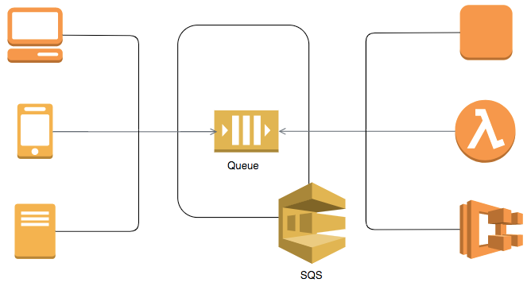

# [Amazon SQS (Simple Queue Service)](https://aws.amazon.com/sqs/)

- Amazon Simple Queue Service (SQS) is a fully managed message queuing service that enables you to decouple and scale microservices, distributed systems, and serverless applications.
- SQS offers two types of message queues.
    - `Standard queues` offer maximum throughput, best-effort ordering, and at-least-once delivery.
    - `SQS FIFO queues` are designed to guarantee that messages are processed exactly once, in the exact order that they are sent.

## [Amazon SQS vs Kafka](https://stackoverflow.com/questions/58970006/are-sqs-and-kafka-same)
- `SQS is NOT so fast as Kafka` and it doesn't fit to high workload, it's much more suitable for `eventing where count of events per second` is not so much.
- SQS is based on `QUEUE` ( hence message can NOT replayed ) while `Kafka` is based on `LOGS` ( which can be replayed ).
- SQS is an `Amazon managed service` (so you do not have to support infrastructure by yourself).
- SQS is better for eventing when you need to catch some message (event) by some client and then this message will be automatically popped out from the queue.

# References
- [SQS vs SNS vs Amazon MQ - Comparison - AWS Certification Cheat Sheet](https://cloud.in28minutes.com/aws-certification-sqs-vs-sns-vs-amazon-mq)