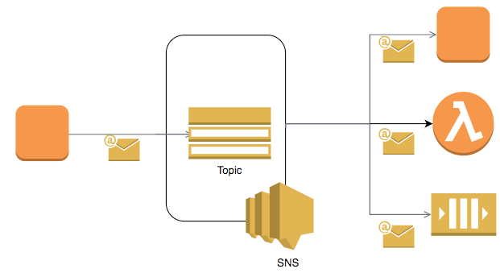

# [Amazon SQS (Simple Queue Service)](https://aws.amazon.com/sqs/)

- Amazon Simple Queue Service (SQS) is a fully managed message queuing service that enables you to decouple and scale microservices, distributed systems, and serverless applications.
- SQS offers two types of message queues.
  - Standard queues offer maximum throughput, best-effort ordering, and at-least-once delivery.
  - SQS FIFO queues are designed to guarantee that messages are processed exactly once, in the exact order that they are sent.

# Amazon SNS (Simple Notification Service)

- Amazon Simple Notification Service (Amazon SNS) is a fully managed messaging service for both application-to-application (A2A) and application-to-person (A2P) communication.
- Using Amazon SNS topics, your publisher systems can fanout messages to a large number of subscriber systems, including Amazon SQS queues, AWS Lambda functions, HTTPS endpoints, and Amazon Kinesis Data Firehose, for parallel processing.
- The A2P functionality enables you to send messages to users at scale via SMS, mobile push, and email.
- The A2A pub/sub functionality provides topics for high-throughput, push-based, many-to-many messaging between distributed systems, microservices, and event-driven serverless applications.

# Amazon SQS vs Amazon SNS

Basis | Amazon SQS                                                                                             | Amazon SNS                                                                                                                                                   |
------------------------------------|--------------------------------------------------------------------------------------------------------|--------------------------------------------------------------------------------------------------------------------------------------------------------------|
Paradigm | `Pull Model`                                                                                           | `Push Model`                                                                                                                                                 |
Process | Message would be pushed to the `Queue`. Consumers would consume it and it would be removed from Queue. | When an SNS Topic receives an event notification (from publisher), it is broadcasted to all Subscribers.                                                     |
Use Cases | -                                                                                                      | Monitoring Apps, workflow systems, mobile apps                                                                                                               |
Web Services | -                                                                                                      | Provides mobile and enterprise messaging web services - Push notifications to Apple, Android, FireOS, Windows devices, Send SMS to mobile users, Send Emails |

# [Amazon SQS vs Kafka](https://stackoverflow.com/questions/58970006/are-sqs-and-kafka-same)
- `SQS is NOT so fast as Kafka` and it doesn't fit to high workload, it's much more suitable for `eventing where count of events per second` is not so much.
- SQS is based on `QUEUE` ( hence message can NOT replayed ) while `Kafka` is based on `LOGS` ( which can be replayed ).
- SQS is an `Amazon managed service` (so you do not have to support infrastructure by yourself).
- SQS is better for eventing when you need to catch some message (event) by some client and then this message will be automatically popped out from the queue.

# [Amazon MQ](https://aws.amazon.com/amazon-mq/?amazon-mq.sort-by=item.additionalFields.postDateTime&amazon-mq.sort-order=desc)
- Amazon MQ is a managed message broker service for `Apache ActiveMQ` and `RabbitMQ` that makes it easy to set up and operate message brokers on AWS.
- Amazon MQ reduces your operational responsibilities by managing the provisioning, setup, and maintenance of message brokers for you. 
- Because Amazon MQ connects to your current applications with industry-standard APIs and protocols, `you can easily migrate to AWS without having to rewrite code`.

# References
- [SQS vs SNS vs Amazon MQ - Comparison - AWS Certification Cheat Sheet](https://cloud.in28minutes.com/aws-certification-sqs-vs-sns-vs-amazon-mq)