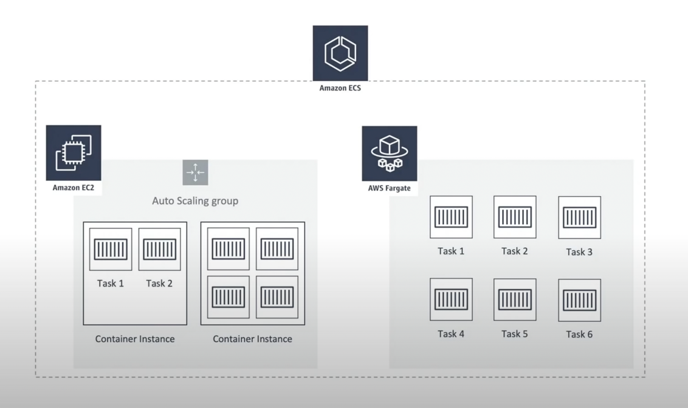

# [AWS Fargate - Serverless compute for containers](https://aws.amazon.com/fargate/)
- AWS Fargate is a serverless compute engine used in conjunction with [Amazon Elastic Container Service (ECS)](../AWSResourceMgmtServices/ECS.md). 
- Compatible with both [EKS](../AWSResourceMgmtServices/EKS.md) & [ECS](../AWSResourceMgmtServices/ECS.md) i.e. these services can run with Fargate as deployment option, instead of EC2.
- You can use it to run containers without managing servers or clusters of Amazon EC2 instances. 
- Fargate has a flexible computing model, which does not require you to select an instance type or directly configure your cluster. 
- It scales up transparently and you pay according to the CPU and memory resources you actually use.

