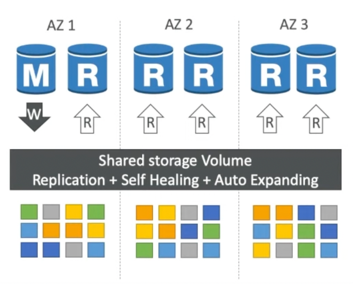
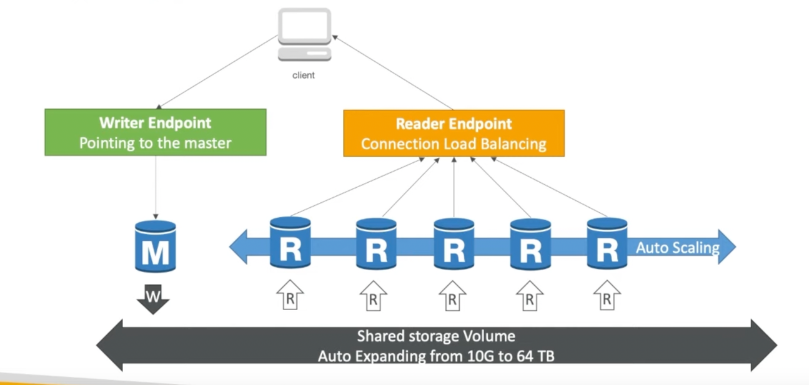
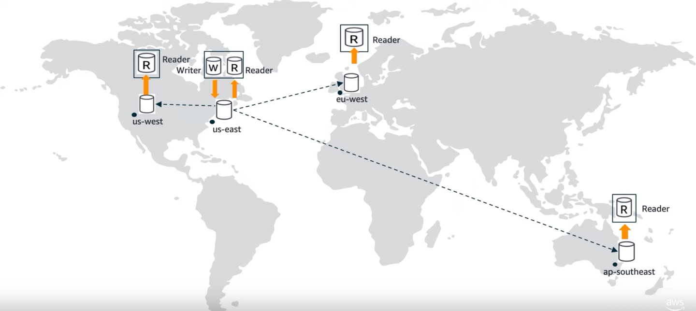

# [How Amazon Aurora engine is better than Amazon RDS, for MySQL/Postgres DB engines?](AWSAuroraVsRDS.md)

# [Amazon Aurora](https://aws.amazon.com/rds/aurora/)
- Designed for unparalleled high performance and availability at global scale with full MySQL and PostgreSQL compatibility ( that means your drivers will work as if Aurora was a Postgres or MySQL database).
- Aurora is a proprietary technology from AWS (not open sourced).
- Aurora is `AWS Cloud Optimized` and claims `5x performance improvement over MySQL on RDS`, over `3x performance improvement over Postgres on RDS`.
- High throughput - Up to 200K writes/second, with negligible performance impact.

## Amazon Aurora High Availability & Scaling
- Aurora is highly available and fail over is instantaneous. 
  - Automated fail over for master in less than 30 seconds.
- It automatically maintains `6 copies of the data across 3 Availability Zones` and automatically backs up data in `Amazon S3`.
  - Highly available for writes - `4 copies out of 6 are for writes`.
  - Highly available for reads - `3 copies out of 6 are for reads`.
- One Aurora Instance (master) takes writes
  - One master can have up to `15 Aurora Read Replicas` across multi-regions ( through auto-scaling or on demand ) 
- Aurora supports `Auto Expanding` & its storage automatically grows in increments of 10GB, up to 128 TB.

## Aurora DB Cluster

## Aurora Global Database
- `Cross-Region Replication with low replica lag` - support for cross-region replication ( in less than 1 second ). Aurora uses `physical, log-based asynchronous replication`. 
- `Disaster Recovery` - promote remote databases to a primary for faster recovery ( in less than 1 min ) in the event of a disaster. ( for industries like `Financial Services` etc.)
- `Data Locality` - bring data closer to users in different regions to enable faster reads.

### Design Patterns - Write forwarding with global read replicas

## Aurora Security ( similar to RDS )
- Encryption at rest using KMS
- Automated backups, snapshots & replicas are also encrypted.
- Encryption in flight/transmit using SSL
- Authentication using IAM

## [Aurora Serverless](https://aws.amazon.com/rds/aurora/serverless/)
- `No need to choose an instance size`. Helpful when you can't predict the workload.
- Available for the Amazon Aurora MySQL-Compatible Edition and PostgreSQL-Compatible Edition.
- DB Cluster starts, shutdown and scales automatically based on CPU/connections.
- Can migrate from Aurora Cluster to Aurora Serverless & vice-versa.
- Aurora serverless usage is measured in `ACU ( Aurora Capacity Units )`.
- Billed in 5 mins increment of ACU.

## [Aurora Multi-master clusters](https://docs.aws.amazon.com/AmazonRDS/latest/AuroraUserGuide/aurora-multi-master.html)

## Cloudformation template
- [Aurora Serverless - Cloudformation template](../AWSInfraAutomation/CloudFormation/templates/aurora_serverless.yml)

## References
- :star: [Amazon Aurora Global Database Design Patterns for HA and DR | Amazon Web Services](https://www.youtube.com/watch?v=bbiWciJSouY)
- [Amazon Aurora Introduction - By Stephane Maarek](https://www.youtube.com/watch?v=ZCt3ctVfGIk)