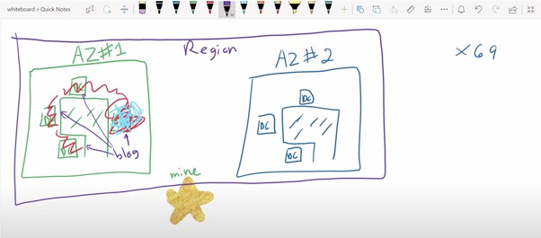

# [Region](https://aws.amazon.com/about-aws/global-infrastructure/regions_az/)
- A region is a `geographic location` where every data center inside the region is called an `availability zone`, AZ in short.
- There are `25 geographic regions` available in AWS, around the world.
- For example 
  - US-West 1 (North California)
  - Asia South (Mumbai)
  - EU-Central-1

# [Availability Zone](https://aws.amazon.com/about-aws/global-infrastructure/regions_az/) 
- An Availability Zone (AZ) is `one or more discrete data centers` with redundant power, networking, and connectivity in an AWS Region. 
- AZs give customers the ability to operate production applications and databases that are more highly available, fault-tolerant, and scalable than would be possible from a single data center.
- There are `69 availability zones` available in AWS, around the world.
- Every AZ is labeled with a letter a, b, c etc.
- For example, AWS Region eu-central-1 has three availability zones eu-central-1a,1b,1c.

# References
- [What are the differences AWS Regions and Availability Zones?](https://www.quora.com/What-are-the-differences-AWS-Regions-and-Availability-Zones)

