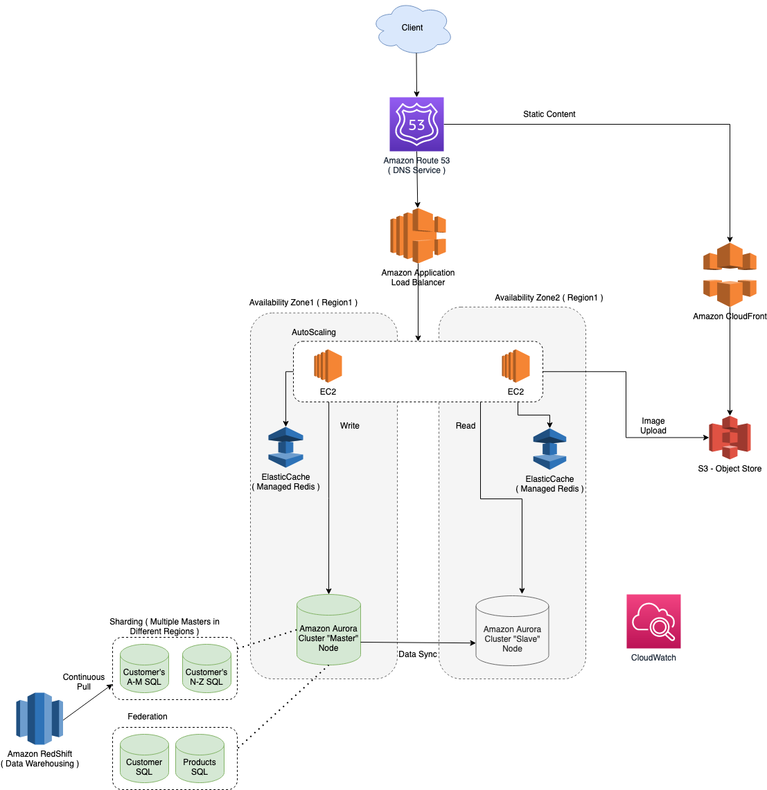

# Introduction
- AWS manages its [global architecture](AWS-Global-Architecture-Region-AZ.md) through region and availability zones.

# AWS Services

Service| Type                                           | Description                                                                                                                                                          |
-----------|-------------------------------------------------------|----------------------------------------------------------------------------------------------------------------------------------------------------------------------|
:star: [AWS Cloud Formation](AWSResourceMgmtServices/CloudFormation/AWSCloudFormation.md) | [Resource Management Service](AWSResourceMgmtServices) | `Infrastructure as a CODE`. Configure & manage complete AWS infrastructure through cloudformation templates ( yaml or json ).                                        |
:star: [Amazon Route 53](NetworkingAndContentDelivery/AmazonRoute53.md)| [Networking Service](NetworkingAndContentDelivery)              | `AWS DNS Service`                                                                                                                                                    |
:star: [Amazon CloudFront](NetworkingAndContentDelivery/AmazonCloudFront.md) | [Networking Service](NetworkingAndContentDelivery)              | `AWS CDN Service`, which securely delivers content with `low latency and high transfer speeds`                                                                       |
:star: [Application Load Balancer](https://docs.aws.amazon.com/elasticloadbalancing/latest/application/introduction.html)| [Networking Service](NetworkingAndContentDelivery)                                    | `Application Load Balancer` is highly available by default, in AWS.                                                                                                  |
:star: [Amazon S3](StorageServices/AmazonS3.md) | [Storage Service](StorageServices)                    | `Object storage` built to retrieve any amount of data from anywhere. `Cost effective & mostly used storage service in AWS`                                           |
:star: [Amazon EKS](AWSResourceMgmtServices/AmazonEKS.md) | [Resource Management Service](AWSResourceMgmtServices) | Fully managed [Kubernetes](../DevOps/Kubernates.md) service                                                                                                          |
:star: [Amazon ECS](AWSResourceMgmtServices/AmazonECS.md) | [Resource Management Service](AWSResourceMgmtServices) | Containers as a service.                                                                                                                                             |
:star: [AWS AutoScaling](AWSResourceMgmtServices/AWSAutoScaling.md) | [Compute Service](ComputeServices)                    | Auto-scaling of [EC2 instances](ComputeServices/AmazonEC2.md), based on demand & traffic                                                                             |
:star: [Amazon EC2](ComputeServices/AmazonEC2.md) | [Compute Service](ComputeServices)                    | Virtual Machine service                                                                                                                                              |
:star: [Amazon SQS](MessageBrokerServices/AmazonSQS.md) | [Message Broker Service](MessageBrokerServices)       | Fully managed Message Queue Service                                                                                                                                  |
:star: [Amazon Elastic Cache](https://aws.amazon.com/elasticache/) | Cache Service                                         | Fully Managed [Redis](../Redis/ReadMe.md) or Memcache                                                                                                                |
:star: [Amazon Aurora](DatabaseServices/AmazonAurora.md) | [Database Service](DatabaseServices)                  | DB management service for Postgres and MySQL ( faster & more reliable than RDS )                                                                                     |
:star: [Amazon Dynamo DB](DatabaseServices/AmazonDynamoDB.md) | [Database Service](DatabaseServices)                  | NoSQL service                                                                                                                                                        |
:star: [Amazon CloudWatch](MonitoringServices/AmazonCloudWatch.md) | [Monitoring Service](MonitoringServices)              | Monitor AWS Resources & set Alarms                                                                                                                                   |
[AWS Lamdba](ComputeServices/AWSLambda.md) | [Compute Service](ComputeServices)                    | Run code without thinking about servers or clusters.                                                                                                                 |
[AWS Fargate ](ComputeServices/AWSFargate.md) | [Compute Service](ComputeServices) | Serverless compute for containers. Compatible with both [EKS](EKS.md) & [ECS](ECS.md) i.e. these services can run with Fargate as deployment option, instead of EC2. |
[Amazon RDS](DatabaseServices/AmazonRDS.md) | [Database Service](DatabaseServices)                  | Database management service for relational databases                                                                                                                 |
[Amazon EFS](StorageServices/AmazonEFS.md) | [Storage Service](StorageServices)                    | Shared File Storage between [EC2 instances](ComputeServices/AmazonEC2.md)                                                                                            |
[Amazon CloudTrail](MonitoringServices/AWSCloudTrail.md) | [Monitoring Service](MonitoringServices)              | Monitor [Amazon Route 53 API](NetworkingAndContentDelivery/AmazonRoute53.md) activities in AWS Account                                                               |
[Amazon Config](MonitoringServices/AWSConfig.md) | [Monitoring Service](MonitoringServices)              | Monitor Configration changes of AWS Resources                                                                                                                        |
[Amazon VPC](SecurityAndIdentityServices/AmazonVPC.md) | [Security Service](SecurityAndIdentityServices)                  | Define and launch AWS resources in a logically isolated virtual network                                                                                              |
[AWS IAM](SecurityAndIdentityServices/AWSIAM.md) | [Security Service](SecurityAndIdentityServices)                                     | AWS User Management Service                                                                                                                                          |
[AWS Shield](SecurityAndIdentityServices/AWSShield.md) | [Security Service](SecurityAndIdentityServices)                                     | DDOS Prevention Service                                                                                                                                              |
[AWS WAF](SecurityAndIdentityServices/AWSWAF.md) | [Security Service](SecurityAndIdentityServices)                                     | Web Application Firewall Service                                                                                                                                     |
[Amazon SNS](MessageBrokerServices/AmazonSNS.md) | [Message Broker Service](MessageBrokerServices)       | Fully managed pub/sub messaging, SMS, email, and mobile push notifications                                                                                           |
[Amazon MQ](MessageBrokerServices/AmazonMQ.md) | [Message Broker Service](MessageBrokerServices)       | Open Source ( [ActiveMQ](../MessageBrokers/ActiveMQ.md), [RabbitMQ](../MessageBrokers/RabbitMQ.md) ) Queue Migration service                                         |
[Amazon OpenSearch service](https://aws.amazon.com/opensearch-service/) | [Database Service](DatabaseServices)                  | Successor to Amazon [ElasticSearch](../ElasticSearch) Service`, includes built in OpenSearch Dashboard and Kibana                                                    |
[Amazon Redshift](https://aws.amazon.com/redshift/) | Other Service                                         | Redshift is a data warehouse product used in data analysis.                                                                                                          |
[AWS Elastic Beanstalk](https://aws.amazon.com/elasticbeanstalk/) | [Resource Management Service](AWSResourceMgmtServices) | Servers Management - Easy to begin, Impossible to outgrow                                                                                                            |
[Amazon EMR](ComputeServices/AmazonEMR.md) | Other Service                                         | Fully Managed Service for [Apache Spark](../BigDataTools/ApacheSpark.md)                                                                                             |

# Centralized Logging Solution in AWS
- The essential services that can be used is [Amazon CloudWatch](MonitoringServices/AmazonCloudWatch.md) logs, store them in [Amazon S3](StorageServices/AmazonS3.md), and then use [Amazon OpenSearch service](https://aws.amazon.com/opensearch-service/) to visualize them. 
- [Amazon Kinesis Firehose](https://aws.amazon.com/kinesis/data-firehose/) can also be used to move the data from Amazon S3 to Amazon ElasticSearch.

# AWS Cost Exploration Services
- [Cost Explorer](https://aws.amazon.com/aws-cost-management/aws-cost-explorer/)
- [AWS Budgets](https://aws.amazon.com/aws-cost-management/aws-budgets/)
- [Cost Allocation Tags](https://docs.aws.amazon.com/awsaccountbilling/latest/aboutv2/cost-alloc-tags.html)

# Other Notes
- ARN stands for `Amazon Resouce Name`.
- Utility services are prefixed with AWS, while standalone services are prefixed by "Amazon". [Reference](https://stackoverflow.com/questions/33125790/why-some-services-are-called-aws-xxx-and-the-others-amazon-xxx).

# References
- [AWS Documentation Overview](https://aws.amazon.com/documentation-overview/)
- [AWS Interview Questions](https://www.simplilearn.com/tutorials/aws-tutorial/aws-interview-questions)
- [The Top 10 Most Used AWS Services](https://insider.ssi-net.com/insights/the-top-10-most-used-aws-services)
- [Is Amazon RDS for PostgreSQL or Amazon Aurora PostgreSQL a better choice for me?](https://aws.amazon.com/blogs/database/is-amazon-rds-for-postgresql-or-amazon-aurora-postgresql-a-better-choice-for-me/)