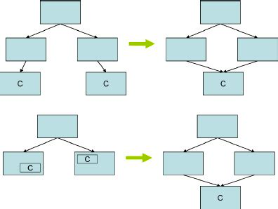

# DRY principle
- The DRY (`don't repeat yourself`) principle is a best practice in software development that recommends software engineers to do something once, and only once.
- The goal of the DRY principle is to lower technical debt by eliminating redundancies in process and logic whenever possible.

## Redundancies in process
- To prevent redundancies in processes (actions required to achieve a result), followers of the DRY principle seek to ensure that there is only one way to complete a particular process. 
- Automating the steps wherever possible also reduces redundancy, as well as the number of actions required to complete a task.

## Redundancies in logic
- To prevent redundancies in logic (code), followers of the DRY principal use abstraction to minimize repetition. 
- Abstraction is the process of removing characteristics until only the most essential characteristics remain.