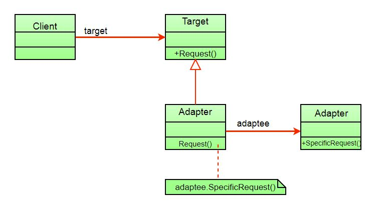
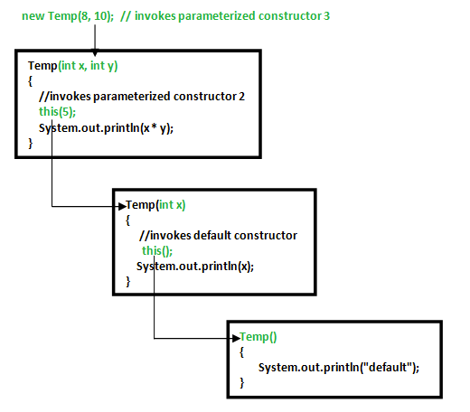

# Different pattern types

## Creational design patterns
- These design patterns are all about class instantiation or object creation.
- These patterns can be further categorized into Class-creational patterns and object-creational patterns.
- Creational design patterns are the Factory Method, Abstract Factory, Builder, Singleton, Object Pool, and Prototype.

## Structural
- These design patterns are about organizing different classes and objects to form larger structures and provide new functionality.
- Structural design patterns are Adapter, Bridge, Composite, Decorator, Facade, Flyweight, Private Class Data, and Proxy.

## Behavioral
- Behavioral patterns are about identifying common communication patterns between objects and realizing these patterns.
- Behavioral patterns are Chain of responsibility, Command, Interpreter, Iterator, Mediator, Memento, Null Object, Observer, State, Strategy, Template method, Visitor

# Different design patterns

## [Factory pattern](https://www.geeksforgeeks.org/factory-method-design-pattern-in-java/)
- It is part of `Creational Design Pattern` type.
- A class implementing factory design pattern works as a bridge between multiple classes.
- Suppose you want to create multiple instances of a similar kind and want to achieve loose coupling then you can go for Factory pattern.
- Example - DB design, NotificationFactory etc.

## [Adapter pattern](https://www.geeksforgeeks.org/adapter-pattern/)
- It is part of `Structural Design Pattern` type.
- When 2 interfaces are not compatible with each other and want to establish a relationship between them, through an adapter it’s called an adapter design pattern.
- The adapter pattern converts the interface of a class into another interface or class that the client expects, i.e. adapter lets classes work together that could not otherwise because of incompatibility. 
- So in these types of incompatible scenarios, we can go for the adapter pattern.
- The client sees only the target interface and not the adapter. 
- The adapter implements the target interface. 
- Adapter delegates all requests to Adaptee.

## [Template pattern](https://www.geeksforgeeks.org/template-method-design-pattern/)
- It is part of `Behavior Design Pattern` type.
- The template pattern defines the skeleton of an algorithm in an operation deferring some steps to sub-classes.
- The template method lets subclasses redefine certain steps of an algorithm without changing the algorithm structure.

## [Observer Pattern](https://www.geeksforgeeks.org/observer-pattern-set-1-introduction/)
- The Observer Pattern defines a one to many dependency between objects so that one object changes state, all of its dependents are notified and updated automatically.
- Subject
- Observer

Provides a loosely coupled design between objects that interact.
- Loosely coupled objects are flexible with changing requirements.
- Here loose coupling means that the interacting objects should have less information about each other.

Disadvantages
- Memory leaks caused by Lapsed listener problem because of explicit register and unregistering of observers.

## [Singleton Design Pattern](https://www.geeksforgeeks.org/singleton-design-pattern/?ref=lbp)
- Singleton obj is not created until we need it and call `getInstance()` method. This is called `lazy instantiation`.
- One option to create singleton class is using `synchronized`. This makes sure that only one thread at a time can execute `getInstance()`. ( this also causes performance overhead )
- A singleton class shouldn't have multiple instances in any case and at any cost.
- Singleton classes are used for logging, driver objects, caching and thread pool, database connections, Networking and Database Connectivity etc.

## [Constructor Chaining](https://www.geeksforgeeks.org/constructor-chaining-java-examples/)
- Constructor chaining is the process of calling one constructor from another constructor with respect to current object.

Constructor chaining can be done in two ways:
- Within same class: It can be done using this() keyword for constructors in same class
- From base class: by using super() keyword to call constructor from the base class.

Rules of constructor chaining :
- The `this()` expression should always be the first line of the constructor.
- There should be at-least be one constructor without the `this()` keyword (constructor 3 in above example).
- Constructor chaining can be achieved in any order.

## Decorator Pattern
- The decorator pattern attaches additional responsibilities to an object dynamically.
- Decorators provide a flexible alternative to subclassing for extending functionality.

## Strategy Pattern ( Delegation )
- In computer programming, the strategy pattern (also known as the policy pattern) is a software design pattern that enables an algorithm’s behavior to be selected at runtime. 

## [Command Pattern](https://www.geeksforgeeks.org/command-pattern/?ref=lbp)
- The command pattern encapsulates a request as an object, thereby letting us parameterize other objects with different requests, queue or log requests, and support undoable operations.

## Iterator Pattern
- The iterator pattern provides a way to access the elements of an aggregate object without exposing its underlying representation.

## MVC Design Pattern
The Model View Controller (MVC) design pattern specifies that an application consist of a data model, presentation information, and control information. 

The pattern requires that each of these be separated into different objects.
- The `Model` contains only the pure application data, it contains no logic describing how to present the data to a user.
- The `View` presents the model’s data to the user. The view knows how to access the model’s data, but it does not know what this data means or what the user can do to manipulate it.
- The `Controller` exists between the view and the model. It listens to events triggered by the view (or another external source) and executes the appropriate reaction to these events. In most cases, the reaction is to call a method on the model. Since the view and the model are connected through a notification mechanism, the result of this action is then automatically reflected in the view.

## Parallel processing approach
- Parallel processing is the processing of program instructions by dividing them among multiple processors.

## Builder Design Pattern
- Builder pattern aims to `Separate the construction of a complex object from its representation so that the same construction process can create different representations.` 
- It is used to construct a complex object step by step and the final step will return the object. 
- The process of constructing an object should be generic so that it can be used to create different representations of the same object.

# References
- https://www.geeksforgeeks.org/design-patterns-set-2-factory-method/?ref=leftbar-rightbar
- https://www.geeksforgeeks.org/constructor-chaining-java-examples/