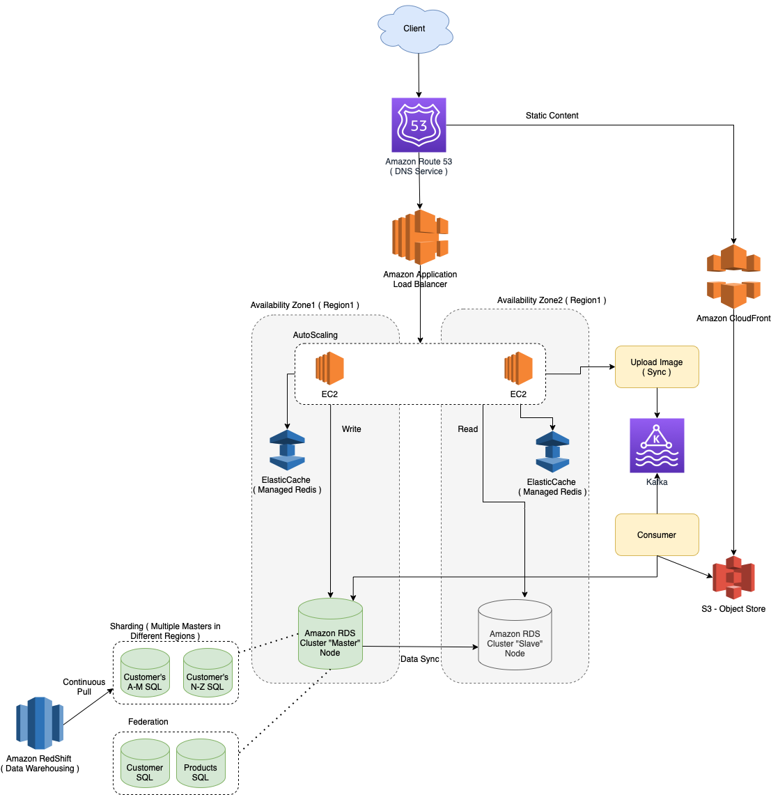

# Notes
- Vertical scalability for the write operations
- Horizontal scalability for the read operations
- Best suited for SQL databases
- In case of data sharding, multiple masters would be there.

# References 
- https://github.com/donnemartin/system-design-primer/blob/master/solutions/system_design/scaling_aws/README.md
- https://aws.amazon.com/blogs/database/sharding-with-amazon-relational-database-service/