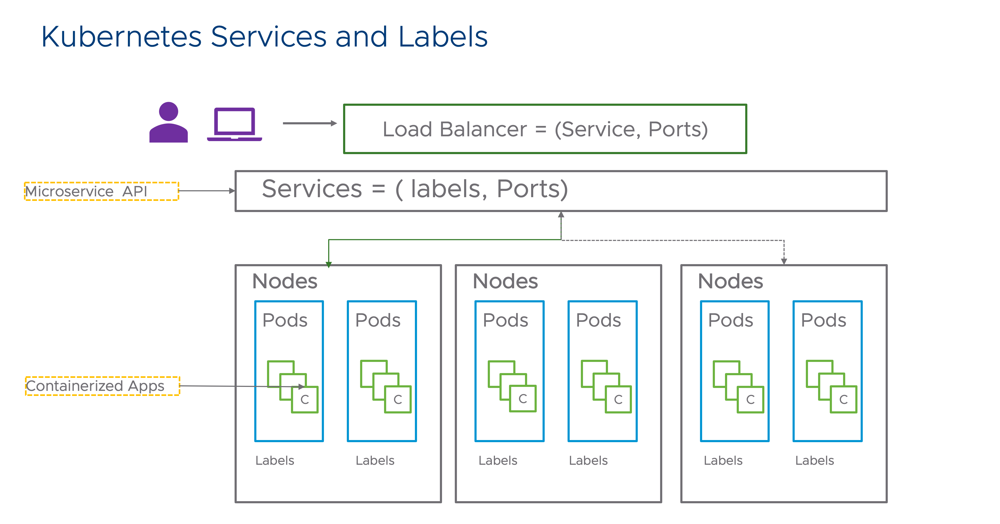

# [Kubernates](https://kubernetes.io)
- Kubernetes, also known as K8s, is an `open-source system for automating deployment, scaling, and management of containerized applications`.

# [What are Pods?](https://kubernetes.io/docs/concepts/workloads/pods/)
- Pods are the smallest deployable units of computing that you can create and manage in Kubernetes.
- A Pod (as in a pod of whales or pea pod) is a group of one or more containers, with shared storage and network resources, and a specification for how to run the containers. 



# [kubectl Cheat Sheet](https://kubernetes.io/docs/reference/kubectl/cheatsheet/)

- `apply` manages applications through files defining Kubernetes resources. It creates and updates resources in a cluster through running `kubectl apply`.

```
kubectl get pods                              # List all pods in the namespace
kubectl get pod my-pod -o yaml                # Get a pod's YAML

kubectl apply -f ./my-manifest.yaml            # create resource(s)
kubectl apply -f ./my1.yaml -f ./my2.yaml      # create from multiple files
kubectl apply -f ./dir                         # create resource(s) in all manifest files in dir
kubectl apply -f https://git.io/vPieo          # create resource(s) from url

kubectl autoscale deployment foo --min=2 --max=10                # Auto scale a deployment "foo"
kubectl scale --replicas=5 rc/foo rc/bar rc/baz                   # Scale multiple replication controllers

kubectl logs my-pod                                 # dump pod logs (stdout)
kubectl logs -l name=myLabel                        # dump pod logs, with label name=myLabel (stdout)

kubectl cp /tmp/foo_dir my-pod:/tmp/bar_dir            # Copy /tmp/foo_dir local directory to /tmp/bar_dir in a remote pod in the current namespace
```

# Installation Guide
- [Install and Set Up kubectl on macOS](https://kubernetes.io/docs/tasks/tools/install-kubectl-macos/)
- [MiniKube Start](https://minikube.sigs.k8s.io/docs/start/)

# References
- [The Uber Engineering Tech Stack, Part I: The Foundation](https://eng.uber.com/tech-stack-part-one-foundation/)