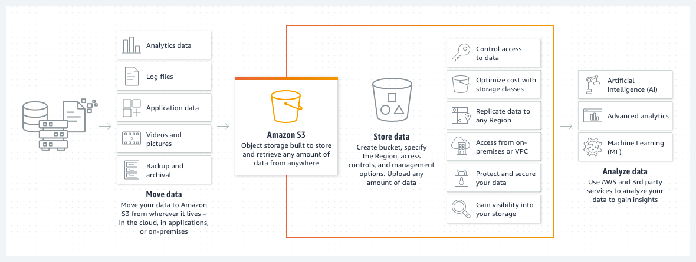
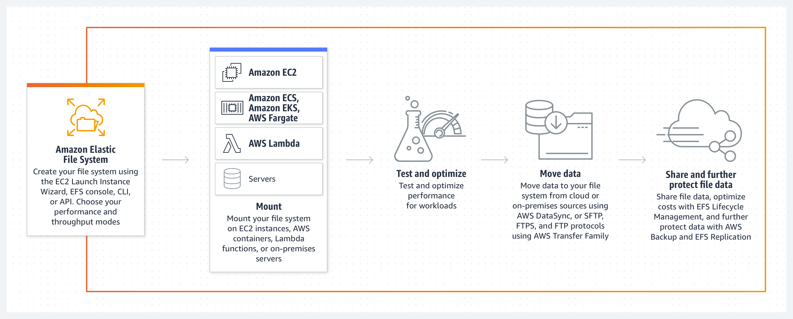

# What is S3?

- [S3](https://aws.amazon.com/s3/) is an object store, meaning it is a higher layer data storage system, essentially *it is a database "blob" storage*, storing data in an underlying simple database as an object. 
- It's designed for Write once Read many access, perfect for media data like image, video, documents particularly as it is distributed and offers a very high level of redundancy.

# What is EFS?

- [EFS](https://docs.aws.amazon.com/efs/latest/ug/whatisefs.html) is a Network Storage system, underlying it is a storage array (SAN) and it offers the standard protocol for multi session network file systems (NFS).
- It's built on high speed SSD drives and is intended for shared storage for your ec2 instances, think file servers. 
- Performance for EFS will be scalable & although I have not seen the details yet I am sure it will allow for provisioned IOPS just like EBS.
- EFS is designed for applications thats concurrently access data from multiple EC2 instances. 
- Simply, by having one EFS you can attach it to multiple EC2.. you can't do that with EBS.
- It's been a long time coming for AWS and IMO this was one of the biggest missing key components for aws to really be a competitor to on-premise enterprise data centers.

# References
- https://stackoverflow.com/questions/29573142/what-is-difference-between-aws-efs-and-s3
