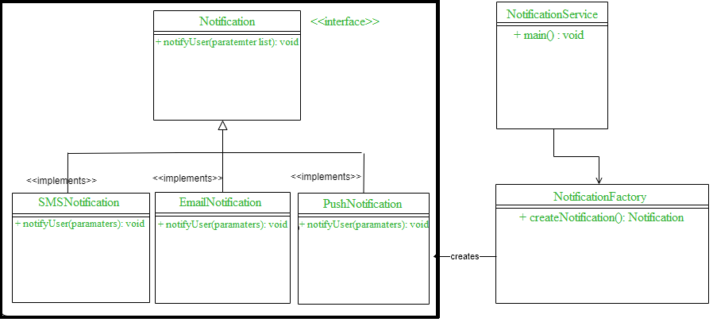

# [Factory pattern](https://www.geeksforgeeks.org/factory-method-design-pattern-in-java/)
- A class implementing factory design pattern works as a bridge between multiple classes.
- Suppose you want to create multiple instances of a similar kind and want to achieve loose coupling then you can go for Factory pattern.
- Example - DB design, NotificationFactory etc.

# Adapter pattern
- When 2 interfaces are not compatible with each other and want to establish a relationship between them through an adapter it’s called an adapter design pattern.
- The adapter pattern converts the interface of a class into another interface or class that the client expects, i.e adapter lets classes work together that could not otherwise because of incompatibility. 
- So in these types of incompatible scenarios, we can go for the adapter pattern.
- The client sees only the target interface and not the adapter. 
- The adapter implements the target interface. 
- Adapter delegates all requests to Adaptee.

# The template pattern
- The template pattern defines the skeleton of an algorithm in an operation deferring some steps to sub-classes.
- The template method lets subclasses redefine certain steps of an algorithm without changing the algorithm structure.

# Observer Pattern
- The Observer Pattern defines a one to many dependency between objects so that one object changes state, all of its dependents are notified and updated automatically.
- Subject
- Observer

Provides a loosely coupled design between objects that interact.
- Loosely coupled objects are flexible with changing requirements.
- Here loose coupling means that the interacting objects should have less information about each other.

Disadvantages
- Memory leaks caused by Lapsed listener problem because of explicit register and unregistering of observers.

# Singleton Design Pattern
- Singleton obj is not created until we need it and call getInstance() method. This is called lazy instantiation.
- Here using synchronized makes sure that only one thread at a time can execute getInstance().
- The main disadvantage of this is method is that using synchronized every time while creating the singleton object is expensive and may decrease the performance of your program.
- Here we have created instance of singleton in static initializer. 
- JVM executes static initializer when the class is loaded and hence this is guaranteed to be thread safe. 
- Use this method only when your singleton class is light and is used throughout the execution of your program.
- A singleton class shouldn’t have multiple instances in any case and at any cost.
- Singleton classes are used for logging, driver objects, caching and thread pool, database connections, Networking and Database Connectivity etc.

# Constructor Chaining In Java with Examples
- Constructor chaining is the process of calling one constructor from another constructor with respect to current object.

Constructor chaining can be done in two ways:
- Within same class: It can be done using this() keyword for constructors in same class
- From base class: by using super() keyword to call constructor from the base class.

Rules of constructor chaining :
- The `this()` expression should always be the first line of the constructor.
- There should be at-least be one constructor without the `this()` keyword (constructor 3 in above example).
- Constructor chaining can be achieved in any order.

# References
- https://www.geeksforgeeks.org/design-patterns-set-2-factory-method/?ref=leftbar-rightbar