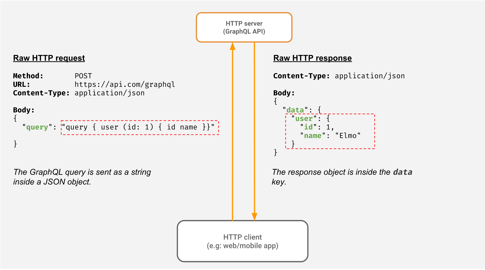

# [GraphQL](https://graphql.org)
- Dynamically get the data columns as needed.
  - Client has control of what data it needs from server?
- GraphQL is schema less

# References
- [GraphQL vs REST APIs | What's the Best Kind of API?](https://www.youtube.com/watch?v=F0_pkxQMZnc)