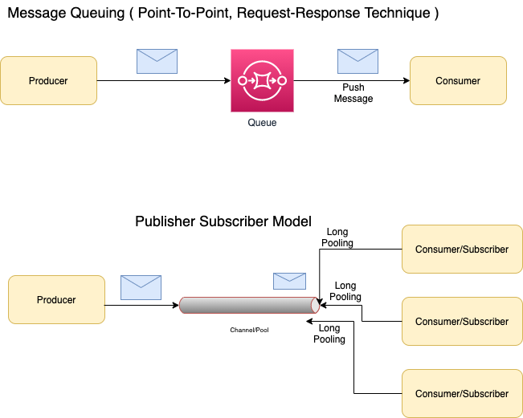

# Introduction
- Apache Kafka is an open-source distributed event streaming platform used by thousands of companies for high-performance data pipelines, streaming analytics, data integration, and mission-critical applications.
- Kafka can process a large amount of data in a short amount of time (`1 million messages/sec`)
- It also has low latency, making it possible to process data in real-time.
- Kafka is `Publish Subscriber Model`. And can be used for `Event Driven Services`.
- Messages ( events ) in the Kafka are immutable and can't be changed once it's pushed. ( due to Kafka's log based queue nature )

# Reasons of why Kafka has HIGH throughput?

## Kafka is based on `Log Based Queue`
- Messages are persisted to `append-only log files by the broker`.
- Producers are appending these log files ( `sequential write` ) & consumers are reading a range of these files ( `sequential reads` ).

# Basic Architecture of Kafka


# Real world usages of Kafka

## As a events/message broker 
- Use Kafka when your application has a High throughput (`1 million messages/sec`), i.e. application has to process a large volume of messages, event driven services etc.

## To monitor metrics, logs of the IT infrastructure 
- Various systems in the IT infrastructure can push events/messages/logs in the Kafka. And logstash ( in ELK ) can act as a consumer to the Kafka.

## For Analytics 
- If we want to build our own google analytics ( to track app activities, events etc.), we can use Kafka as a broker.

## Stream Processing 
- Use Kafka when the event stream needs to process data in multi-stage pipelines, the pipelines can generate graphs of the real-time data flows, thus providing real-time monitoring of traffic in the pipelines. Example - Video streaming in YouTube etc.

## [TwilloSendMessageAPI](https://github.com/Anshul619/System-Designs/tree/main/src/TwilloSendMessageAPI)

# Top Features of Kafka

## Scalability 
- Kafka can be horizontally scaled easily across the cluster. 
- A cluster of brokers is used to partition and streamline the data thereby, scaling up the storage capacity.

## Performance 
- High Throughput ( `1 million messages/sec` ).
- Each Kafka broker can serve more than `1 million messages per second` and can hold TBs of data.
- Default configured message size in Kafka is `1MB`.

## High Volume 
- Large amount of data can be stored in the Kafka pool.

## Replication, Durability, Zero Downtime
- The data is kept persistent ( as per retention policy ) and tolerant to any hardware failures by copying the data in the clusters.
- Each partition would be replicated across the brokers/servers in the cluster. ( as per configured replication factor )
- Replication is done using `Leader/Follower` technique.

## Fault Tolerance
- Kafka connector can handle failures with three strategies summarised as fast-fail, ignore and re-queue(sends to another topic).

## Reliability
- The distributed, partitioned, replicated, and fault-tolerant nature of Kafka makes it very Reliable.

## Extensibility
- Allows multiple ways for applications to plugin and make use of Kafka. 
- Also, it has provisions for new connectors that you can write as needed.

## Data Transformation
- Kafka allows for deriving new data streams using the existing data streams from producers.

# Traditional methods of Message Transfer



## Push Model/Message Queuing ( Point-To-Point, Request-Response technique)
- Once the message is delivered to the consumer, it would be removed from Queue.
- The push model's goal is to distribute messages individually and promptly, ensuring that work is parallelized equitably and messages are handled roughly in the order they came in the queue.
- RabbitMQ, [Amazon SNS ( Simple Notification Service )](https://aws.amazon.com/sns/) support Point-To-Point model.
- Kafka doesn't support Point-To-Point model.

## Pull Model/Publisher-Subscriber Model
- Unlike point-to-point texting, a message is only removed once it has been consumed by all category subscribers.
- Kafka, ActiveMQ, AmazonMQ, RabbitMQ, [Amazon SQS ( Simple Queue Service )](https://aws.amazon.com/sqs/) supports Publisher-Subscriber Model.
- This is completely asynchronous. You can't say for sure when this process will happen and in what order.

# Major Components of Kafka

## Topic ( i.e. Category )
- Topic is a category or feed where messages ( or events ) would be saved and published.
- Topics are logically collections of partitions (the physical files). 
- A broker contains some partitions for a topic.

## Producer
- Producer writes data into the topics ( 1 or more ) in the Kafka.
- In Kafka 0.7, producers are `fire-&-forgot`.
- In Kafka 0.8, there are 3 ACK levels
  - No ack(0)
  - Ack from N replicas (1...N)
  - Ack from all replicas (-1)

## Partitioning
- Partitioning allows Kafka producers to serialize, compress, and load balance data among brokers.
- Topics can be parallelized via partitions, which split data into a single topic among numerous brokers.
- [More partitions](https://www.confluent.io/blog/how-choose-number-topics-partitions-kafka-cluster/) lead to higher throughput.

## Consumer
- A consumer can subscribe ( listen ) to the topics ( 1 or more ) and read data from those in the Kafka.
- Each consumer in a consumer group will be responsible for reading a subset of the partitions of each subject to which they have subscribed.
- Reading data out of Kafka is very fast thanks to `java.nio.channels.FileChannel#transferTo`.
  - This method uses `sendFile` system call which allows for very efficient transfer of data from a file to another file ( including sockets ).

## Broker ( i.e. Server )
- `A Kafka broker` is a server that works as part of a Kafka cluster (in other words, a Kafka cluster is made up of a number of brokers)
- Multiple brokers in the Kafka cluster, provides load balancing, reliable redundancy & fail-over.
- Without sacrificing performance, each broker instance can handle read and write volumes of hundreds of thousands per second (and gigabytes of messages).
- Brokers keep very little state, mostly just open file pointers & connections. 

## ZooKeeper
- Zookeeper manages Kafka Cluster ( new broker, new partition etc. ) and brokers coordination
- Zookeeper also manages leaders selection in the Kafka Cluster.
- For every partition, there would be 1 leader ( reader/writer of the partition ) and 1 or more follower ( which keeps replicating the leader ).
- Based on configured `replication factor`, the number of followers would be decided.

## Consumer Group
- The name of an application is essentially represented by a consumer group
- A consumer in Kafka can be part of one or more consumer groups.
- A consumer group in Kafka is a collection of consumers who work together to ingest data from the same topic or range of topics.
- The `-group` command must be used to consume messages from a consumer group.

## Schema Registry
- Schema Registry holds Avro schemas & ensures that schema used by producer and consumer, are identical.
- Producer sends schema id while pushing the data and consumer look for schema id to get schema.

## What is Partition Key in Kafka?


- Partitioning is done using `key` in the record
- If we want to sequence records execution in Kafka, as per the records input time, we should push those in the same partition ( hence same key should be used for the records ).
- If we push those in different partitions, then we can't guarantee of their execution sequence. 
- Producers can be configured with a custom routing function ( implementing the `Partitioner interface` ).
- Default message routing is `hash-mod`.

Example 
- This is important because we may have to deliver records to customers in the same order that they were made. 
- You want these events to come in the order they were created when a consumer purchases an eBook from your webshop and subsequently cancels the transaction. 
- If you receive a cancellation event before a buy event, the cancellation will be rejected as invalid (since the purchase has not yet been registered in the system), and the system will then record the purchase and send the product to the client (and lose you money). 
- You might use a customer id as the key of these Kafka records to solve this problem and assure ordering. 
- This will ensure that all of a customer's purchase events are grouped together in the same partition.

# [Core APIs in Kafka](https://github.com/confluentinc/kafka-rest)

[Kafka HTTP APIs](https://www.confluent.io/blog/http-and-rest-api-use-cases-and-architecture-with-apache-kafka/) can be integrated in the client apis, to push the message to the specific topic ( & partition key ).

## [Producer API](https://kafka.apache.org/10/javadoc/org/apache/kafka/clients/producer/KafkaProducer.html)

- Push the message to a topic (1 or more) in the Kafka.

```java

    Properties props = new Properties();
    props.put("bootstrap.servers","localhost:9092");
    props.put("acks","all");
    props.put("retries",0);
    props.put("batch.size",16384);
    props.put("linger.ms",1);
    props.put("buffer.memory",33554432);
    props.put("key.serializer","org.apache.kafka.common.serialization.StringSerializer");
    props.put("value.serializer","org.apache.kafka.common.serialization.StringSerializer");
    
    Producer<String, String> producer = new KafkaProducer<>(props);
    
    for(int i = 0; i < 100; i++) {
        producer.send(new ProducerRecord<String, String>("my-topic", Integer.toString(i), Integer.toString(i)));
    }

    producer.close();
```

## [Consumer API](https://kafka.apache.org/22/javadoc/org/apache/kafka/clients/consumer/KafkaConsumer.html)
- A consumer can subscribe ( poll at the given interval ) to one or more topics in the Kafka.

```java

        Properties props = new Properties();
        props.setProperty("bootstrap.servers", "localhost:9092");
        props.setProperty("group.id", "test");
        props.setProperty("enable.auto.commit", "true");
        props.setProperty("auto.commit.interval.ms", "1000");
        props.setProperty("key.deserializer", "org.apache.kafka.common.serialization.StringDeserializer");
        props.setProperty("value.deserializer", "org.apache.kafka.common.serialization.StringDeserializer");
        KafkaConsumer<String, String> consumer = new KafkaConsumer<>(props);
        
        consumer.subscribe(Arrays.asList("foo-topic", "bar-topic"));
        
        while (true) {
            
            ConsumerRecords<String, String> records = consumer.poll(Duration.ofMillis(100));
            
            for (ConsumerRecord<String, String> record : records)
                System.out.printf("offset = %d, key = %s, value = %s%n", record.offset(), record.key(), record.value());
            }
        
        }
```

## [Streams API](https://hevodata.com/learn/kafka-streams/)
- The Kafka Streams API allows an application to use a stream processing architecture to process data in Kafka. 
- An application can use this API to take input streams from one or more topics, process them using streams operations, and generate output streams to transmit to one or more topics. 
- The Streams API allows you to convert input streams into output streams in this manner.

## Connect API
- The Kafka Connector API connects Kafka topics to applications. 
- This opens up possibilities for constructing and managing the operations of producers and consumers, as well as establishing reusable links between these solutions. A connector, for example, may capture all database updates and ensure that they are made available in a Kafka topic.

# How to use Kafka on AWS?
- Amazon Managed Streaming for [Apache Kafka (MSK)](https://aws.amazon.com/msk/) 

# [Estimation - How to decide number of partitions in Kafka?](https://www.confluent.io/blog/how-choose-number-topics-partitions-kafka-cluster/)

[Kafka cluster size calculator](https://docs.google.com/spreadsheets/d/1a3uIa8TTRLlN6HTtMzPPqf8p5j5OxflJuAyff-uHLgk/edit?usp=sharing)

Rough formula for picking the number of partitions = `MAX(t/p, t/c)`

 Parameter | Title                           | More Description                                                                                |
-----------|---------------------------------|-------------------------------------------------------------------------------------------------|
`t`         | Target Throughput               | Let’s say your target throughput is t. |
`p`         | Thoughput on a single partition | You measure the throughout that you can achieve on a single partition for production (call it p). |
`c`         | Consumption Rate                | And consumption (call it c). |

## Other Points
- More partitions lead to higher throughput
- More partitions requires more open file handles
  - This is mostly just a configuration issue. 
  - We have seen production Kafka clusters running with more than 30 thousand open file handles per broker.
- More partitions may increase unavailability
  - It’s probably better to limit the number of partitions per broker to two to four thousand and the total number of partitions in the cluster to low tens of thousand.
- More partitions may increase end-to-end latency
  - As a rule of thumb, if you care about latency, it’s probably a good idea to limit the number of partitions per broker to *100 x b x r*, where b is the number of brokers in a Kafka cluster and r is the replication factor.
- More partitions may require more memory in the client.

## [Kafka Stats in LinkedIn](https://www.slideshare.net/mumrah/kafka-talk-tri-hug)
- Peak writes per second: `460k`
- Average writes per day: `28 billion`
- Average reads per second: `2.3 million`
- `~700 topics`
- `Thousands of producers`
- `~1000 consumers`

# [Kafka vs RabbitMQ](https://www.interviewbit.com/blog/rabbitmq-vs-kafka)

 Basis                                 | Kafka                                                                               | RabbitMQ                                                                                                                                                           |
---------------------------------------|-------------------------------------------------------------------------------------|--------------------------------------------------------------------------------------------------------------------------------------------------------------------|
 Performance | Up to 1 million ( 1000K ) messages per second                                       | Up to 10K messages per second ( ie. around 100 nodes are needed to match with 1 kafka broker )                                                                     |                                                                                             |
 Message Transfer Model | Pull Based                                                                          | Push based                                                                                                                                                         |                                                                                             |
 Use Cases | Massive data/high throughput cases ( like analytics )                               | Simple low-latency use cases when message guarantee is needed or some consistent behaviour is needed for every message ( like order workflow, failed orders etc. ) |                                                                                             |
 Event storage structure | `Logs`                                                                              | `Queue`                                                                                                                                                              |                                                                                             |
 Data Type | Operational                                                                         | Transactional                                                                                                                                                      |                                                                                             |
 Broker/Publisher Type | Dump                                                                                | Smart ( Consistent transmission of messages to consumers at about the same speed as the broker monitors the consumer's status)                                     |                                                                                             |
 Consumer Type | Smart ( Consumers maintain their own state (i.e. "dump" brokers )                   | Dumb                                                                                                                                                               |                                                                                             |
 Ordering Of Messages                  | Supported ( using partition key )                                                   | Not-Supported                                                                                                                                                      |
 Lifetime Of Messages                  | As per retension policy, messages are retained in Kafka. And these can be replayed. | Once message is consumed and acknowledgement is sent, it would be removed from RabbitMQ message queue.                                                             |
 Prioritizing Messages for consumption | Not-Supported.                                                                      | Supported                                                                                                                                                          |                                                                                             |
 Payload Size | Default 1MB limit                                                                   | No constraints                                                                                                                                                     |                                                                                             |
 
# Kafka vs AmazonMQ

Basis                                 | Kafka                                                                               | AmazonMQ                                                                                                                                                           |
---------------------------------------|-------------------------------------------------------------------------------------|--------------------------------------------------------------------------------------------------------------------------------------------------------------------|
 Migration | Kafka is a distributed, partitioned, replicated commit log service. It provides the functionality of a messaging system, but with a unique design.                                                 | Amazon MQ is a managed message broker service for Apache ActiveMQ that makes it easy to set up and operate message brokers in the cloud.                                                                     |                                                                                             |

# [Kafka vs Amazon SQS](https://stackoverflow.com/questions/58970006/are-sqs-and-kafka-same)
- SQS is an `Amazon managed service` (so you do not have to support infrastructure by yourself).
- SQS is better for eventing when you need to catch some message (event) by some client and then this message will be automatically popped out from the queue.
- `Amazon SQS is NOT so fast as Kafka` and it doesn't fit to high workload, it's much more suitable for `eventing where count of events per second` is not so much.
- `Amazon SQS` is based on [QUEUE](https://blog.iron.io/amazon-sqs-vs-apache-kafka/) ( hence message can NOT replayed ) while `Kafka` is based on `LOGS` ( which can be replayed ).
- Both `Amazon SQS` & `Kafka` are based on [pull based modal](https://blog.iron.io/amazon-sqs-vs-apache-kafka/).

# [Amazon SQS vs Amazon SNS](https://cloud.in28minutes.com/aws-certification-sqs-vs-sns-vs-amazon-mq)

Basis | Amazon SQS                                                                                           | Amazon SNS |
------------------------------------|------------------------------------------------------------------------------------------------------|------------------------------------|
Paradigm | Pull Modal                                                                                           | Publish-Subscribe (pub-sub) paradigm|
Process | Message would be pushed to the Queue. Consumers would consume it and it would be removed from Queue. | When an SNS Topic receives an event notification (from publisher), it is broadcast to all Subscribers |
Use Cases | - | Monitoring Apps, workflow systems, mobile apps |
Web Services | - | Provides mobile and enterprise messaging web services - Push notifications to Apple, Android, FireOS, Windows devices, Send SMS to mobile users, Send Emails |

# References
- [Kafka Interview Question](https://www.interviewbit.com/kafka-interview-questions/)
- [How to minimize the latency involved in kafka messaging framework?](https://stackoverflow.com/questions/20520492/how-to-minimize-the-latency-involved-in-kafka-messaging-framework)
- [Benchmarking Apache Kafka, Apache Pulsar, and RabbitMQ: Which is the Fastest?](https://www.confluent.io/blog/kafka-fastest-messaging-system/)
- [Apache Kafka on AWS using Amazon MSK](https://aws.amazon.com/msk/what-is-kafka/)
- [Kafka Talk by Tri Hug](https://www.slideshare.net/mumrah/kafka-talk-tri-hug)
