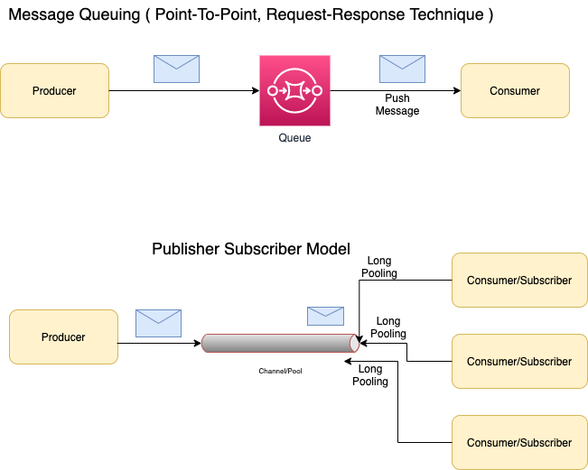

# Methods of Message Transfer

## Push Model/Message Queuing ( Point-To-Point, Request-Response technique)
- Once the message is delivered to the consumer, it would be removed from Queue.
- The main goal is to `distribute messages individually` and promptly, ensuring that `work is parallelized equitably` and messages are handled roughly in the order they came in the queue.
- [RabbitMQ](RabbitMQ.md), [Amazon SNS](../AWS/AmazonSQSvsSNSvsMQ.md) support `Push Model` ( i.e. `Point-To-Point` model ).
- Kafka `DOESN't support Push/Point-To-Point model`.

## Pull Model/Publisher-Subscriber Model
- Unlike point-to-point texting, a message is only removed once it has been consumed by all category subscribers or according to retention policy.
- [Kafka](Kafka.md), [Active MQ](ActiveMQ.md), [Amazon SQS](../AWS/AmazonSQSvsSNSvsMQ.md) supports Publisher-Subscriber Model.
- This is completely asynchronous. You can't say for sure when this process will happen and in what order.

## [Various Message Brokers](../../../README.md)