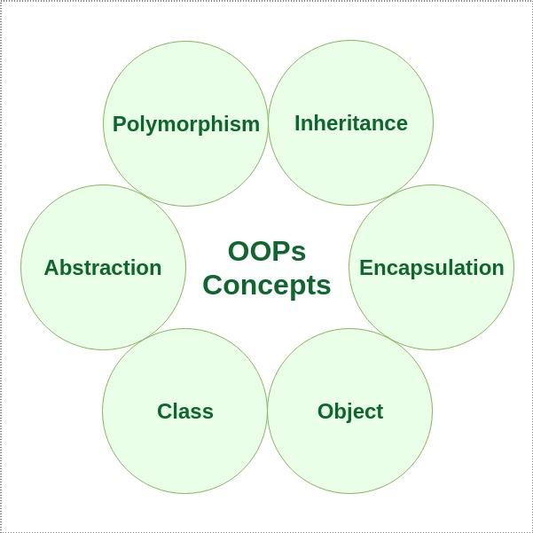

# Inheritance - Extends
- In Java, the extends keyword is used to indicate that the class which is being defined is derived from the base class using inheritance.
- So basically, extends keyword is used to extend the functionality of the parent class to the subclass.
- In Java, multiple inheritances are not allowed due to ambiguity.
- Therefore, a class can extend only one class to avoid ambiguity.

# Inheritance - Implements
- In Java, the implements keyword is used to implement an interface.
- An interface is a special type of class which implements a complete abstraction and only contains abstract methods.
- To access the interface methods, the interface must be “implemented” by another class with the implements keyword and the methods need to be implemented in the class which is inheriting the properties of the interface.
- Since an interface is not having the implementation of the methods, *a class can implement any number of interfaces at a time*

# Polymorphism
- If one task is performed in different ways, it is known as polymorphism.
- In Java, we use method *overloading and method overriding* to achieve polymorphism.

# Abstraction
- Hiding internal details and showing functionality is known as abstraction.
- For example phone call, we don't know the internal processing.
- In Java, we use *abstract class and interface* to achieve abstraction.

# Encapsulation
- Encapsulation in Java is a process of wrapping code and data together into a single unit, for example, a capsule which is mixed of several medicines.
- We can create a fully encapsulated class in Java by making all the data members of the class `private`.
- Now we can use `setter` and `getter` methods to set and get the data in it.

# Composition
- The composition is also a way to achieve association.
- The composition represents the relationship where one object contains other objects as a part of its state.
- There is a strong relationship between the containing object and the dependent object.
- It is the state where containing objects do not have an independent existence.
- If you delete the parent object, all the child objects will be deleted automatically.

# Interface vs Abstract

## Abstract

Consider using `abstract` classes if any of these statements apply to your situation:
- In the java application, there are some related classes that need to share some lines of code then you can put these lines of code within the abstract class and this abstract class should be extended by all these related classes.
- You can define the non-static or non-final field(s) in the abstract class so that via a method you can access and modify the state of the object to which they belong.
- You can expect that the classes that extend an abstract class have many common methods or fields, or require access modifiers other than public (such as protected and private).
- Example - `Person` class as abstract class. And `User`, `Admin` classes extending the `Person` class.

## Interface

Consider using `interfaces` if any of these statements apply to your situation:
- It is total abstraction, all methods declared within an interface must be implemented by the class(es) that implements this interface.
- A class can implement more than one interface. It is called `multiple inheritances`.
- You want to specify the behavior of a particular data type but are not concerned about who implements its behavior.
- Example - `Search` interface as interface. And `UserSearch`, `BookSearch` etc. implementing the interface.

# References
- https://www.javatpoint.com/java-oops-concepts
- https://www.geeksforgeeks.org/extends-vs-implements-in-java/
- https://www.geeksforgeeks.org/difference-between-abstract-class-and-interface-in-java/
- https://stackoverflow.com/questions/15132528/class-extending-more-than-one-class-java