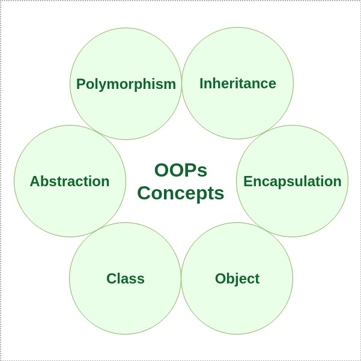

# Inheritance - Extends
- In Java, the `extends` keyword is used to indicate that the class which is being defined is derived from the base class using inheritance.
- So basically, extends keyword is used to extend the functionality of the parent class to the subclass.
- In Java, multiple inheritances are not allowed due to ambiguity.
- Therefore, a class can extend only one class to avoid ambiguity.

# Inheritance - Implements
- In Java, the `implements` keyword is used to implement an interface.
- An interface is a special type of class which implements a complete abstraction and only contains abstract methods.
- To access the interface methods, the interface must be `implemented` by another class with the implements keyword and the methods need to be implemented in the class which is inheriting the properties of the interface.
- Since an interface is not having the implementation of the methods, `a class can implement any number of interfaces at a time`.

# Polymorphism
- If one task is performed in different ways, it is known as polymorphism.
- In Java, we use method `overloading and method overriding` to achieve polymorphism.

# Abstraction
- Hiding internal details and showing functionality is known as abstraction.
- For example phone call, we don't know the internal processing.
- In Java, we use `abstract class and interface` to achieve abstraction.

```java
abstract class Shape {
    String color;

    // these are abstract methods
    abstract double area();
    public abstract String toString();

    // abstract class can have a constructor
    public Shape(String color)
    {
        System.out.println("Shape constructor called");
        this.color = color;
    }

    // this is a concrete method
    public String getColor()
    {
        return color;
    }
}
class Circle extends Shape {
    double radius;

    public Circle(String color, double radius)
    {

        // calling Shape constructor
        super(color);
        System.out.println("Circle constructor called");
        this.radius = radius;
    }

    @Override
    double area()
    {
        return Math.PI * Math.pow(radius, 2);
    }

    @Override
    public String toString()
    {
        return "Circle color is "
                + super.color
                + "and area is : "
                + area();
    }
}

class Rectangle extends Shape {

    double length;
    double width;

    public Rectangle(String color,
                     double length,
                     double width)
    {

        // calling Shape constructor
        super(color);
        System.out.println("Rectangle constructor called");
        this.length = length;
        this.width = width;
    }

    @Override
    double area()
    {
        return length * width;
    }

    @Override
    public String toString()
    {
        return "Rectangle color is "
                + super.color
                + "and area is : "
                + area();
    }
}

public class Test {
    public static void main(String[] args)
    {
        Shape s1 = new Circle("Red", 2.2);
        Shape s2 = new Rectangle("Yellow", 2, 4);

        System.out.println(s1.toString());
        System.out.println(s2.toString());
    }
}
```

# Encapsulation
- Encapsulation in Java is a process of wrapping code and data together into a single unit, for example, a capsule which is mixed of several medicines.
- We can create a fully encapsulated class in Java by making all the data members of the class `private`.
- We can use `setter` and `getter` methods to set and get the data in it.

```java
public class Encapsulate {
 
    // private variables declared
    // these can only be accessed by
    // public methods of class
    private String geekName;
    private int geekRoll;
    private int geekAge;
 
    // get method for age to access
    // private variable geekAge
    public int getAge() { return geekAge; }
 
    // get method for name to access
    // private variable geekName
    public String getName() { return geekName; }
 
    // get method for roll to access
    // private variable geekRoll
    public int getRoll() { return geekRoll; }
 
    // set method for age to access
    // private variable geekage
    public void setAge(int newAge) { geekAge = newAge; }
 
    // set method for name to access
    // private variable geekName
    public void setName(String newName)
    {
        geekName = newName;
    }
 
    // set method for roll to access
    // private variable geekRoll
    public void setRoll(int newRoll) { geekRoll = newRoll; }
}
 
// Class to access variables
// of the class Encapsulate
class TestEncapsulation {
    public static void main(String[] args)
    {
        Encapsulate obj = new Encapsulate();
 
        // setting values of the variables
        obj.setName(" Harsh & quot;);
        obj.setAge(19);
        obj.setRoll(51);
 
        // Displaying values of the variables
        System.out.println("Geek's name: " + obj.getName());
        System.out.println("Geek's age: " + obj.getAge());
        System.out.println("Geek's roll: " + obj.getRoll());
 
        // Direct access of geekRoll is not possible
        // due to encapsulation
        // System.out.println("Geek's roll: " +
        // obj.geekName);
    }
}
```

# Composition
- The composition is also a way to achieve association.
- The composition represents the relationship where one object contains other objects as a part of its state.
- There is a strong relationship between the `containing object` and the `dependent object`.
- It is the state where containing objects do not have an independent existence.
- If you delete the parent object, all the child objects will be deleted automatically.

```java
// Java program to Illustrate Concept of Composition
 
// Importing required classes
import java.io.*;
import java.util.*;
 
// Class 1
// Helper class
// Book class
class Book {
 
    // Member variables of this class
    public String title;
    public String author;
 
    // Constructor of this class
    Book(String title, String author)
    {
 
        // This keyword refers top current instance
        this.title = title;
        this.author = author;
    }
}
 
// Class 2
// Helper class
// Library class contains list of books.
class Library {
 
    // Reference to refer to list of books.
    private final List<Book> books;
 
    // Constructor of this class
    Library(List<Book> books)
    {
 
        // This keyword refers to current instance itself
        this.books = books;
    }
 
    // Method of this class
    // Getting the list of books
    public List<Book> getListOfBooksInLibrary()
    {
        return books;
    }
}
 
// Class 3
// Main class
class GFG {
 
    // Main driver method
    public static void main(String[] args)
    {
 
        // Creating the objects of class 1 (Book class)
        // inside main() method
        Book b1
            = new Book("EffectiveJ Java", "Joshua Bloch");
        Book b2
            = new Book("Thinking in Java", "Bruce Eckel");
        Book b3 = new Book("Java: The Complete Reference",
                           "Herbert Schildt");
 
        // Creating the list which contains the
        // no. of books.
        List<Book> book = new ArrayList<Book>();
 
        // Adding books to List object
        // using standard add() method
        book.add(b1);
        book.add(b2);
        book.add(b3);
 
        // Creating an object of class 2
        Library library = new Library(book);
 
        // Calling method of class 2 and storing list of
        // books in List Here List is declared of type
        // Books(user-defined)
        List<Book> books
            = library.getListOfBooksInLibrary();
 
        // Iterating over for each loop
        for (Book bk : books) {
 
            // Print and display the title and author of
            // books inside List object
            System.out.println("Title : " + bk.title
                               + " and "
                               + " Author : " + bk.author);
        }
    }
}
```

# Interface vs Abstract

## Abstract

Consider using `abstract` classes if any of these statements apply to your situation:
- In the java application, there are some related classes that need to share some lines of code then you can put these lines of code within the abstract class and this abstract class should be extended by all these related classes.
- You can define the non-static or non-final field(s) in the abstract class so that via a method you can access and modify the state of the object to which they belong.
- You can expect that the classes that extend an abstract class have many common methods or fields, or require access modifiers other than public (such as protected and private).
- Example - `Person` class as abstract class. And `User`, `Admin` classes extending the `Person` class.

## Interface

Consider using `interfaces` if any of these statements apply to your situation:
- It is total abstraction, all methods declared within an interface must be implemented by the class(es) that implements this interface.
- A class can implement more than one interface. It is called `multiple inheritances`.
- You want to specify the behavior of a particular data type but are not concerned about who implements its behavior.
- Example - `Search` interface as interface. And `UserSearch`, `BookSearch` etc. implementing the interface.

# References
- https://www.javatpoint.com/java-oops-concepts
- https://www.geeksforgeeks.org/extends-vs-implements-in-java/
- https://www.geeksforgeeks.org/difference-between-abstract-class-and-interface-in-java/
- https://www.geeksforgeeks.org/difference-between-abstraction-and-encapsulation-in-java-with-examples/
- https://stackoverflow.com/questions/15132528/class-extending-more-than-one-class-java