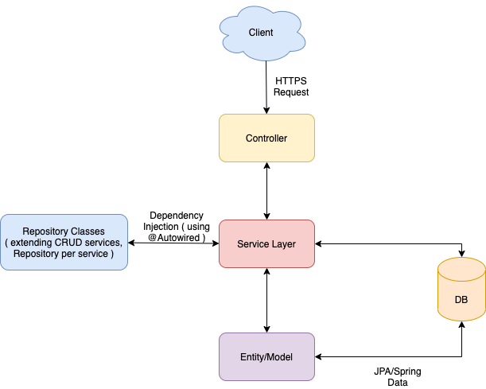
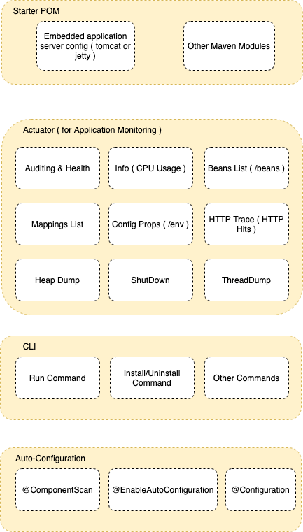
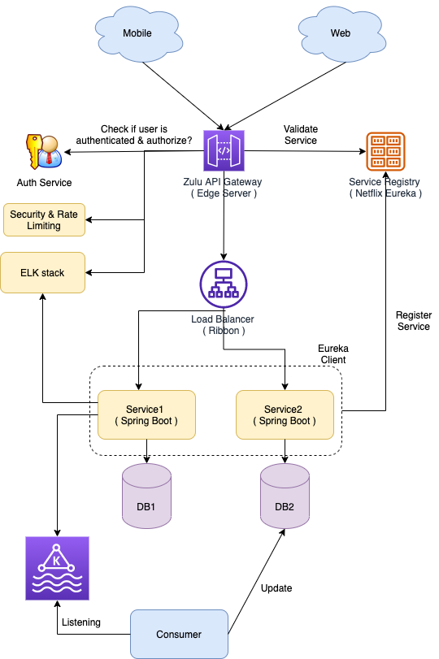

# What is Spring boot?
- Sprint boot is a Java-based spring framework used for Rapid Application Development (to build stand-alone microservices). 
- It has extra support of auto-configuration and *embedded application server like tomcat*, jetty, etc.

# What are the advantages of using Spring Boot?
- Easy to understand and develop spring applications.
- Spring Boot is nothing but an existing framework with the addition of an embedded HTTP server and annotation configuration which makes it easier to understand and faster the process of development.
- Increases productivity and reduces development time.
- Minimum configuration.
- We don’t need to write any XML configuration, only a few annotations are required to do the configuration.

# What are the Spring Boot key components?
- Spring Boot auto-configuration.
- Spring Boot CLI.
- Spring Boot starter POMs.
- Spring Boot Actuators.

# Why Spring Boot over Spring?
- Starter POM.
- Version Management.
- Auto Configuration.
- Component Scanning.
- Embedded server.
- InMemory DB.
- Actuators

# How does Spring Boot works?
- Spring Boot automatically configures your application based on the dependencies you have added to the project `by using annotation`. 
- The entry point of the spring boot application is the class that contains `@SpringBootApplication` annotation and the main method.
- Spring Boot automatically scans all the components included in the project by using `@ComponentScan` annotation.

# Most commonly used Spring Boot CLI commands?
- `spring --help`
- `-run, -test, -grap, -jar, -war, -install, -uninstall, --init, -shell, -help.`

# What is the default port of tomcat in spring boot?
- The default port of the tomcat server-id 8080. It can be changed by adding sever.port properties in the application.property file.

# Can we override or replace the Embedded tomcat server in Spring Boot?
- Yes, we can replace the Embedded Tomcat server with any server by using the Starter dependency in the pom.xml file. Like you can use spring-boot-starter-jetty as a dependency for using a jetty server in your project.

# How to disable a specific auto-configuration class?
You can use exclude attribute of @EnableAutoConfiguration if you want auto-configuration not to apply to any specific class.

<pre>
//use of exclude
@EnableAutoConfiguration(exclude={className})
</pre>

# How to enable Actuator in Spring boot application?

<pre>
<dependency>
<groupId> org.springframework.boot</groupId>
<artifactId> spring-boot-starter-actuator </artifactId>
</dependency>
</pre>

# What is the starter dependency of the Spring boot module?
- Data JPA starter.
- Test Starter.
- Security starter.
- Web starter.
- Mail starter.
- Thymeleaf starter.

# Min. Java Version needed for Spring Boot
- Java 8

# Is Dependency needed to create a Spring Boot web application?
- Spring Boot Starter Web

# Database object must be annotated with?
- @Entity

# Different Annotations

Annotation| Remarks                               |
---------------------------------------|---------------------------------------|
@RestController||
@PostMapping("/store")| Post mapping annotation on the method |
@GetMapping("/store")| Get mapping annotation on the method  |
@RequestMapping(value = "/activate",  method = RequestMethod.POST, produces = "application/json")||
X(@RequestBody MeterReadings meterReadings)| HTTP Post body                        |
Y(@PathVariable String smartMeterId)| URL Parameter                         |
@SpringBootApplication||
@Bean||
@Primary||
@Entity||
@Configuration||

# Microservices - How to develop, deploy microservices using Spring Boot?

## [Zulu API Gateway](https://stackabuse.com/spring-cloud-routing-with-zuul-and-gateway/)
- Zulu is an API gateway, for routing microservices properly. ( An alternative to AWS API gateway )
- Netflix created Zuul server and later open-sourced it.
- Spring provided a nice wrapper around it for easily incorporating it to the Spring stack.

## [Eureka Server - Service Registry](https://www.tutorialspoint.com/spring_boot/spring_boot_eureka_server.htm)
- Eureka naming server is a REST-based server that is used in the AWS Cloud services for load balancing and failover of middle-tier services.
- Eureka naming server is an application that holds information about all client service applications. 
- Each microservice registers itself with the Eureka naming server. 
- The naming server registers the client services with their port numbers and IP addresses. 
- It is also known as `Discovery Server`.  
- Eureka naming server comes with the bundle of Spring Cloud. It runs on the default port 8761. 
- It also comes with a Java-based client component, the eureka client, which makes interactions with the service much easier.

# References
- https://www.javatpoint.com/microservices
- https://www.interviewbit.com/spring-boot-interview-questions/
- https://java2blog.com/spring-restcontroller-example/
- https://res.cloudinary.com/deop9ytsv/image/upload/v1545143589/1_Z8HUa8vdvIrF68crSJOPTQ.png
- https://medium.com/geekculture/zuul-api-gateway-2bcdf4dd33e6
- https://www.javatpoint.com/eureka-naming-server
- https://1nwu8i3sj55rdbw4k4fm55i1-wpengine.netdna-ssl.com/wp-content/uploads/2015/09/MSArchitech.png
- https://res.cloudinary.com/practicaldev/image/fetch/s--DXg7gK9m--/c_limit%2Cf_auto%2Cfl_progressive%2Cq_auto%2Cw_880/https://cdn-images-1.medium.com/max/2000/1*b4krMVZ-mqjxAIh_EM1jhQ.png