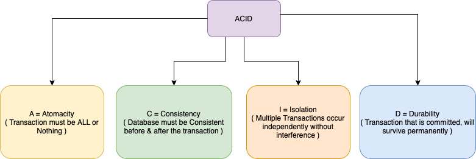

# System Design Glossaries

## Throughput
- Throughput is the number of actions executed or results produced per unit of time. 
- This is measured in units of whatever is being produced (cars, motorcycles, I/O samples, memory words, iterations) per unit of time.
- Example - `500 transactions per second` etc.

## Latency
- Latency is the time required to perform an action or to produce some result. 
- Latency is measured in units of time - hours, minutes, seconds, nanoseconds or clock periods.
- Example - `50 secs to do a transaction`.

## What is TPS ( Transactions per Second )?
- The number of things to be transmitted every second, that is, the number of transactions per second processed by the server.
- The TPS includes a message entry and a message, plus a user database access. (Business TPS = CAPSX per call average TPs)

## What is QPS ( Queries per Second )?
- Every transaction might have multiple queries.
- Hence, QPS is the subset of TPS.

## [High Availability](https://avinetworks.com/glossary/high-availability/)
- High Availability (HA) describes systems that are dependable enough to operate continuously without failing.
- They are well-tested and sometimes equipped with redundant components.

## [Fault Tolerance](https://www.fortinet.com/resources/cyberglossary/fault-tolerance)
- Fault tolerance is a process that enables an operating system to respond to a failure in hardware or software.
- This fault-tolerance definition refers to the system’s ability to continue operating despite failures or malfunctions.
- Components of a `Fault-tolerance` system
  - Diversity
  - Redundancy
  - Replication

## [ACID Properties of the Transaction](https://www.geeksforgeeks.org/acid-properties-in-dbms/)

### [Atomicity](https://www.geeksforgeeks.org/acid-properties-in-dbms/)
- Atomicity is a feature of databases systems dictating where a transaction must be `all-or-nothing`.
- That is, the transaction must either fully happen, or not happen at all. It must not complete partially.
- Each transaction is considered as one unit and either runs to completion or is not executed at all. 
- It involves the following two operations.
  - `Abort`: If a transaction aborts, changes made to the database are not visible.
  - `Commit`: If a transaction commits, changes made are visible.

### [Consistency](https://www.geeksforgeeks.org/acid-properties-in-dbms/)
- This means that integrity constraints must be maintained so that the database is consistent before and after the transaction.
- Consistency (or `Correctness`) in database systems refers to the requirement that any given database transaction [must change affected data only](https://en.wikipedia.org/wiki/Consistency_(database_systems)) in allowed ways.
- Any data written to the database must be valid according to all defined rules, including constraints, cascades, triggers, and any combination thereof.

### [Isolation](https://www.geeksforgeeks.org/acid-properties-in-dbms/)
- This property ensures that multiple transactions can occur concurrently without leading to the inconsistency of the database state. 
- Transactions occur independently without interference. 
- Changes occurring in a particular transaction will not be visible to any other transaction until that particular change in that transaction is written to memory or has been committed

### [Durability](https://en.wikipedia.org/wiki/Durability)
- In database systems, durability is the `ACID property` which guarantees that `transactions that have committed will survive permanently`.
- For example, if a flight booking reports that a seat has successfully been booked, then the seat will remain booked even if the system crashes.

## [Language Agnostic](https://en.wikipedia.org/wiki/Language-agnostic)
- We should design the system considering agnostic feature (Language agnostic, AWS agnostic etc.) into the consideration.
- Language-agnostic - Language-agnostic programming or scripting (also called language-neutral, language-independent, or cross-language) is a software development paradigm where a particular language is chosen because of its appropriateness for a particular task (taking into consideration all factors, including ecosystem, developer skill-sets, performance, etc.), and not purely because of the skill-set available within a development team.

