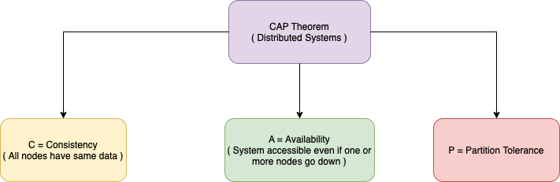
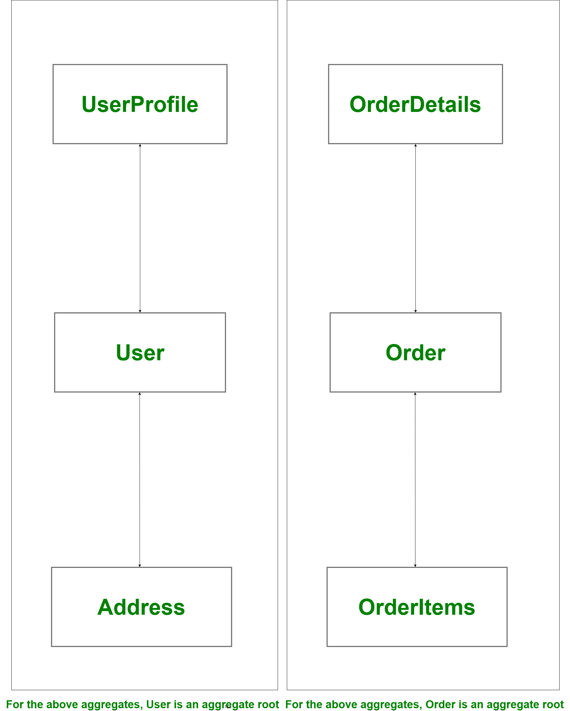

# System Design Glossaries

## Latency
- Latency is the time required to `perform an action or to produce some result`. 
- Latency is measured in units of time - hours, minutes, seconds, nanoseconds or clock periods.
- Example - `50 secs to do a transaction`.

## Throughput
- Throughput is the number of actions executed or results produced per unit of time.
- This is measured in units of whatever is being produced (cars, motorcycles, I/O samples, memory words, iterations) per unit of time.

### TPS (Transactions per Second)
- For transactions processing systems, throughput is typically measured in `TPS`.
- The TPS includes a message entry and a message, plus a user database access. (Business TPS = CAPSX per call average TPs)
- Example - `500 transactions per second ( 500 TPS )` etc.

### QPS (Queries per Second)
- `Every transaction might have multiple queries`.
- Hence, QPS is the subset of TPS.

## [High Availability ( HA )](https://avinetworks.com/glossary/high-availability/)
- High Availability (HA) describes systems that are dependable enough to operate continuously without failing.
- They are well-tested and sometimes equipped with redundant components.
- `99.99% uptime` means that website is down only for `52 mins` in the complete year. This means it is `highly available`.
- In AWS, high availability is achieved through multiple deployments of the app in `different availability zones`.
- [Design Scalable System With RDMS on AWS](DesignScalableSystemWithRDMS)

### Components of HA
- `Redundancy` - Ensures that critical system components have another identical components with the same data, that can take over in case of failure.
- `Monitoring` - Identify problems in production systems that may disrupt or degrade service.
- `Failover` - Switch from an active system component to a redundant component in case of failure with degraded performance or functionality.
- `Failback` - Switch back from a redundant component to the primary active component, when it has recovered from failure.

## [Fault Tolerance](https://www.fortinet.com/resources/cyberglossary/fault-tolerance)
- Fault tolerance is a process that enables an operating system to respond to a failure in hardware or software.
- This fault-tolerance definition refers to the system’s ability to continue operating despite failures or malfunctions.
- Components of a `Fault-tolerance` system
  - Diversity
  - Redundancy
  - Replication

## [ACID Properties of the Transaction](https://www.geeksforgeeks.org/acid-properties-in-dbms/)

### [Atomicity](https://www.geeksforgeeks.org/acid-properties-in-dbms/)
- Atomicity is a feature of databases systems dictating where a transaction must be `all-or-nothing`.
- That is, the transaction must either fully happen, or not happen at all. It must not complete partially.
- Each transaction is considered as one unit and either runs to completion or is not executed at all. 
- It involves the following two operations.
  - `Abort`: If a transaction aborts, changes made to the database are not visible.
  - `Commit`: If a transaction commits, changes made are visible.

### [Consistency](https://www.geeksforgeeks.org/acid-properties-in-dbms/)
- This means that integrity constraints must be maintained so that the database is consistent before and after the transaction.
- `Consistency` (or `Correctness`) in database systems refers to the requirement that any given database transaction [must change affected data only](https://en.wikipedia.org/wiki/Consistency_(database_systems)) in allowed ways.
- Any data written to the database must be valid according to all defined rules, including constraints, cascades, triggers, and any combination thereof.

### [Isolation](https://www.geeksforgeeks.org/acid-properties-in-dbms/)
- This property ensures that multiple transactions can occur concurrently without leading to the inconsistency of the database state. 
- Transactions occur independently without interference. 
- Changes occurring in a particular transaction will not be visible to any other transaction until that particular change in that transaction is written to memory or has been committed

### [Durability](https://en.wikipedia.org/wiki/Durability)
- In database systems, durability is the `ACID property` which guarantees that `transactions that have committed will survive permanently`.
- For example, if a flight booking reports that a seat has successfully been booked, then the seat will remain booked even if the system crashes.

## [CAP Theorem of the Distributed Systems](https://www.geeksforgeeks.org/the-cap-theorem-in-dbms/)

> The use of the word `Consistency` in `CAP` and its use in `ACID` do not refer to the same identical concept.
> - In CAP, the term consistency refers to the `consistency of the values in different copies of the same data item in a replicated distributed system`.
>   - In case of high availability, it takes time for data to be replicated in multiple highly available zones.
>   - Hence `Consistency` won't be there for those `milliseconds`.
> - In ACID, it refers to the fact that a transaction will not violate the integrity constraints specified on the database schema.

## [Language Agnostic](https://en.wikipedia.org/wiki/Language-agnostic)
- We should design the system considering agnostic feature (Language agnostic, AWS agnostic etc.) into the consideration.
- Language-agnostic programming or scripting (also called language-neutral, language-independent, or cross-language) is a software development paradigm where a particular language is chosen because of its appropriateness for a particular task (taking into consideration all factors, including ecosystem, developer skill-sets, performance, etc.), and not purely because of the skill-set available within a development team.

## [Stateful vs Stateless](https://www.geeksforgeeks.org/difference-between-stateless-and-stateful-protocol/)
- `Stateless Protocol` does not require the server to retain the server information or session details.
- `Stateful Protocol` require server to save the status and session information.

## [Load Balancers](https://github.com/ema2159/Grokking-System-Design-Interview-Quizzes/blob/master/Quizzes/Load%20Balancer.org)
- It helps to spread the traffic across a cluster of servers to improve responsiveness and availability of applications, websites or databases.
- LB also keeps `track of the status of all the resources` while distributing requests.
- If a server is not available to take new requests or is NOT responding or has elevated error rate, LB will stop sending traffic to such a server.

## [Event Driven Architecture](https://aws.amazon.com/event-driven-architecture/)
- An event-driven architecture uses events to `trigger and communicate between decoupled services` and is common in modern applications built with microservice.
- An event is a change in state, or an update, like an item being placed in a shopping cart on an e-commerce website.
- Events can either carry the state (the item purchased, its price, and a delivery address) or events can be identifiers (a notification that an order was shipped).

## [Domain Driven Architecture](https://www.geeksforgeeks.org/domain-driven-design-ddd/)
- When we are developing software our focus should not be primarily on technology, rather it should be primarily on business/domain.
- Classes, modals, services, microservices, rest apis etc. should be designed according to the domains.

