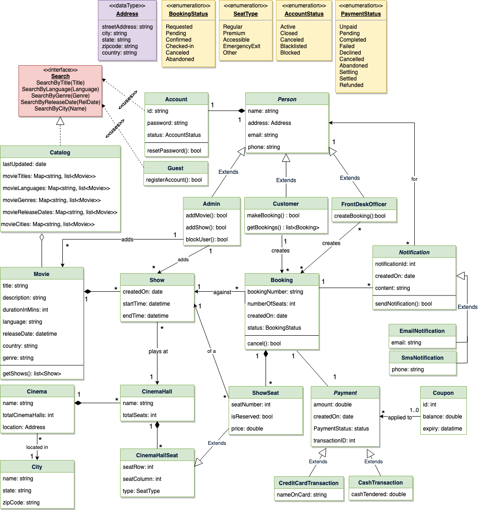

# Requirements
- Design a booking Platform where a user wishes to book a move from a theater in a given city.
- City → Theater → (Date, Show) → Seats

# Scope
- View movies (screens) for a given date
- Lock `Set<Seat>` seats for x minutes
- Proceed with the booking

# Class Diagram

# Important Points
- ShowSeats would have "Show" & seat availability properties.
- Booking would list of seats & show as properties.
- During the payment, the seats would have to be reserved and blocked in the database.

# References
- Asked in `Titan.email` on 4-June-2022
- https://www.educative.io/courses/grokking-the-object-oriented-design-interview/gxkvNgMqDk3
- https://akshay-iyangar.github.io/system-design/grokking-ood/examples/java/movie-ticket-booking-system.html