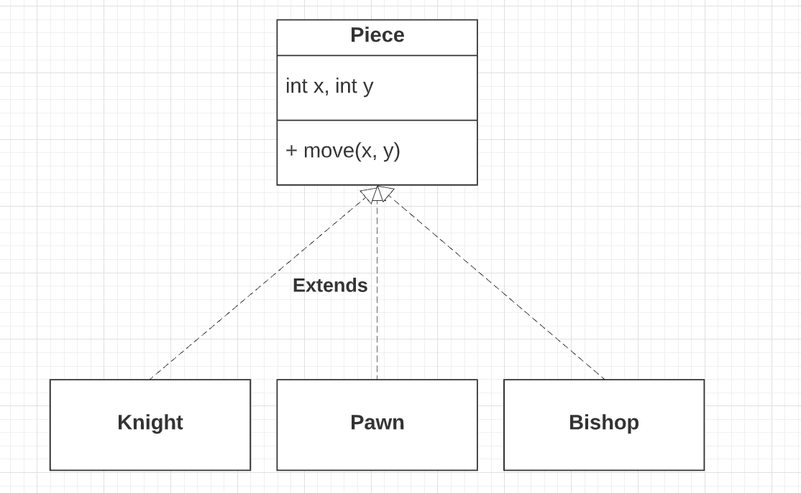

# [LLD Design - Tips & Techniques](https://betterprogramming.pub/how-to-ace-the-low-level-design-interview-3f1be6401070)

1. `Requirements Gathering`
    - What are use cases? What are business actors?
    - Every requirement will translate into action (`methods`) in the system.
    - Think from `user perspective` & `use cases`.

2. `Object Modelling`
    - Define `composition` & `relationship` b/w entities
    - Establish the relationships between the classes / objects by observing the interactions among the classes / objects.
    - This is important perspective.
    - Most of the classes would have a composition with another domain class. This is natural.

3. Define `Main & Core Classes/Entities`
    - Make sure `SOLID` principals are followed.
    - Think of as many smaller & unit classes as possible.
    - A single feature might involve interaction between multiple entities.
    - Examples
        - In the case of a movie booking application, the booking will involve components such as `BookingController`, `BookingManager`, and `PaymentProcessor`.
        - The `BookingController` will handle the booking requests and send a request to the `BookingManager` to book movie seats.
        - `BookingManager` will then interact with the `PaymentProcessor` for completing the payment.

4. Define `abstract classes`
    - Common, reusable classes which can be extended for various business Actors, UCS etc.
    - Examples
        - `User Account` abstract class ( with first name, last name etc. ) can be extended for different user actors ( `Employee`, `Manager` etc. ).
        - `Piece` abstract class ( with `move()`) in the chess game ( for pawn, knight, bishop classes ).

5. Define `interfaces`
    - Interfaces are core entities which can be implemented as per the needs.
    - Examples
        - `Search` interface

6. Define `enums`
    - `Enums` are different types of entities which are hardcoded but at one place.
    - Examples
        - `Payment status`
        - `entity status`
        - `reservation status`
        - `booking status` etc.