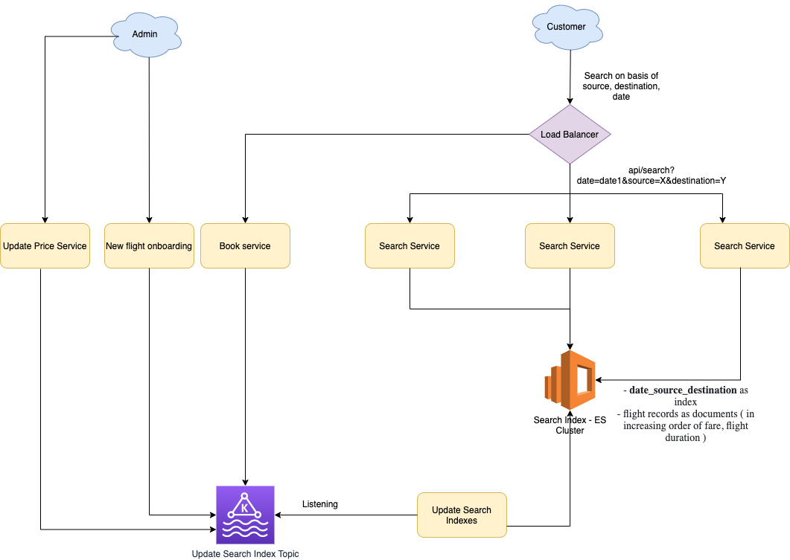

# Requirements
- Customer should be able to search for the flight for the given date. 
- The results should be in increasing order of fare, flight duration.
- Customer can then select the flight.
- System should be scalable with high performance.

# Different Events to update the search index
- Price Update
- Flight booking
- New flight onboarding ( admin )

# Estimation
- Assuming each apache ( service ) server can handle 512 concurrent requests.
- If we consider 1 million concurrent users, around `2000 servers` would be needed.
- Expectated Latency - `10ms for ElasticSearch`.

# Data Modeling
- Search Interface 
  - searchbyDate
- FlightSearch would implement Search Interface 

# References
- https://ankita4priya.medium.com/flight-booking-website-app-system-design-899c626a6ee6
- https://www.nexsoftsys.com/articles/how-to-design-backend-system-of-an-online-hotel-booking-app-using-java.html
- Asked in Amazon Interview Question, 15June2022
